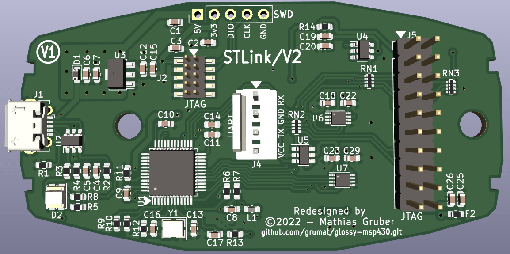
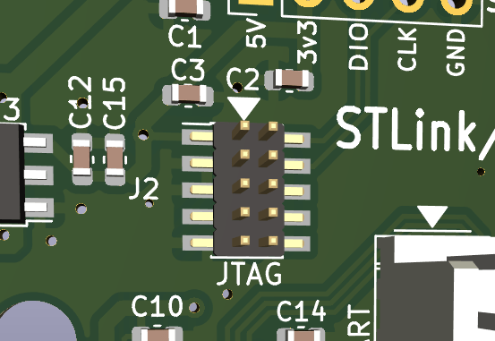
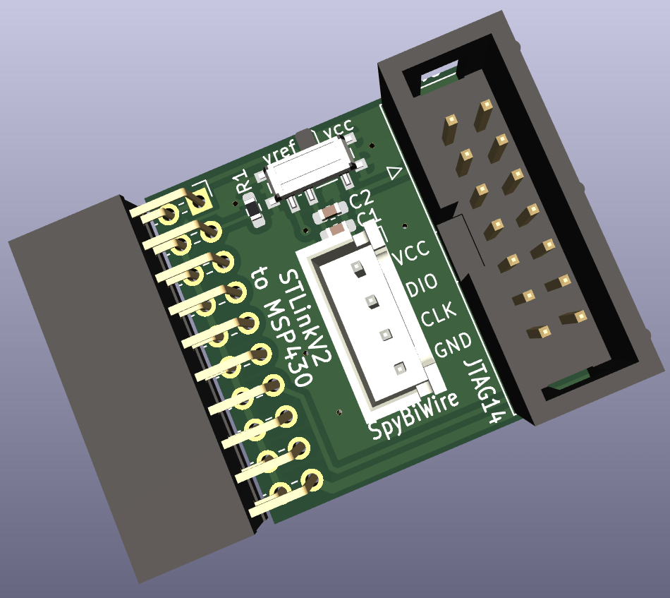
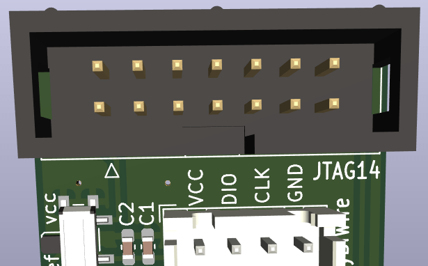
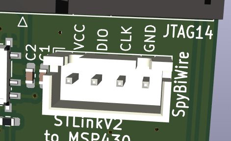
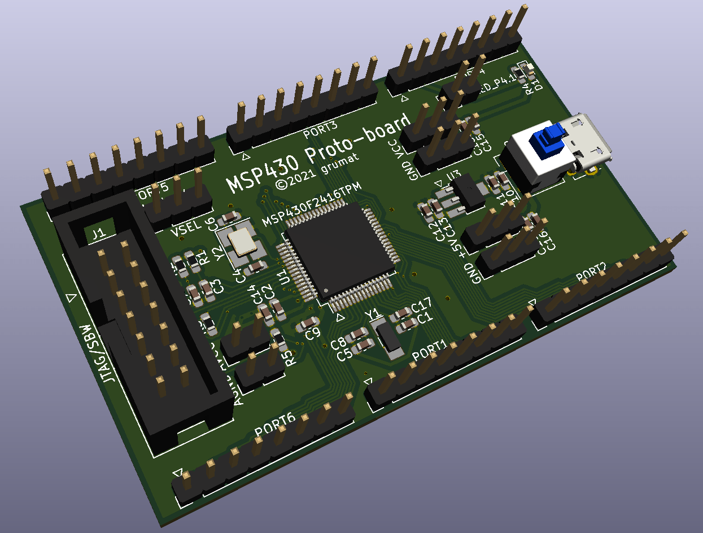
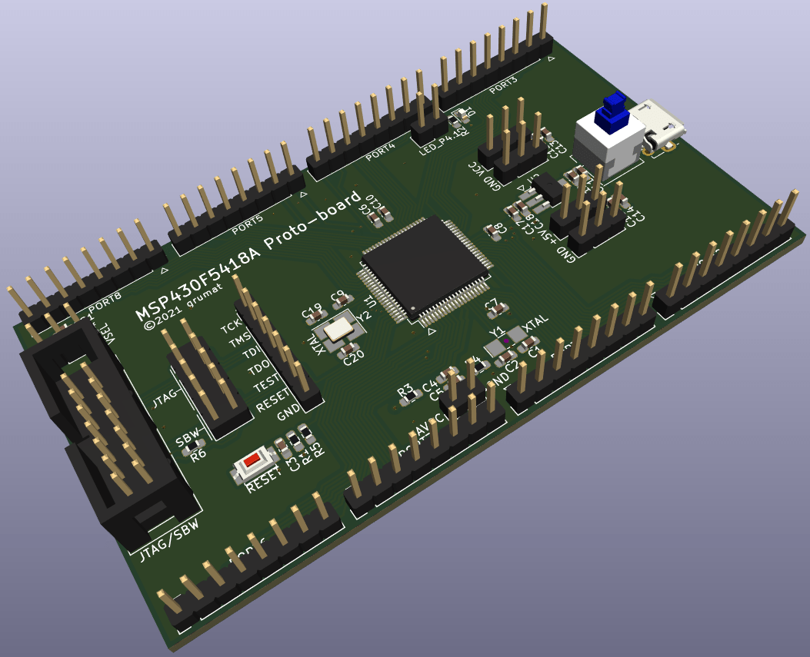
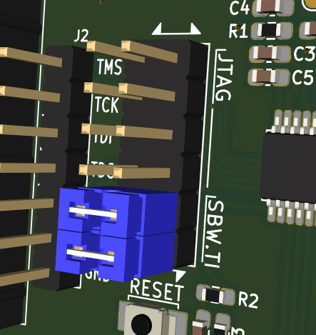
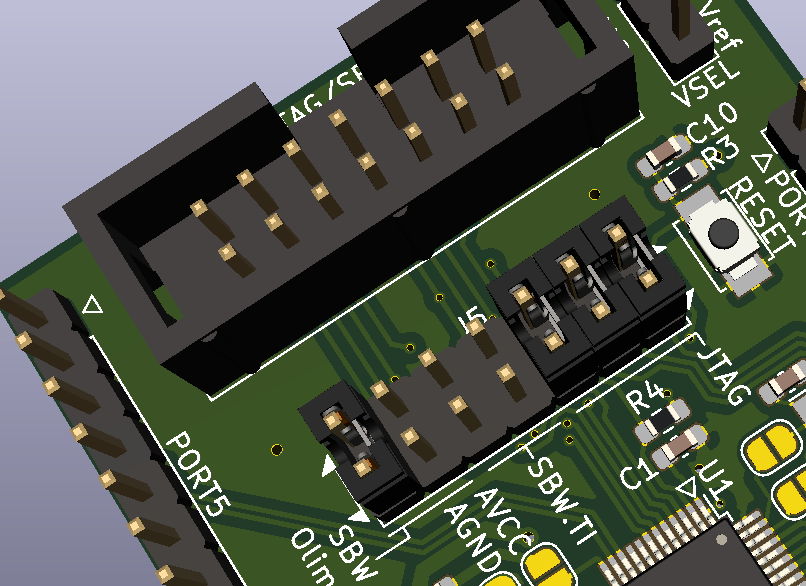
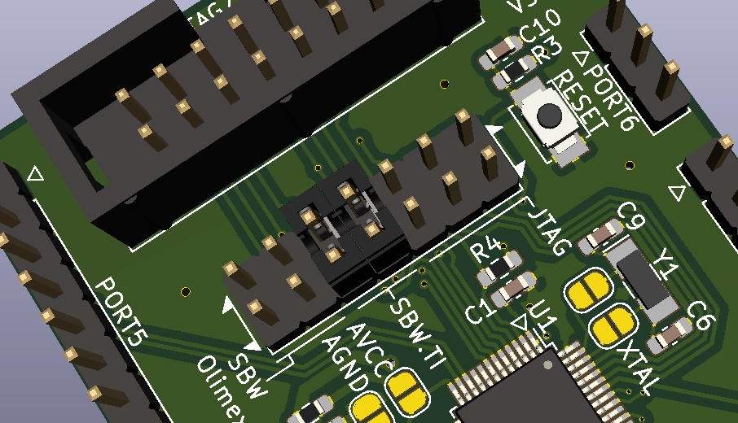

# Glossy MSP430 — Probe ↔ Target Wiring Guide (DRAFT)

> **Status: draft.** Probe-side and proto-board tables are filled from
> `target.*/platform.h` and the `Hardware/*/README.md` files. Items I inferred
> rather than read verbatim are flagged **⚠ CONFIRM**. The two things only you
> can supply — your physical cable/adapter inventory and any board you own that
> isn't a repo proto-board — are marked **🛠 FILL IN**.
>
> When finalised, promote this to `Hardware/WIRING.md` (a real deliverable) and
> drop the DRAFT banner.

## How to use this guide

1. Find your **probe** (§2) — that fixes the connector type and the SBW wiring
   convention (TI vs ARM-remap).
2. Find your **target board / MCU** (§4) — that tells you whether **JTAG**,
   **SBW**, or **both** are available and how to jumper the mode.
3. Pick the **adapter / cable** (§3) that bridges the two.
4. Mind the **power & voltage** rules (§6) — especially the STLinkV2 3.3 V limit.
5. §5 has the TI 14-pin reference; §7 has ready-made connection recipes.

## 1. Signal glossary

| JTAG signal | Pin | In **SBW (TI)** this cable pin carries… |
|-------------|:---:|------------------------------------------|
| TDO  | 1 | **SBWDIO** — the bidirectional SBW data line |
| TDI / **TCLK** | 3 | — (idle) |
| TMS  | 5 | — (idle) |
| TCK  | 7 | **SBWTCK** — the SBW clock |
| TEST | 8 | — (chip TEST is where SBWTCK *lands on-chip*) |
| RST/NMI | 11 | — (chip RST is where SBWDIO *lands on-chip*; **Olimex** carries SBWDIO on this cable pin) |

**Mind the chip-pin vs cable-pin distinction — this is the whole reason for the
cheat sheet (§5.1).** On the **chip**, SBW always uses the TEST pin (SBWTCK) and
the RST/NMI pin (SBWTDIO). But on the **JTAG-14 cable**, the **TI convention
carries SBWTCK on the TCK wire (pin 7) and SBWDIO on the TDO wire (pin 1)** — the
*target board* routes those wires onto the chip TEST/RST pins via its mode
jumpers. The **Olimex** convention instead carries SBWDIO on the RST wire
(pin 11). **Glossy MSP430 uses the TI convention.** (The STLinkV2 path borrows
the ARM SWD pins and is different again — §5.1.)

Every JTAG bit is encoded as 3 cycles on the two SBW wires. The SBWDIO line is
loaded by the target's reset RC, which caps the wire speed — see §6.

## 2. Probes (host side)

### 2a. BluePill-G431 "Jiga-Board" (and plain BluePill)

Dual-socket carrier: accepts either a **BluePill (STM32F103)** or a
**G431-in-BluePill-form** board. Target-facing signal map (from
`target.bluepill.g431kb/platform.h` / `Hardware/BluePill-G431/README.md`):

| Signal | MCU pin | Peripheral | Notes |
|--------|:-------:|------------|-------|
| TCK / **SBWCLK** | PA5 | SPI1_SCK | |
| TDO | PA6 | SPI1_MISO | from target |
| TDI / TCLK | PA7 | SPI1_MOSI | to target |
| TMS | PA9 | TIM1_CH2 | timer-driven during frames |
| RST | PA1 | GPIO | bit-bang |
| TEST | PA0 | GPIO | bit-bang |
| **SBWDIO** | PA6/PA7 pair → merged | — | host-side SBWDI/SBWDO merge to one target line |
| SBW direction (SBW_RD) | PA10 | GPIO (TIM1_CH3 capable) | turnaround control |
| Target UART | PB6 (TX) / PB7 (RX) | USART1 | VCP builds only |
| GDB serial | PA2 (TX) / PA3 (RX) | USART2 | non-VCP |
| Target Vcc gen | PA4 (DAC) **or** PB9 (PWM) | DAC1_OUT1 / TIM4_CH4 | one at a time |

- **SBW wiring convention: TI-standard.** On the JTAG-14 cable, **SBWCLK is on
  the TCK wire (pin 7) and SBWDIO is on the TDO wire (pin 1)**; the host's
  separate SBWDI/SBWDO legs (PA6/PA7) merge into that one TDO line through the
  level converter, and the target board routes it onto the chip RST/TEST pins.
  So **the same TI 14-pin cable carries both JTAG and SBW** — firmware picks the
  mode. (Contrast the STLinkV2 path in §2b/§5.1.)
- **Level translator present** → can drive MSP430 targets **below 3.3 V**
  (unlike STLinkV2).
- Bus buffers are enable-gated (`DIS_RST`/`DIS_TCK`/`DIS_JTAG`/`DIS_COM`); the
  firmware sequences them per mode (see the Bus-buffer-control table in the
  board README).

### 2b. STLinkV2 clone (redesign / clone repurposing)

STM32F103CBT6 (or Geehy APM32F103CB clone). Target-facing map (from
`target.stlinv2/platform.h` / `Hardware/STLinkV2/README.md`):

| Signal | MCU pin | Peripheral | Notes |
|--------|:-------:|------------|-------|
| JTCK / **SBWCLK** | PA5 | SPI1_SCK / GPIO | **shorted to PB13** on PCB |
| JTDO | PA6 | SPI1_MISO | only signal behind a level converter (input xlate) |
| JTDI / JTCLK | PA7 | SPI1_MOSI | |
| JTMS / **SBWDIO** | PB14 | TIM1_CH2N / GPIO | bidirectional SBW data |
| /RST | PB0 | GPIO | |
| TEST / TRST | PB1 | GPIO | adapter needs a strong TEST pull-down |
| SWD_IN (read-back) | PB12 | GPIO | passive echo of PB14 — the SBW read-back path |
| UART | PA2 (TX) / PA3 (RX) | USART2 | borrowed SWIM connector |

- **SBW wiring convention: ARM-SWD remap (NOT TI).** SBWDIO = **TMS / SWDIO**
  (PB14, JTAG-20 pin 7), SBWCLK = **TCK / SWCLK** (PA5). ⚠ **The JTAG-14
  connector cannot carry SBW in the normal TI-SBW jumper sense on this probe.**
  Use either the STLink-Adapter's dedicated SBW connector (§3a) **or** the
  SWD-Adapter (§3c) — because SBW borrows the SWD pins, the SWD-Adapter's DIO/CLK
  map straight onto SBWDIO/SBWCLK. (You *can* still reach an SBW target through a
  JTAG-14 proto-board by leaving it in its JTAG jumper layout and hand-wiring the
  SWD pins onto connector pins 11/8 — see §4.4.)
- **No hardware direction mux** → SBW turnaround is software-paced via the PB12
  passive read-back echo.
- **3.3 V-only outputs.** The clone's translators only translate *inputs*;
  debug outputs are fixed at 3.3 V. **Do not connect an MSP430 powered below
  ~3 V** — over-voltage on the debug pins. (§6)
- Connector options: ARM **20-pin** (standard), or jumper wires for SWD-style
  access; ⚠ 10-pin clones are **SBW-only**. **CONFIRM** which connector your
  unit exposes.

 

## 3. Adapters (repo `Hardware/*-Adapter/`)

### 3a. STLink-Adapter — ST 20-pin → MSP430 (passive)

Bridges a generic STLink 20-pin to MSP430. **For use with the STLinkV2 probe.**

- **JTAG-20 port**: fits a generic STLink (⚠ *not* a J-Link — power pinout
  differs).
- **JTAG-14 port**: TI MSP430-compatible 14-pin. ⚠ **Do NOT use for SBW.**
- **Dedicated SBW connector** (required for SBW): uses the ARM-remap layout —
  **DIO = TMS** (JTAG-20 pin 7), **CLK = TCK**. (TI uses DIO=TDO; Olimex uses
  DIO=RST — this adapter is neither.)
- **Power-select switch**: `Vref` (self-powered target) vs `Vcc` (probe powers
  target).
- Weak **TEST pull-down** included (optional; on-chip pull-down usually
  suffices).
- Passive — turnaround is entirely the probe/firmware's job.

  

*Left → right: the adapter, its TI JTAG-14 port (JTAG only), and the dedicated SBW connector (ARM-remap — use this for SBW, never the 14-pin).*

### 3b. SBW-Adapter — SBW breakout daughter-board

Robust 2-wire SBW breakout with two switches:
- **Power switch**: TVCC as target **power** vs **voltage reference**.
- **Emulator-style select**: TI (Data-I/O on JTAG **pin 1 / TDO**) vs Olimex
  (Data-I/O on **pin 12 / RST**). ⚠ Confirm which side matches your probe's SBW
  convention before use (Glossy/STLinkV2 = ARM-remap, so verify against §2b).


### 3c. SWD-Adapter — also works for STLinkV2 SBW

Designed to connect a SWD board to a standard 20-pin JTAG connector, breaking
out **DIO / CLK** (+ SWO, RST). Because the **STLinkV2 SBW convention borrows the
SWD pins** (SBWDIO = TMS/SWDIO, SBWCLK = TCK/SWCLK), the adapter's **DIO → SBWDIO
and CLK → SBWCLK** directly — so this adapter is a usable SBW path for the
STLinkV2, equivalent to the STLink-Adapter's dedicated SBW connector. The pin
layout favors a plain 4-pin flat cable (no wire twisting).

- Optional low-dropout power switch on JTAG-20 **pin 19** (3.3 V from ST-Link;
  turn off for self-powered targets).
- ⚠ Only valid for the **STLinkV2 (SWD-borrowed) convention**, not for TI-pinout
  targets driven directly — it carries DIO/CLK, not the TI TDO/TCK split.
- For ARM SWD debugging of the probe itself it serves its original purpose too.


## 4. Target capability matrix (repo proto-boards)

All proto-boards expose a **standard TI 14-pin JTAG connector** and use the
**TI SBW pin-out** (SBWTCK = chip TEST, SBWTDIO = chip RST/NMI). Mode is chosen
by an on-board jumper block (mutually exclusive — never enable both).

> **Ordering convention:** device tables and per-board blocks throughout §4 are
> sorted by **ascending SLAUxxx users-guide number** — which also tracks the TI
> release timeline (lower = older family). New boards slot into that order.
> The authoritative **device ↔ SLAU family map** is the wiki `Home.md`
> "Supported Targets" list (covers all families; §4 here is just the subset with
> a physical repo proto-board or LaunchPad on hand).

| Users guide | MCU family / package | JTAG | SBW | Mode jumper | Notes |
|-------------|----------------------|:----:|:---:|-------------|-------|
| SLAU049 / SLAU144 | F1xx / F2xx / Gxxx, LQFP64 (+ G2955/22xx 38-pin) | ✅ | ⚠ 38-pin only (STLinkV2 SBW ❌ — [#41](https://github.com/grumat/glossy-msp430/issues/41)) | none (MCU-fixed) | LQFP64 parts are JTAG-only; SBW is a 38-pin-package feature. No mode jumper — detail in **§4.3** |
| SLAU208 | F5418 family (F54xx), LQFP80 | ✅ | ✅ (STLinkV2 SBW ✅ bench) | **J10** (3 jmp = JTAG, 2 = SBW) | main bring-up target — full jumper detail + STLinkV2 path in **§4.4** |
| SLAU272 / SLAU367 | FR57xx / FR58xx, TSSOP-38 | ✅ | ✅ (STLinkV2 SBW ✅ bench) | **J3** (4 jmp = JTAG, 2 = SBW-TI or Olimex) | FRAM; full jumper detail + STLinkV2 path in **§4.5** |
| SLAU335 | i20xx, TSSOP-28 | ✅ | ✅ (STLinkV2 SBW ❌ — [#40](https://github.com/grumat/glossy-msp430/issues/40)) | **J3** (4 jmp = JTAG, 2 = SBW-TI) | 24-bit ADC metering parts; full jumper detail + STLinkV2 path in **§4.6** |
| SLAU445 | FR2476 family (FR24xx/FR26xx), LQFP48 | ✅ | ✅ | **J5** (4 jmp = JTAG, 2 = SBW-TI or Olimex) | FRAM; FR5994 is a sibling family — see issues #19/#20 |

**Per-board mode jumper detail (TI pin-out):**
- **JTAG** routes: TDO→TDO, TCK→TCK, RST→RESET, (+ TEST→TEST on FRAM/i20xx).
- **SBW (TI)** routes: **TDO→RESET, TCK→TEST** (i.e. chip RST/NMI = SBWTDIO,
  chip TEST = SBWTCK).
- **SBW (Olimex)** where offered: RST→RESET (+ TEST→TEST) — *not* what
  Glossy/STLinkV2 expects unless you match the convention; default to TI.

🛠 **FILL IN:** any non-repo target you wire (LaunchPads, custom boards) — MCU,
package, JTAG/SBW availability, connector.

### 4.1 Board photos & mode-jumper images

Each row: the board, then the **JTAG** jumper set and the **SBW (TI)** jumper
set (where the board README provides them). The silk-screen on each board is the
authority.

**SLAU049 / SLAU144 (F1xx/F2xx/Gxxx)** — JTAG-only except 38-pin parts; README
has no jumper images.



**SLAU208 (F5418, LQFP80)** — JTAG / SBW via **J10**.

  

**SLAU272 / SLAU367 (FR57xx/FR58xx, TSSOP-38)** — JTAG / SBW via **J3**.

  

**SLAU335 (i20xx, TSSOP-28)** — JTAG / SBW via **J3**.

  

**SLAU445 (FR2476, LQFP48)** — JTAG / SBW via **J5**.

  

### 4.2 TI LaunchPad targets (eZ-FET isolation jumpers)

Most MSP430 LaunchPads carry an on-board **eZ-FET** emulator and the target MCU
on the same PCB, separated by a row of **isolation jumpers** (labeled, not
numbered). With the caps **on**, the eZ-FET drives the target. To debug the
target with an external Glossy probe instead, **remove the caps** (isolating the
eZ-FET) and wire the probe to the **target side** of the relevant jumpers.

Unlike §5, this header exposes the **raw chip 2-wire SBW pins by name**
(SBWDIO = chip RST/NMI, SBWTCK = chip TEST) — there is **no TI/Olimex connector
convention to decode**. Just match names: probe SBWDIO → LaunchPad SBWDIO,
probe SBWTCK → LaunchPad SBWTCK.

**Diagram orientation:** each block is drawn **as you hold that board with the
silk-screen text upright**, so it matches the PCB. **Which side is the target vs
the emulator differs per board** — the 1st-gen G2 (first block) is mirrored,
target on the RIGHT; the F5529 and FR5994 put the target on the LEFT — so every
block labels both sides (T = target, E = emulator). Read the labels downward and
wire the probe to the **target-side (T) pad**. Labels stay readable
left-to-right (columns are reversed per board; glyphs are never mirrored).

*(Blocks are ordered by ascending SLAUxxx — see the §4 convention note.)*

#### MSP-EXP430G2 (1st-gen "LaunchPad", SLAU144)

> ✅ **Bench-confirmed** (G2553) — STLinkV2 + SBW through this board's isolation
> pads brings the part up cleanly (legacy `0x89` identify → GDB loop). Trace:
> [`../msp430/INIT_TRACE_VALIDATION.md`](../msp430/INIT_TRACE_VALIDATION.md).

- **MCU:** swappable **socket** — MSP430G2553 / G2452 / G2231 / G2211. All
  low-pin-count parts, **SBW only** (no JTAG support at all).
- **Emulator:** the on-board **USB FET**.
- ⚠ **Mirrored layout:** held silk-upright, the **USB FET is on the LEFT and the
  target socket on the RIGHT** — the opposite of the F5529/FR5994 blocks below.
- **5 isolation jumpers:** TEST, RST, RXD, TXD, VCC. (As before, named by carrier
  pin: **`TEST` = SBWTCK**, **`RST` = SBWDIO**.)
- ⚠ **No GND on this header.** Tie the probe GND to any board GND pin; the nearest
  is **J2 pin 1** (the 10-pin breakout jumper).
- **For Glossy:** remove **all** caps, then wire **VCC (→ probe 3V3), TEST (→ probe
  SBWTCK), RST (→ probe SBWDIO)** on the target side, plus **GND via J2 pin 1**.
  Leave **RXD, TXD** open.

```
   USB FET  ┄┄ board held silk-upright ┄┄  TARGET (G2xxx in socket)
   on the LEFT                              on the RIGHT

    E   T   label    to probe
   ─── ───  ──────   ──────────────────────────────
    ○   ●   TEST  ────►  probe SBWTCK   (chip TEST     = SBWTCK)
    ○   ●   RST   ────►  probe SBWDIO   (chip RST/NMI  = SBWDIO)
    ○   ●   RXD          (open — USB-FET backchannel UART)
    ○   ●   TXD          (open)
    ○   ●   VCC   ────►  probe 3V3      (probe powers the target)

   ● = target-side pad (T, right) — wire the probe here
   ○ = USB-FET-side pad (E, left) — leave open
   ALL jumper caps REMOVED (USB FET isolated)

   GND ────► probe GND   via J2 pin 1 (nearest board GND; not on this header)
```

- **Power / probe SBW pins:** VCC from the probe powers the G2xxx at 3.3 V (don't
  also power over USB); STLinkV2 → SBWDIO = PB14, SBWTCK = PA5; BluePill-G431 →
  SBWDIO on TDO (pin 1), SBWTCK on TCK (pin 7).
- Jumper order matches the board silk; ⚠ confirm the J2 pin-1 GND location
  against the board silk.

#### MSP-EXP430F5529LP (SLAU208)

> ✅ **Bench-confirmed** — STLinkV2 + SBW through this board's isolation pads
> (`SBW RST`/`SBW TST`) identifies the F5529 (CPUXv2, `0x91`) → GDB loop. Trace:
> [`../msp430/INIT_TRACE_VALIDATION.md`](../msp430/INIT_TRACE_VALIDATION.md).

- **MCU:** MSP430F5529 — **SBW only** on this board (JTAG pins not broken out
  through the isolation header). Emulator is the **eZ-FET lite**.
- **9 isolation jumpers:** GND, 5V, 3V3, RTS, CTS, RXD, TXD, SBW RST, SBW TST.
- ⚠ **Label naming:** this board names the two SBW jumpers by their **carrier
  pin**, not the SBW function — **`SBW RST` = SBWDIO** (rides the chip RST/NMI
  pin) and **`SBW TST` = SBWTCK** (rides the chip TEST pin). Map accordingly.
- **For Glossy:** remove **all** caps, then wire **GND, 3V3, SBW RST (→ probe
  SBWDIO), SBW TST (→ probe SBWTCK)** to the target side. Leave **5V, RTS, CTS,
  RXD, TXD** open.

```
   TARGET (F5529)  ┄┄ board held silk-upright ┄┄  eZ-FET lite
        on the LEFT                              on the RIGHT

    to probe             label     T   E    note
   ───────────────      ───────   ─── ───  ─────────────────────────────
   probe GND    ◄──────  GND       ●   ○
        (open)           5V        ●   ○
   probe 3V3    ◄──────  3V3       ●   ○    probe powers the target
        (open)           RTS       ●   ○    eZ-FET backchannel UART (flow ctrl)
        (open)           CTS       ●   ○    eZ-FET backchannel UART (flow ctrl)
        (open)           RXD       ●   ○    eZ-FET backchannel UART
        (open)           TXD       ●   ○
   probe SBWDIO ◄──────  SBW RST   ●   ○    chip RST/NMI  (= SBWDIO)
   probe SBWTCK ◄──────  SBW TST   ●   ○    chip TEST     (= SBWTCK)

   ● = target-side pad (T, left) — wire the probe here
   ○ = eZ-FET-side pad  (E, right) — leave open
   ALL jumper caps REMOVED (eZ-FET lite fully isolated)
```

- **Power / probe SBW pins:** same as the other LaunchPad blocks — 3V3 from the
  probe powers the F5529 at 3.3 V (don't double-power over USB or wire 5V);
  STLinkV2 → SBWDIO = PB14, SBWTCK = PA5, BluePill-G431 → SBWDIO on TDO (pin 1),
  SBWTCK on TCK (pin 7).
- Jumper order matches the board silk (top to bottom).

#### MSP-EXP430FR5994 (SLAU367)

> ✅ **Bench-confirmed** — STLinkV2 + SBW through this board's isolation pads
> identifies the FR5994 and reads the descriptor `0606 9b74 82a1 1021` (matches
> the eZ-FET golden reference; #19/#20 fix confirmed) → GDB loop. Trace:
> [`../msp430/INIT_TRACE_VALIDATION.md`](../msp430/INIT_TRACE_VALIDATION.md).

- **MCU:** MSP430FR5994 — **SBW only** on this board (the JTAG pins are not
  broken out through the isolation header). *(Same part whose SBW descriptor
  read is tracked in issues #19 / #20.)*
- **7 isolation jumpers:** GND, 5V, 3V3, RXD, TXD, SBWDIO, SBWTCK.
- **For Glossy:** remove **all** caps, then wire **GND, 3V3, SBWDIO, SBWTCK** from
  the probe to the target side. Leave **5V, RXD, TXD** open.

```
   TARGET (FR5994)  ┄┄ board held silk-upright ┄┄  eZ-FET
        on the LEFT                              on the RIGHT

    to probe          label    T   E    note
   ───────────       ──────   ─── ───  ─────────────────────────
   probe GND   ◄────  GND      ●   ○
        (open)        5V       ●   ○
   probe 3V3   ◄────  3V3      ●   ○    probe powers the target
        (open)        RXD      ●   ○    eZ-FET backchannel UART
        (open)        TXD      ●   ○
   probe SBWDIO ◄───  SBWDIO   ●   ○    chip RST/NMI
   probe SBWTCK ◄───  SBWTCK   ●   ○    chip TEST

   ● = target-side pad (T, left) — wire the probe here
   ○ = eZ-FET-side pad  (E, right) — leave open
   ALL jumper caps REMOVED (eZ-FET fully isolated)
```

- **Power:** supplying **3V3** from the probe runs the FR5994 at 3.3 V. Do **not**
  also power the LaunchPad over its USB at the same time (two supplies fighting),
  and do **not** wire 5V. The 3.3 V level suits the STLinkV2 (3.3 V-only) path.
- **Probe SBW pins:** STLinkV2 → SBWDIO = PB14, SBWTCK = PA5 (direct, or via the
  SWD-Adapter DIO/CLK). BluePill-G431 → SBWDIO on the TI TDO line (connector
  pin 1), SBWTCK on TCK (pin 7) — break those two out to the LaunchPad header.
- Jumper order matches the board silk (top to bottom).

🛠 **Next LaunchPads:** add one block per board as you wire them.

### 4.3 SLAU049 / SLAU144 (F1xx / F2xx / Gxxx, LQFP64 + 38-pin) — no mode jumper

The oldest proto-board ("MSP430 Generic", MSP430x1xx = SLAU049, MSP430x2xx =
SLAU144). It exposes a standard **TI 14-pin JTAG connector (J1)** and — like the
third-party boards below — has **no JTAG/SBW mode-jumper block**: whether a part
speaks JTAG, SBW, or both is **fixed by the MCU**, not by jumpers. The only
config jumper is **VSEL** (`Vref` self-powered / `Vtool` probe-powered).

> ⚠ **Probe ↔ part match matters here.** The **LQFP64** parts (U1) are
> **JTAG-only**; **SBW** is only on the **38-pin** parts (U2, e.g. G2xx5 /
> F22x2 / F22x4). The **STLinkV2 path is SBW-only**, so it can drive **only the
> 38-pin SBW-capable parts** on this board — a JTAG-only LQFP64 part needs a
> JTAG-capable probe (BluePill-G431, 4-wire). *(38-pin SBW also needs R3 fitted;
> LQFP64 JTAG wants R1/R3/R6 + C3 removed — see the board README.)*

**STLinkV2 wiring (38-pin SBW parts) is the same hand-wire as every other
board** — STLink-Adapter (JTAG-20→14), then to the 14-pin connector **J1**:

| STLinkV2 wire | → J1 pin | JTAG-14 name | Reaches (on chip) |
|---------------|:--------:|--------------|-------------------|
| **SWDIO** (SBWDIO, PB14) | **11** | JRST / RST/NMI | chip RST/NMI = **SBWDIO** |
| **SWCLK** (SBWCLK, PA5)  | **8**  | TEST / VPP     | chip TEST = **SBWTCK** |
| **GND**                  | **9**  | GND            | |
| **VCC**                  | **2**  | VCC_TOOL       | probe powers the board (self-power → VSEL=`Vref`, VCC on pin 4) |

With no mode-jumper block, connector pin 11 → chip RST/NMI and pin 8 → chip TEST
directly. **3.3 V only** on the STLinkV2 path (§6). For full **JTAG** on the
LQFP64 parts, use a JTAG probe and the standard 4-wire 14-pin cable (§5).

> ❌ **STLinkV2 SBW currently failing on this board** (G2955, 38-pin) —
> `jtag_init: no device found`, tracked in
> [#41](https://github.com/grumat/glossy-msp430/issues/41) (same symptom as the
> SLAU335 / #40). **Verify R3 is fitted** (the README requires it for 38-pin
> SBW; it's removed for the LQFP64 JTAG config) before suspecting the protocol.

### 4.4 SLAU208 (F5418, LQFP80) — JTAG-14 jumper block & the STLinkV2 SWD-wire path

The F5418 board is the **main bring-up target** and the worked example for the
**JTAG-14 + flat-cable** proto-boards. The *same* 14-pin cable serves several
probes: **Glossy**, **STLinkV2**, TI's official **MSP-FET430UIF**, and the latest
**MSP-FET**. The debug mode is set on the **J10** jumper block (5 positions); the
JTAG-14 connector itself is **J19**.

```
   J10 — mode select (5 jumpers, set as a block, top → bottom)

      pos    JTAG        SBW (TI)
     ─────  ─────────   ──────────
       1     ▌ short     ░ open
       2     ▌ short     ░ open
       3     ▌ short     ░ open
       4     ░ open      ▌ short
       5     ░ open      ▌ short

     ▌ = cap on (shorted)    ░ = cap off (open)
     JTAG → first THREE shorted, last TWO open
     SBW  → the exact COMPLEMENT: first three open, last two shorted
     ⚠ mutually exclusive — never short a JTAG and an SBW jumper together
```

What the jumpers route (per the board README — authoritative for the routes,
even though the silk doesn't number the positions):

- **JTAG** (3 caps): TDO→TDO (P1.7), TCK→TCK (P1.4), RST→RESET.
- **SBW — TI** (2 caps): TDO→RESET, TCK→TEST (i.e. TI 2-wire SBW; chip RST/NMI =
  SBWDIO, chip TEST = SBWTCK). **This is the Glossy / MSP-FET430UIF / MSP-FET
  config.**
- **SBW — Olimex** (variant): the **central** jumper only (RST→RESET). *Not*
  Glossy's convention — listed for completeness.

#### STLinkV2 on this board — keep the JTAG jumpers, hand-wire the SWD pins

> ✅ **Bench-confirmed** — this exact path (STLinkV2 + SBW) brings up the F5418A:
> clean TAP identify → profile → GDB loop. Trace logged in
> [`../msp430/INIT_TRACE_VALIDATION.md`](../msp430/INIT_TRACE_VALIDATION.md).


**Prerequisite — connector conversion:** the STLinkV2's own header is the ARM
**JTAG-20** (not a 14-pin), so the **STLink-Adapter (§3a) is required** to convert
JTAG-20 → JTAG-14 (and it carries the Vref/Vcc power-select switch). The four
wires below originate from the adapter side and land on the **target board's
JTAG-14 connector (J19)**.

The STLinkV2 carries SBWDIO/SBWCLK on the **ARM SWD** pins, not on the TI
TDO/TCK split (§5.1), so the J10 **SBW** position does **not** match it. Instead,
**leave J10 in the JTAG layout** (3 shorted / 2 open) and run four wires to J19:

| STLinkV2 wire | → J19 pin | JTAG-14 name | Reaches (on chip) |
|---------------|:---------:|--------------|-------------------|
| **SWDIO** (SBWDIO, PB14) | **11** | JRST / RST/NMI | chip RST/NMI = **SBWDIO** |
| **SWCLK** (SBWCLK, PA5)  | **8**  | TEST / VPP     | chip TEST = **SBWTCK** |
| **GND**                  | **9**  | GND            | (pin 13 is also GND) |
| **VCC**                  | **2**  | VCC_TOOL       | probe powers the board |

**Why it works:** in the **JTAG** jumper layout, J19 **pin 11 routes through to
the chip RST/NMI** and **pin 8 is hard-wired to the chip TEST** — exactly the two
SBW chip pins. Driving the STLinkV2's SWDIO/SWCLK onto pins 11/8 reaches them
directly, side-stepping the TI-vs-SWD connector-convention mismatch. **This same
trick generalises to the other JTAG-14 proto-boards:** set the board to *its* own
JTAG jumper config, then hand-wire SWDIO→pin 11, SWCLK→pin 8, GND→pin 9,
VCC→pin 2.

- **Self-powered target:** wire **VCC to pin 4 (VCC_SENSE / Vref)** instead of
  pin 2, and short the board's **`Vref`** (VSEL) jumper so the probe *senses* the
  target's own rail rather than driving it. (Probe-powered is the default: VCC on
  pin 2, VSEL on **`Vtool`**.)
- **3.3 V only** for the STLinkV2 path (§6) — the F5418 runs at 3.3 V, so fine.

### 4.5 SLAU272 / SLAU367 (FR57xx / FR58xx, TSSOP-38) — JTAG-14 jumper block & the STLinkV2 SWD-wire path

> ✅ **Bench-confirmed** (both families on this board) — STLinkV2 + SBW via the
> hand-wire path below identifies **FR5858** (SLAU367, `0x99`) and **FR5739**
> (SLAU272, `0x91`) → GDB loop. Traces:
> [`../msp430/INIT_TRACE_VALIDATION.md`](../msp430/INIT_TRACE_VALIDATION.md).

This dual-family FRAM proto-board (FR57xx = SLAU272, FR58xx/59xx = SLAU367,
TSSOP-38) is a **JTAG-14 + flat-cable** board like the SLAU208 block above; the
**J3** mode block and STLinkV2 setup are **identical to the SLAU335 block** —
6 jumpers, top four = JTAG, last two = SBW; JTAG-14 connector is **J7**.

```
   J3 — mode select (6 jumpers, top → bottom)

      pos    JTAG        SBW (TI)
     ─────  ─────────   ──────────
      1-4    ▌ short     ░ open      (TDO→TDO PJ.0, TCK→TCK PJ.3, RST→RESET, TEST→TEST)
      5-6    ░ open      ▌ short      (TDO→RESET, TCK→TEST)

     ▌ = cap on (shorted)    ░ = cap off (open)
     JTAG → top FOUR shorted, last TWO open
     SBW  → the COMPLEMENT: top four open, last two shorted
     (an Olimex SBW variant shares the JTAG jumpers — RST→RESET; not Glossy's)
     ⚠ mutually exclusive — never short a JTAG and an SBW jumper together
```

#### STLinkV2 on this board — keep the JTAG jumpers, hand-wire the SWD pins

Identical method to the other JTAG-14 proto-board blocks. **Prerequisite:** the
STLink-Adapter (JTAG-20→14). Leave **J3 in the JTAG layout** and run four wires
to the JTAG-14 connector (**J7**):

| STLinkV2 wire | → J7 pin | JTAG-14 name | Reaches (on chip) |
|---------------|:--------:|--------------|-------------------|
| **SWDIO** (SBWDIO, PB14) | **11** | JRST / RST/NMI | chip RST/NMI = **SBWDIO** |
| **SWCLK** (SBWCLK, PA5)  | **8**  | TEST / VPP     | chip TEST = **SBWTCK** |
| **GND**                  | **9**  | GND            | (pin 13 is also GND) |
| **VCC**                  | **2**  | VCC_TOOL       | probe powers the board |

The JTAG-layout **TEST→TEST** and **RST→RESET** jumpers route J7 pin 8 → chip
TEST and pin 11 → chip RST/NMI, the two SBW chip pins. Self-powered = VCC on
pin 4 (VCC_SENSE / Vref) + the `Vref` (VSEL) jumper; **3.3 V only** on the
STLinkV2 path (§6).

### 4.6 SLAU335 (i20xx, TSSOP-28) — JTAG-14 jumper block & the STLinkV2 SWD-wire path

> ❌ **Known failure (under investigation).** The MSP430i2041 does **not** yet
> come up over STLinkV2 + SBW on this board (`jtag_init: no device found`).
> Tracked in [#40](https://github.com/grumat/glossy-msp430/issues/40); failure
> analysis in [`../msp430/INIT_TRACE_VALIDATION.md`](../msp430/INIT_TRACE_VALIDATION.md).
> The wiring below is the intended setup — **not yet bench-confirmed**.

The SLAU335 board (MSP430i20xx 24-bit-ADC metering parts, TSSOP-28) is a
**JTAG-14 + flat-cable** proto-board like the SLAU208 block above, driven by the
same probes (Glossy / STLinkV2 / MSP-FET430UIF / MSP-FET). Debug mode is set on
the **J3** jumper block (6 positions); the JTAG-14 connector is **J7**.

```
   J3 — mode select (6 jumpers, top → bottom)

      pos    JTAG        SBW (TI)
     ─────  ─────────   ──────────
      1-4    ▌ short     ░ open      (TDO→TDO, TCK→TCK, RST→RESET, TEST→TEST)
      5-6    ░ open      ▌ short      (TDO→RESET, TCK→TEST)

     ▌ = cap on (shorted)    ░ = cap off (open)
     JTAG → top FOUR shorted, last TWO open
     SBW  → the COMPLEMENT: top four open, last two shorted
     ⚠ mutually exclusive — never short a JTAG and an SBW jumper together
```

What the jumpers route (per the board README):

- **JTAG** (4 caps): TDO→TDO (P1.3), TCK→TCK (P1.0), RST→RESET, TEST→TEST.
- **SBW — TI** (2 caps): TDO→RESET, TCK→TEST (chip RST/NMI = SBWDIO, chip TEST =
  SBWTCK). **This is the Glossy / MSP-FET430UIF / MSP-FET config.**

#### STLinkV2 on this board — keep the JTAG jumpers, hand-wire the SWD pins

Identical method to the other JTAG-14 proto-board blocks. **Prerequisite:** the
STLink-Adapter (JTAG-20→14). Leave **J3 in the JTAG layout** (top four shorted,
last two open) and run four wires to the board's JTAG-14 connector (**J7**):

| STLinkV2 wire | → J7 pin | JTAG-14 name | Reaches (on chip) |
|---------------|:--------:|--------------|-------------------|
| **SWDIO** (SBWDIO, PB14) | **11** | JRST / RST/NMI | chip RST/NMI = **SBWDIO** |
| **SWCLK** (SBWCLK, PA5)  | **8**  | TEST / VPP     | chip TEST = **SBWTCK** |
| **GND**                  | **9**  | GND            | (pin 13 is also GND) |
| **VCC**                  | **2**  | VCC_TOOL       | probe powers the board |

**Why it works:** in the JTAG layout, the **TEST→TEST** and **RST→RESET** jumpers
route J7 **pin 8 to chip TEST** and **pin 11 to chip RST/NMI** — the two SBW chip
pins — so the STLinkV2's SWDIO/SWCLK reach them directly. (Unlike the SLAU208,
TEST here is jumpered rather than hard-wired, but the result is the same.)

- **Self-powered target:** wire **VCC to pin 4 (VCC_SENSE / Vref)** and short the
  board's **`Vref`** (VSEL) jumper; probe-powered default is VCC on pin 2, VSEL on
  **`Vtool`**.
- **3.3 V only** for the STLinkV2 path (§6).
- ⚠ **Currently failing — see [#40](https://github.com/grumat/glossy-msp430/issues/40).**
  Rule out this (new, unverified) hand-wire before suspecting the i20xx protocol.

### 4.7 Third-party boards — Olimex MSP430-CCRF (CC430, SLAU259)

> ✅ **Bench-confirmed** (CC430F5137) — STLinkV2 + SBW identifies the part
> (CPUXv2, `0x91`, `coreip_id 0x1101`, `[SLAU259]`) → GDB loop. Trace:
> [`../msp430/INIT_TRACE_VALIDATION.md`](../msp430/INIT_TRACE_VALIDATION.md).

Non-repo third-party board (Olimex MSP430-CCRF, a CC430F5137 RF SoC). It exposes
a standard **TI 14-pin JTAG connector** and — unlike the repo proto-boards — has
**no JTAG/SBW mode-jumper block**; the only jumper selects **self-powered vs
probe-powered** (the `Vref`/`Vtool` equivalent).

**STLinkV2 wiring is identical to the JTAG-14 proto-board blocks above** —
STLink-Adapter (JTAG-20→14), then hand-wire to the board's 14-pin connector:

| STLinkV2 wire | → pin | JTAG-14 name | Reaches (on chip) |
|---------------|:-----:|--------------|-------------------|
| **SWDIO** (SBWDIO, PB14) | **11** | JRST / RST/NMI | chip RST/NMI = **SBWDIO** |
| **SWCLK** (SBWCLK, PA5)  | **8**  | TEST / VPP     | chip TEST = **SBWTCK** |
| **GND**                  | **9**  | GND            | |
| **VCC**                  | **2**  | VCC_TOOL       | probe powers the board (or set the board's self-power jumper + use pin 4) |

With no mode-jumper block to set, connector **pin 11 → chip RST/NMI** and **pin 8
→ chip TEST** directly, so the same SWDIO/SWCLK hand-wire reaches the SBW chip
pins. **3.3 V only** on the STLinkV2 path (§6). *(General rule for any
third-party TI-14-pin board: same hand-wire; just find the self-power jumper.)*

## 5. TI 14-pin JTAG connector reference ⚠ CONFIRM against board silk

```
         ┌────────────┐
    TDO  1 ●        ● 2   VCC_TOOL  (probe → target supply)   ← SBWDIO (TI)
    TDI  3 ●        ● 4   VCC_TARGET (Vref sense)
    TMS  5 ●        ● 6   (nc)
    TCK  7 ●        ● 8   TEST / VPP                          ← SBWTCK (TI)
    GND  9 ●        ● 10  (nc)
RST/NMI 11 ●        ● 12  (nc)             (Olimex carries SBWDIO on pin 11)
        13 ●        ● 14  (nc)
         └────────────┘
```

- **JTAG (4-wire):** TDO(1), TDI(3), TMS(5), TCK(7) + RST(11), TEST(8), GND(9).
- **SBW (TI, 2-wire — Glossy default):** **SBWDIO on TDO (pin 1)**, **SBWTCK on
  TCK (pin 7)**, GND(9). The target board jumpers route these onto the chip
  RST/NMI and TEST pins.
- **SBW (Olimex):** SBWDIO on RST (pin 11). *Not* used by Glossy — listed so the
  difference is explicit.
- Supply: pin 2 = tool→target power; pin 4 = target Vref to the probe. Select
  with the board's `VSEL` jumper: **Vref** = self-powered target, **Vtool** =
  probe powers the board.

### 5.1 Connector cheat sheet — same connector, different signals (the whole point)

The JTAG-14 female connector looks identical everywhere, but what each pin
*carries* depends on the mode and the probe convention. **This is the reason
this guide exists.**

JTAG-14 connector (target proto-boards + BluePill-G431 + STLink-Adapter's
JTAG-14 port):

| Pin | JTAG | SBW — TI (Glossy default) | SBW — Olimex |
|:---:|------|---------------------------|--------------|
| 1 (TDO)  | TDO  | **SBWDIO** | — |
| 3 (TDI)  | TDI  | — | — |
| 5 (TMS)  | TMS  | — | — |
| 7 (TCK)  | TCK  | **SBWTCK** | **SBWTCK** |
| 8 (TEST) | TEST | (enable) | (enable) |
| 11 (RST) | RST  | (reset)  | **SBWDIO** |
| 9 (GND)  | GND  | GND | GND |

**STLinkV2 path is different** — its SBW borrows the ARM **SWD** pins, so SBWDIO
lands on **TMS/SWDIO**, not on TDO. Use the STLink-Adapter's dedicated SBW
connector **or** the SWD-Adapter (§3a/§3c):

| SBW line | STLinkV2 (SWD-borrowed) | Probe MCU pin |
|----------|-------------------------|:-------------:|
| DIO | **TMS / SWDIO** (JTAG-20 pin 7) | PB14 |
| CLK | **TCK / SWCLK** | PA5 |

So the *same* SBWDIO signal sits on **TDO (pin 1)** in the TI convention but on
**TMS/SWDIO** in the STLinkV2/SWD-borrowed convention — never infer it from the
pin label alone.

## 6. Power & voltage cautions

- **STLinkV2 is 3.3 V-only on outputs.** Its translators convert inputs only;
  outputs stay at 3.3 V regardless of Vref. **Never** attach an MSP430 running
  below ~3 V to the STLinkV2 path — debug pins are over-driven. The
  BluePill-G431 board *does* have a real level translator and can go lower.
- **SBW wire speed is target-RC-bound.** SBWTDIO sits on the chip RST/NMI pin,
  whose reset RC caps the practical SBW rate (~1.2 MHz on the proto targets,
  even with a series resistor). Long/marginal cabling → step the grade down
  (firmware grades: 200/400/800/1000/1200 kHz).
- **One supply domain.** On the STLinkV2, the JTAG `VCC` input pin ties to
  connector pins 1/2 — keep the probe and target on the same supply rail.
- **VSEL jumper before connecting:** set `Vref` (self-powered) or `Vtool`
  (probe-powered) on the target board *before* plugging the cable.

## 7. Connection recipes

| Probe | Target mode | Cable / adapter | Convention | Voltage |
|-------|-------------|-----------------|-----------|---------|
| BluePill-G431 Jiga | **JTAG** | TI 14-pin ribbon, direct | TI | any (translator) |
| BluePill-G431 Jiga | **SBW** | TI 14-pin ribbon, direct (same cable) | TI | any (translator) |
| STLinkV2 | **JTAG** | STLink-Adapter: ST 20-pin → TI 14-pin | TI | 3.3 V only |
| STLinkV2 | **SBW** | STLink-Adapter **dedicated SBW connector**, *or* the **SWD-Adapter** (⚠ not the JTAG-14) | SWD-borrowed (DIO=TMS/SWDIO, CLK=TCK/SWCLK) | 3.3 V only |
| STLinkV2 | **SBW** (proto-board direct) | **STLink-Adapter (20→14)** + board in **JTAG jumper layout** + hand-wire SWDIO→pin 11, SWCLK→pin 8, GND→pin 9, VCC→pin 2 (§4.4) | SWD-borrowed | 3.3 V only |
| plain BluePill (in Jiga) | JTAG/SBW | same as BluePill-G431 row | TI | any (translator) |

🛠 **FILL IN:** map the above to the **actual cables/adapters you own** (ribbon
lengths, pin-1 orientation, any home-made jumper looms). Photos or silk labels
welcome — I can transcribe them into a per-cable table.

## 8. Open items to resolve before promoting to `Hardware/WIRING.md`

- [ ] Confirm the TI 14-pin pinout (§5) against your board silk (esp. pins 2/4
      supply and any TXD/RXD on 12/14).
- [ ] Confirm STLinkV2 connector variant (20-pin vs 10-pin SBW-only).
- [ ] Confirm SLAU049/144 SBW availability is strictly the 38-pin package.
- [ ] 🛠 Your physical adapter/cable inventory (§7) and any non-repo targets
      (§4).
- [x] Inline the wiring images from each `Hardware/*/images/` folder (done —
      §2b/§3/§4.1). **BluePill-G431 has no images yet**; add a board photo when
      available.
- [ ] **On promotion to `Hardware/WIRING.md`:** rewrite the image paths from
      `../../../Hardware/...` to `...` (the guide will then sit inside
      `Hardware/`, one level above the board folders).
