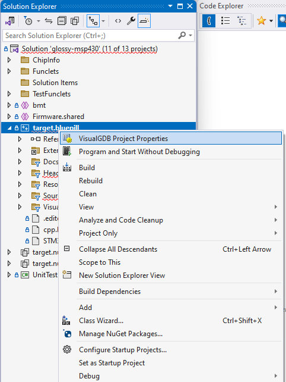
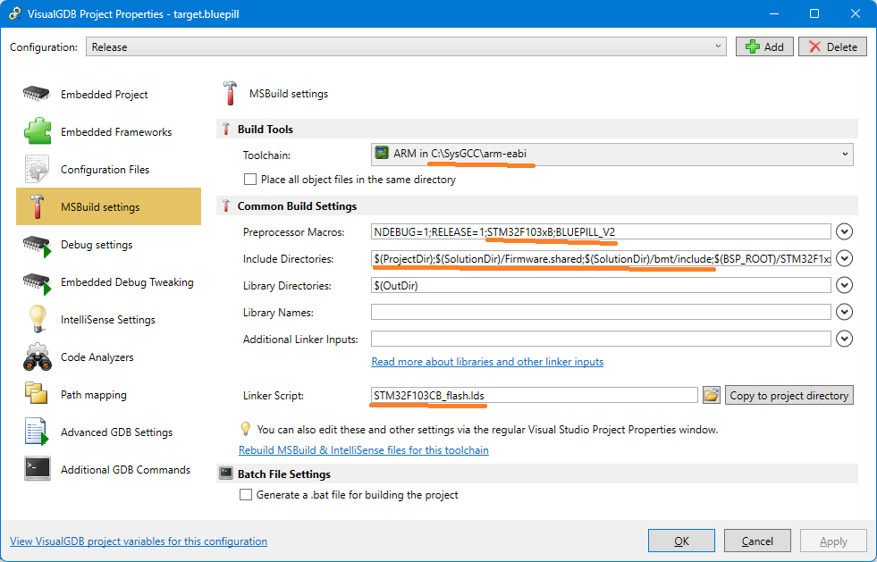
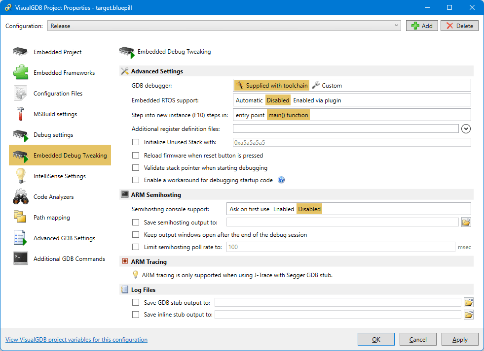
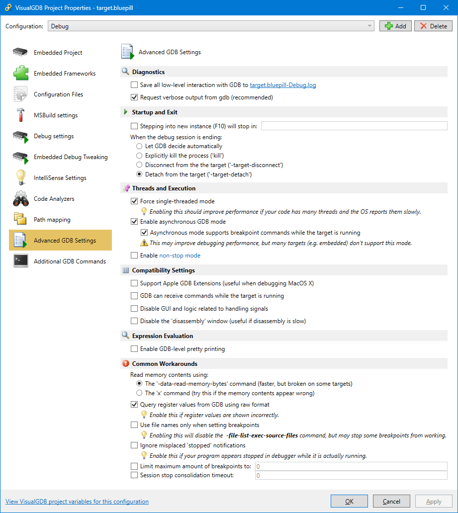
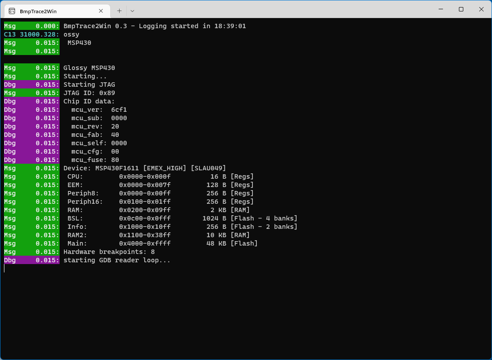
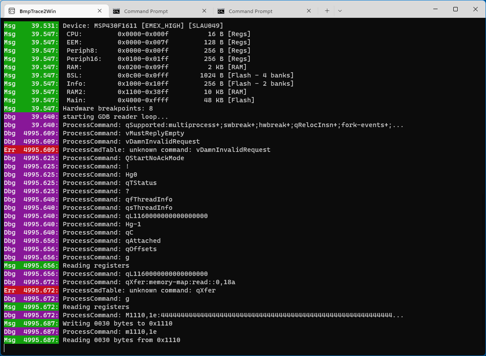

# Brief Description of the Development Environment


## Hardware Tools

The following hardware tools are used for the firmware development:
- A **Glossy-MSP430** prototype board, based on a BluePill, and the design can be found [here](../../Hardware/BlackPill-BMP/README.md).
- A **STLinkV2** converted to [Black Magic Probe](https://github.com/blackmagic-debug/blackmagic). 
  - A [guide can be found on the wiki](https://github.com/grumat/glossy-msp430/wiki/Convert-stlink-to-bmp) to convert a chinese clone into a handy debug tool.
  - Alternatively a usable PCB can be found [here](../../Hardware/STLinkV2/README.md). Costs on JLCPCB can be really cheap and the circuit quality is better than the clone.
- A **Logic Analyzer** is highly recommended. In my case I use the **Kingst LA2016**. A generic Logic Analyzer can also be used as long as transmission speed is kept low.
- Optional JTAG to SWD adapter that can be found [here](../../Hardware/SWD-Adapter/README.md). This tool resolves the hassle when connecting wires from the 20-pin of 
the emulator to 4 pin SWD input of the BluePill.

In the end you will have something similar to the setup of this image:


## Software Tools

The following tools are used for the software development:
- Visual Studio 2022 Community Edition
- VisualGDB
- BMP SWO Trace Viewer. You can use any you like. In my case, I opted to create a tool myself and can be found [here](https://github.com/grumat/BmpTrace2Win).


## Visual Studio Solution

At the root of te repo you will find the **glossy-msp430.sln** file, which is the Visual Studio 2022 solution file.


## VisualGDB Build Settings

To configure VisualGDB, use the **VisualGDB Project Properties**:



> **TODO:** *Update this picture. Project name has changed...*

These are the settings for the prototype firmware development:



> **TODO:** *Update this picture. Lots of compile options has changed...*


## Black Magic Probe Settings

Because Black Magic Probe is not directly supported by VisualGDB a custom settings is required.

A set of settings is required here. The images below display all settings that are working in my environment:

Select **Full Custom Mode**, then the GDB executable and the arguments like in the image below:


Set the **working directory** to `$(TargetDir)` to ensure debug files can find the original sources.  
Because BMP is directly compatible with GDB, no middleware is required, so leave  **GDB Stub** empty.

Very important is how to connect to BMP. Check Windows Device Manager to locate the COM port of your device. The BMP exposes two COM ports, so you have to indicate the proper one.

When you open **Properties** of a COM Port, check on the **Details** tab, if the **Device instance path** corresponds to one of the known values, shown in the table below:

| Path                              | Function                              |
|:---------------------------------:|:--------------------------------------|
| `USB\VID_1D50&PID_6018&MI_00\`... | GDB Compatible debug device           |
| `USB\VID_1D50&PID_6018&MI_02\`... | Virtual COM port used to communicate with our firmware |
| `USB\VID_1D50&PID_6018&MI_04\`... | Trace SWO device                      |
| `USB\VID_1D50&PID_6018&MI_05\`... | DFU device used for BMP firmware upgrades |

See in the image below, that in this example the GDB port is the **COM4**: 


Once you know the debug port of the BMP you need to update the **Target selection command** field of the VisualGDB settings. For this example it would be: 

```
target extended-remote COM4
```

The abbreviated for is also supported:
```
tar ext COM4
```

And if the communication port uses an instance number above 9:
```
tar ext \\.\COM10
```


### Embedded Debug Tweaking Settings Page

Some tweaking is allowed by VisualGDB. This is how it looks in my case:




### Advanced GDB Settings Page

For the **Advanced GDB Settings** page, use the following settings:




### Additional GDB Commands

This page is absolutely important to accomplish a successful connection:


These commands are generally described on the Black Magic Probe documentation, but important points are:

| Command                   | Description                                        |
|:--------------------------|:---------------------------------------------------|
| `monitor swdp_scan`       | BMP connects and detects a MCU using SWD protocol. |
| `monitor traceswo 720000` | Use this command if you want to obtain trace output using my Trace SWO viewer. |
| `attach 1`                | GDB attaches to the device detected by BMP.        |
| `load`                    | Flashes the compiled firmware                      |

Regarding the `set mem inaccessible-by-default off` command this is the description found on the documentation:

> If `on` is specified, make GDB treat memory not explicitly described by the memory ranges as non-existent and refuse accesses to such memory. The checks are only performed if there's at least one memory range defined. If `off` is specified, make GDB treat the memory not explicitly described by the memory ranges as RAM. The default value is `on`. 


## Activating the Trace SWO utility

Once you have connected all devices into the USB bus you can activate the Trace SWO utility. This utility displays a console window where trace data are shown.


## Compiling and Running the Application

To compile a project use **[Ctrl]**+**[Shift]**+**[B]** and **[F5]** to run.

When you press **[F5]** VisualGDB establishes a connection with the **Black Magic Probe** abd downloads the program into the flash memory of the BluePill. Execution then starts.

The Trace SWO viewer would display activities depending on the connected target. In the image below a MSP430F1611 is connected to the JTAG bus of the Glossy MSP430 prototype board like shown in the first picture, and produces the following output:



In the example we can check that the firmware detects MCU identification data and queries the *Chip Database* having approximately 500 devices locating the MSP430F1611. Information about debug capabilities and memory ranges is then dumped to the trace viewer.


## Running a Unit Test

When the solution performs the complete build, a Unit test suite is compiled into:
```bat
$(SolutionDir)\UnitTest\bin\Debug\net6.0
```

Open a console window and `cd` to this folder.

To obtain a brief help simply type the executable name:
```
xxx\glossy-msp430\UnitTest\bin\Debug\net6.0>UnitTest.exe
UnitTest Tool 1.0
=================
Tool that performs unit test on GDB Remote Serial Protocol (RSP) for a MSP430 chip.
USAGE:
    UnitTest <port> <chip> <test_num> [<test_num> ...]
    UnitTest <COMn> <chip> <test_num> [<test_num> ...]
WHERE:
    <port>     : The localhost TCP port number
    <COMn>     : The serial port
    <test_num> : Unit test number
    <chip>     : Chip Number (see ChipDB.xml)
INFORMATIONAL:
    UnitTest list
        Displays a list of the available tests
    UnitTest mcus
        Displays a list of the available MSP430 MCUs templates
```

Some other useful help commands are:

| Command             | Information                       |
|:--------------------|:----------------------------------|
| `UnitTest.exe list` | Lists all implemented unit tests. |
| `UnitTest.exe mcus` | Lists all supported MCUs.         |

Unit tests numbers below 100 are compound tests, which performs several steps in a logical sense forming a complete sequence.  
Test numbers above 100 are one of these steps used by the complete tests. This allows to debug failures on a specific test only. 

The list of supported MCUs is obtained from the `ChipDB.xml` file. More MCUs can be added by providing appropriate entries on this file.

The test #1 executes a non modifying test to recognize basic device functionality. This test replicates a typical GDB connection startup.

For example, to execute the unit test #1 on a MSP430F1611 MCU we type:

```
xxx\glossy-msp430\UnitTest\bin\Debug\net6.0>UnitTest.exe COM3 MSP430F1611 1
SUPPORTED FEATURES
  "PacketSize=a28;QStartNoAckMode+"
  PacketSize a28
  QStartNoAckMode +
REPLY MODE FOR UNKNOWN PACKETS
  OK: '<unsupported>'
  Simulating an invalid request... OK
START NO ACK MODE
SET EXTENDED MODE
  OK: 'OK'
SET THREAD FOR SUBSEQUENT OPERATION
  OK: 'OK'
GET TRACEPOINT STATUS
  OK: '<unsupported>'
REASON THE TARGET HALTED
  T0500:feff0000;01:82000000;
  S=05
  R0=0xfffe
  R1=0x0082
GET THREAD INFO
  OK: 'm0'
  OK: 'l'
OBTAIN THREAD INFORMATION FROM RTOS
  OK: '<unsupported>'
SET THREAD FOR SUBSEQUENT OPERATION
  OK: 'OK'
GET CURRENT THREAD ID
  OK: 'QC0'
QUERY IF REMOTE IS ATTACHED
  OK: '<unsupported>'
GET SECTION OFFSETS
  OK: '<unsupported>'
GET REGISTER VALUES
  R0  = 0x0FFFE
  R1  = 0x0C2EB
  R2  = 0x0FFFF
  R3  = 0x00000
  R4  = 0x00000
  R5  = 0x00000
  R6  = 0x00000
  R7  = 0x00000
  R8  = 0x00000
  R9  = 0x00000
  R10 = 0x00000
  R11 = 0x00000
  R12 = 0x00000
  R13 = 0x00000
  R14 = 0x00000
  R15 = 0x00000
OBTAIN THREAD INFORMATION FROM RTOS
  OK: '<unsupported>'
GET MEMORY MAP
  OK: '<unsupported>'
COMPARE REGISTER VALUES
    WARNING! R1  = 0x00000 (was 0x0C2EB)
    FAILED!
TEST RAM WRITE MIXED PATTERNS
  Using RAM at 0x1110 (30 bytes)
  VERIFICATION ERROR! Got 0x00 instead of 0x44 in address 0x1110

TOTAL TEST DURATION: 0,102 s
```

While the test is executed, the Trace view displays all internal firmware operations:


