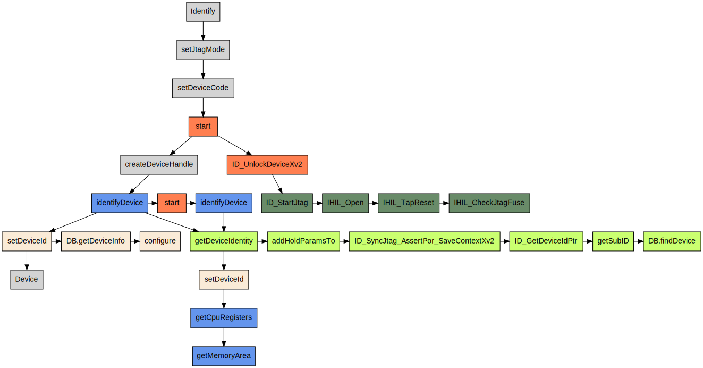

# Step By Step TI Code Tracing

This doc forms a trace of each TI step for the MSP430.dll and the UIF v1 
firmware. We use a python-styled algorithm to broadly describe involved 
methods.

Sample Program:

```cpp
int32_t lVersion; // MSPDebugStack version

// init JTAG interface – TIUSB will use first connected debugger
if(MSP430_Initialize("TIUSB", &lVersion) == STATUS_ERROR)
{
    printf("Error: %s\n", MSP430_Error_String(MSP430_Error_Number())); // print error string
    MSP430_Close(1); // close the debug session
}

// Set target architecture
if (MSP430_SetTargetArchitecture(MSP430) == STATUS_ERROR)
{
    printf("Error: %s\n", MSP430_Error_String(MSP430_Error_Number())); // print error string
    MSP430_Close(1); // close the debug session and turn VCC off
}

// Check firmware compatibility
if(lVersion < 0) // firmware outdated?
{
    // perform firmware update
    if(MSP430_FET_FwUpdate(NULL, NULL, NULL) == STATUS_ERROR)
    {
        printf("Error: %s\n", MSP430_Error_String(MSP430_Error_Number())); // print error string
        MSP430_Close(1); // close the debug session and turn VCC off
    } 
}

// power up the target device
if(MSP430_VCC(3000) == STATUS_ERROR) // target VCC in millivolts
{ 
    printf("Error: %s\n", MSP430_Error_String(MSP430_Error_Number())); // print error string 
    MSP430_Close(1); // close the debug session and turn VCC off 
}

// configure interface - this is optional! automatic interface selection is the default
if(MSP430_Configure(INTERFACE_MODE, AUTOMATIC_IF) == STATUS_ERROR)
{
    printf("Error: %s\n", MSP430_Error_String(MSP430_Error_Number())); // print error string
    MSP430_Close(1); // close the debug session and turn VCC off
}

// If the device is password protected, use MSP430_OpenDevice with appropriate password
if(passwordLen > 0)
{
    if(MSP430_OpenDevice("DEVICE_UNKNOWN", password, passwordLen, 0, DEVICE_UNKNOWN)
        == STATUS_ERROR)
    {
        printf("Error: %s\n", MSP430_Error_String(MSP430_Error_Number())); // print error string 
        MSP430_Close(1); // close the debug session and turn VCC off
    }
}
else 
{
    if(MSP430_OpenDevice("DEVICE_UNKNOWN", "", 0, 0, DEVICE_UNKNOWN) == STATUS_ERROR)
    {
        printf("Error: %s\n", MSP430_Error_String(MSP430_Error_Number())); // print error string
        MSP430_Close(1); // close the debug session and turn VCC off
    }
}

// program .txt file into device memory (optional) 
if(MSP430_ProgramFile("C:\file.txt", ERASE_ALL, verify) == STATUS_ERROR)
{
    printf("Error: %s\n", MSP430_Error_String(MSP430_Error_Number())); // print error string
    MSP430_Close(1); // close the debug session and turn VCC off
}
/**************************** debug session is started ****************************/
```

# MSP430_Initialize

This method just initializes system and creates a connection to the windows 
device. It also checks the firmware version.

The method is not directly required fo the Glossy MSP430 device.


# MSP430_SetTargetArchitecture

This method is also not required by the Glossy MSP430, as it enables support for 
the MSP432.


# MSP430_FET_FwUpdate

This method is not required by the Glossy MSP430, as it implements the firmware 
update for TI devices.

# MSP430_VCC

This method is also not required by the Glossy MSP430.

# MSP430_Configure

This method is used to specify the device interface, such as JTAG SBW or 
automatic. Similar feature will be developed in the future, so this will not 
be covered now.

# Passwords

Currently unsupported.

# MSP430_OpenDevice

```cpp
bool OpenDevice(const char* Device  // "DEVICE_UNKNOWN"
    , const char* Password          // ""
    , int32_t PwLength              // 0
    , int32_t DeviceCode            // 0
    , int32_t setId)                // DEVICE_UNKNOWN (0)
```

This routine is very important for the Glossy MSP430 for device initialization. The dissection of it follows next.

```python
# Handle Special devices
if Device ~ "MSP430C09":
    Set DeviceCode to 0xDEADBABE
elif Device ~ "MSP430I":
    Set DeviceCode to 0x20404020
elif Device one of "MSP430L09", "MSP430C09":
    The DeviceCode parameter shall specify the device code
    Set Interface Mode to JTAG

if Identify():
    Read Memory Area
```

About the snippet above: Not really sure if I am going to support any of MSP430x09 parts. Also user has to have a way to specify the ActivationKey.  
Activation Keys can be found on the device database:

| Part Number  | Activation Key |   ti.com   |
|--------------|:--------------:|:----------:|
| MSP430L09    |   0x5AA55AA5   |   Active   |
| MSP430C09    |   0xDEADBABE   | not listed |
| RF430FRL152H |   0x5AA55AA5   |   Active   |
| RF430FRL152H |   0xA55AA55A   |   Active   |
| RF430FRL153H |   0x5AA55AA5   |   Active   |
| RF430FRL153H |   0xA55AA55A   |   Active   |
| RF430FRL154H |   0x5AA55AA5   |   Active   |
| RF430FRL154H |   0xA55AA55A   |   Active   |


## 1) `Identify()`

```cpp
bool Identify(uint8_t* buffer       // DEVICE_T structure (see MSP430.h)
    , int32_t count                 // sizeof(DEVICE_T)
    , int32_t setId                 // argument DEVICE_UNKNOWN (0)
    , const char* Password          // argument Password
    , int32_t PwLength              // argument PwLength
    , int32_t code)                 // argument DeviceCode
```

The step summary follows below (without MSP432 stuff).

```python
# Validate device database stuff
if Device Database is not valid:
    return Error
if setId not in range of Device Database:
    return Error

# Hardware may draw too much current at startup
Disable over-current protection

# Resolve automatic JTAG interface mode
if Jtag Mode is automatic:
    ifMode = getInterfaceMode   # ID_GetInterfaceMode
    setJtagMode(ifMode)

setDeviceCode(code)     # default is 0

if not start():
    Handle Error states
# After this point, call stop() for new errors
# using the scope of a smart pointer

createDeviceHandle()    # This clears the EemTimer values

if setId is specified:
    # attach to running target
    if getJtagId() fails:
        # if no jtag id was found the device is locked or lpmx.5
        setId = DEVICE_UNKNOWN

if setId is not specified:
    # This will reset and pause the target MCU
    setId = identifyDevice()    # afterMagicPattern = false
    if setId is failure:
        isFuseBlown = isJtagFuseBlown()

        if deviceCode is 0x20404020:
            MSP430I_MagicPattern()
        if no errors and JtagID != 0x89:    # except original MSP430
            magicPatternSend()
        if JtagID == 0x89:
            call HIL_CMD_BSL_1XX_4XX
            start()

        Handle Error States

        # If the device is locked by a password, unlock it
        if has password:
            start()
        # try to identify the device again
        setId = identifyDevice()    # afterMagicPattern = true

        if isJtagFuseBlown()
            return Error
        debug.state = STOPPED

else:
    # this is Attach to running target
    setDeviceId(setId)
    debug.state=RUNNING;

if Device is Legacy:
    return Error

# TODO: Setup Debug Manager
    # Timers
    # Clock
    # Cycle Counter

# Loads device information from database
DeviceDb::Database().getDeviceInfo()

return Device()
```

## 2) `ConfigManager::start()`

```cpp
int16_t ConfigManager::start(
    const string& pwd
    , uint32_t deviceCode)
```
ref: `DLL430_v3\src\TI\DLL430\ConfigManager.cpp`

```python
# if we have an C092 Rom device
if deviceCode == 0xDEADBABE:
    call ID_UnlockC092
    return 1
# if we have an L092 device (RF430Fxx also falls in this class)
elif deviceCode in (0xA55AA55A, 0x5AA55AA5):
    call ID_StartJtagActivationCode
    return 1
# if we have a device locked with a custom password
elif has password:
    call ID_UnlockDeviceXv2
    return 1
# if we have a "normal" msp430 device without special handling
else:
    call ID_StartJtag
    return numberOfDevices
```


## 3) ID_StartJtag

```cpp
HAL_FUNCTION(_hal_StartJtag)
```
ref: `Bios\src\hal\macros\StartJtag.c`

```python
IHIL_Open(RSTHIGH)          # General output activation
    _hil_Open()             # TapMcu::InitDevice()
    # Reset entry sequences.
    _hil_Connect()          # JtagDev::OnEnterTap() - Needs improvement.
IHIL_TapReset()             # ref: Bios\src\hil\uifv1\hil_4w.c
    # six pulses for *Test-Logic-Reset*
    _hil_4w_TapReset()      # JtagDev::OnResetTap()
IHIL_CheckJtagFuse()
    _hil_4w_CheckJtagFuse() # JtagDev::OnResetTap()
```

> This code captures device by means of the debug core.


## 4) `identifyDevice()`

```cpp
int32_t DeviceHandleMSP430::identifyDevice (
    uint32_t activationKey
    , bool afterMagicPattern)       // false for the first-time-call only
```

Ref: `DLL430_v3\src\TI\DLL430\DeviceHandleMSP430.cpp`

Identifies device by calling `getDeviceIdentity()`, then loads PC and SR and combines them
with the other registers.

```python
# Sends default Configurations to POD
    # Most of them shall be retrieved from the Device Database, but not
    # until we identify the exact part. This happens before getDeviceIdentity()
    # returns.

# General validation
if isJtagFuseBlown():
    return Error
if jtagId is not valid:
    return Error
# Read identity values
devId = getDeviceIdentity()
if devId is not valid:
    return Error
# Loads device configuration
setDeviceId(devId)
# Read general registers
getCpuRegisters(devId)
# Cache RAM
getMemoryArea()
```

## 5) `getDeviceIdentity()`

```cpp
long DeviceHandleMSP430::getDeviceIdentity(
    uint32_t activationKey
    , uint32_t* pc
    , uint32_t* sr
    , bool afterMagicPattern)       // false for the first-time-call only
```

Ref: `DLL430_v3\src\TI\DLL430\DeviceHandleMSP430.cpp`

Core of target initialization. Selects the FET procedure, which performs almost 
everything independently.

> A very different behavior happens depending on `afterMagicPattern` flag. IMHO
> this should be split into two distinct routines.  
> Abstraction comes in trouble when **jtagId is 0x99**.

```python
# Selects the FET service ID
select hal_id:
    ID_SyncJtag_Conditional_SaveContextXv2 for isXv2 and afterMagicPattern and jtagId != 0x99
    ID_SyncJtag_AssertPor_SaveContextXv2 for isXv2
    ID_SyncJtag_AssertPor_SaveContext for any other case
# Watchdog hardware register
addHoldParamsTo()
# Copy EEM timers (in etwCodes global var)
for eemTimer in etwCodes:
    appendInputData8(eemTimer)
# Enqueue a double sequence of calls
call hal_id
call ID_GetDeviceIdPtr
# Return values depends on hal_id value
wdtCtrl = pop() # WDT original value.
if hal_id != ID_SyncJtag_Conditional_SaveContextXv2:
    *pc = pop()
    *sr = pop()
else:
    *pc = ReamMemWord(0xFFFE)   # reset interrupt vector
    *sr = 0
# Load device identity information
deviceIdPtr = pop()
if not Xv2:
    idDataAddr = pop()
    idCode.version = ReadMemWord(idDataAddr)
    idCode.subversion = 0x0000
    idCode.revision = ReadMemWord(idDataAddr + 2).low()
    idCode.fab = ReadMemWord(idDataAddr + 2).high()
    idCode.self = ReadMemWord(idDataAddr + 4)
    idCode.config = ReadMemWord(idDataAddr + 12).high() & 0x7f
    idCode.fuses = GetFuses()
    idCode.activationKey = 0
else:
    # must be xv2 CPU device 99, 95, 91
    idCode.version = ReadMemWord(deviceIdPtr + 4)
    idCode.subversion = 0x0000                              # init with zero = no sub id
    idCode.revision = ReadMemWord(deviceIdPtr + 6).low()    # HW Revision
    idCode.config = ReadMemWord(deviceIdPtr + 6).high()     # SW Revision
    # Some irrelevant "no open source" comes here
    idCode.subversion = getSubID()
    call ID_EemDataExchangeXv2
    eemVersion = pop()      # This is nowhere used!!!
    # Other values are irrelevant. Set to unlikely values...
    idCode.fab = 0x55
    idCode.self = 0x5555
    idCode.fuses = 0x55
    idCode.activationKey = activationKey

# Query the database
return DeviceDb::Database().findDevice(idCode)
```

Tons of interaction between DLL and firmware. Moving more *intelligence* into the POD would drastically improve performance.

## Glossy MSP430 Equivalence Table

| FET | Glossy MSP430 |
| --- | ------------- |
| MSP430_OpenDevice() | TapMcu::Open() |
| Identify()          |  |
| start()             | TapMcu::InitDevice() |
| ID_UnlockDeviceXv2  |  *not ported* |
| ID_StartJtag        | TapMcu::OnConnectJtag() |
| IHIL_Open           | JtagDev::OnEnterTap() |
| IHIL_TapReset       | JtagDev::OnResetTap() |
| IHIL_CheckJtagFuse  | JtagDev::OnResetTap() |
| IdentifyDevice      |  |

## 6) `ID_GetDeviceIdPtr`

Ported to `ITapDev::GetDevice()`. Specializations are `TapDev430Xv2::GetDevice()`

## 7) `getSubID()`

## 8) `ID_EemDataExchangeXv2`

## 9) `setDeviceId`

```cpp
int32_t DeviceHandleMSP430::setDeviceId (long id)
```

Device is located in the database and all configurations are set
in this routine, such as the EEM timers.

```python
if DeviceDb.getDeviceInfo():
    configure()
```

## 10) `Device()`

Fills the `Device_t` structure returned by the driver.

## Rough Call Graph

A rough call graph for Xv2 CPU case is shown below:



# MSP430i20xx Acquisition — the "JTAG password" (issue #43)

This section traces, end to end, what the official tool does to bring up an
**MSP430i20xx** part (i2020/i2021/i2030/i2031/i2040/**i2041**). Glossy currently
fails this device with `jtag_init: no device found` on **both** SBW and JTAG
(`.claude/issues/043-i20xx-jtag-access-password.md`). The TI sources show the
"password" the user remembered is **not** a data word / JTAG-mailbox key — it is a
**timed TEST/RST pulse pattern** (the *BSL entry sequence*) that resets the running
device and parks it in LPM4 so the TAP can be captured.

## Why this family is special

The i20xx is a **legacy `0x89` CPU** (not Xv2). It has **no JTAG-mailbox /
MagicPattern mechanism** — the `0xA55A` JMB trick glossy uses in
`TapMcu::InitDevice()` (`Firmware.shared/drivers/TapMcu.cpp:148`) does not exist on
this part. A running or locked i20xx therefore never yields a valid JTAG-ID on the
normal RST-high entry, and there is no mailbox to halt it. The **only** way in is the
BSL entry sequence on the TEST/RST (SBWTCK/SBWTDIO) pins.

## How the device is selected (host side)

The i20xx cannot be auto-discovered before it is halted (chicken-and-egg: you need
the ID to know to halt it, but you must halt it to read the ID). TI resolves this by
having the **host pick the family explicitly**: `MSP430_OpenDevice("MSP430I", …)`
maps the name to **`deviceCode = activationKey = 0x20404020`** (see the dissection at
the top of this doc, ~line 128, and `ConfigManager`/`DeviceHandleMSP430`). That
constant is the switch that selects the BSL-entry acquisition strategy everywhere
downstream.

Add the family to the activation-key table:

| Part Number  | Activation Key | Acquisition macro |
|--------------|:--------------:|:-----------------:|
| MSP430I20xx  |  `0x20404020`  | `ID_Reset430I` (BSL entry) |
| MSP430L09    |  `0x5AA55AA5`  | `ID_StartJtagActivationCode` |
| MSP430C09    |  `0xDEADBABE`  | `ID_UnlockC092` |

## Acquisition call path (deviceCode `0x20404020`)

```python
# Identify(): first pass with afterMagicPattern=false fails (no valid id)
setId = identifyDevice(afterMagicPattern=False)   # -> failure on i20xx
if setId is failure:
    isFuseBlown = isJtagFuseBlown()
    if deviceCode == 0x20404020:
        ConfigManager::MSP430I_MagicPattern(AUTOMATIC_IF)   # <-- the i20xx path
    ...
    setId = identifyDevice(afterMagicPattern=True)          # re-identify, now succeeds
```

`ConfigManager::MSP430I_MagicPattern(ifMode)`
— ref `DLL430_v3/src/TI/DLL430/ConfigManager.cpp:510`:

```python
# AUTOMATIC_IF expands to two attempts; otherwise the single forced mode
modes = [SPYBIWIRE_IF, SPYBIWIREJTAG_IF] if ifMode == AUTOMATIC_IF else [ifMode, ifMode]
for mode in modes:
    setJtagMode(mode)
    start()                       # ID_StartJtag for a plain 0x89 part
    el = HalExecElement(ID_Reset430I)
    if send(el) and el.chainLen > 0 and el.jtagId == 0x89:
        return 0                  # acquired
return -1
```

Note it tries **SBW first, then 4-wire JTAG** — both transports run the *same*
`ID_Reset430I` macro, which is exactly why issue #43 sees identical failures on both:
the missing piece (BSL entry) is transport-shared, not a wiring fault.

`_hal_Reset430I` — ref `Bios/src/hal/macros/Reset430I.c`:

```python
IHIL_BSL_EntrySequence(1)   # TEST/RST pulse pattern -> device now halted in LPM4
IHIL_Delay_1ms(500)
IHIL_Open(RSTHIGH)          # normal JTAG entry, RST high
IHIL_TapReset()
IHIL_CheckJtagFuse()
id = cntrl_sig_capture()    # IR = CNTRL_SIG_CAPTURE
if id == JTAGVERSION:       # JTAGVERSION == 0x89  (Bios/src/hal/JTAG_defs.h:85)
    return chainLen=1, jtagId=0x89, protocol=SPYBIWIREJTAG
return -1
```

After acquisition, `DebugManagerMSP430::wakeupDevice()`
(`DLL430_v3/src/TI/DLL430/DebugManagerMSP430.cpp:414`) **also** routes `0x20404020`
back through `MSP430I_MagicPattern` instead of the generic TST/RST pin-wiggle, so the
BSL entry is re-applied on every wake.

## The BSL entry sequence (the actual "key")

Ref `Bios/src/hil/uifv1/hil430.c:860` (`_hil_BSL_EntrySequence`). The waveform from
the source comment:

```
                     __________     <15us    __________
Test/SBWTCK ________|          |____________|          |___
                                                __________
RST/SBWTDIO ____________________________________|
                                               BSL Enabled here!!
```

Two implementations share the function, picked by `gprotocol_id`:

- **SPYBIWIRE (2-wire)** — drives `sbwclk` as **TEST** and `sbwdato` as **RST**
  (`hil430.c:862`). This is the form glossy's STLinkV2 SBW transport needs.
- **4-wire JTAG** — drives the dedicated `TEST`/`RST` lines plus TCK
  (`hil430.c:890`).

The timing-critical edge is the **single TEST low pulse held < 15 µs**
(`_hil_Delay_1us(10)` in both branches); the surrounding settle steps are 100 ms
(uifv1) and are not critical. The `ez_fet` build has the same shape with shorter
settle delays (`Bios/src/hil/ez_fet/hil.c:451`) — note the user's caveat that eZ-FET
is SBW-centric; the **uifv1** path is the more complete reference for the 4-wire case.

## Config bit that follows from `0x20404020`

`DeviceHandleMSP430::identifyDevice` sets
`assertBSLValid = (activationKey == 0x20404020)` and forwards it as
`CONFIG_ASSERT_BSL_VALID_BIT` to the POD
(`DLL430_v3/src/TI/DLL430/DeviceHandleMSP430.cpp:187,199`). This tells the firmware
the device's BSL/reset vector is valid after the entry sequence — relevant once the
later SyncJtag/SaveContext step runs.

## What Glossy is missing (port plan for #43)

| TI step | Glossy today | Needed |
|---------|--------------|--------|
| `deviceCode == 0x20404020` selector | not handled | add an i20xx branch in `TapMcu::InitDevice()` alongside the MagicPattern fallback (`Firmware.shared/drivers/TapMcu.cpp:148`) |
| `IHIL_BSL_EntrySequence` | **no primitive** | new `JtagDev` method emitting the TEST/RST pulse train; SBW form drives SBWTCK/SBWTDIO, 4-wire form drives TEST/RST+TCK |
| `ID_Reset430I` orchestration | n/a | BSL-entry → 500 ms → `OnEnterTap(rst_low=false)` → `OnResetTap()` → fuse-check → `IR_Shift(kCntrlSigCapture)` expecting `0x89` |
| `0x89` → legacy traits | already works | route to `TapDev430` (the existing `msp430legacy_` path) |

Glossy's `OnEnterTap` (`Firmware.shared/drivers/JtagDev.h:67`) currently performs only
the slau320aj fuse-check entry — it does **not** include a BSL entry sequence, so the
new primitive is genuinely additive, not a tweak of the existing entry.

### Bench-confirmed (i2031, 2026-06-05)

Confirmed by pinning the transport in `MinimalMSP430_dll` via
`MSP430_Configure(INTERFACE_MODE, value)`: plain **`JTAG_IF` fails**, while
**`SPYBIWIREJTAG_IF`** (4-wire + SBW-style TEST activation) and **`SPYBIWIRE_IF`**
both succeed. The "password" is the **BSL Entry Sequence** (TEST/RST pulse train) that
halts the running CPU into LPM4, **not** a data word — after a `SPYBIWIREJTAG`/SBW open
the TAP returns JTAG ID **`0x89`**. Full decode in
`.claude/docs/msp430/I2031_ACQUISITION_GOLDEN_REFERENCE.md`
(decoder `supp/docs-ai/decode_jtag_fsm.py`).

> **Correction.** An earlier note here claimed the fix was stretching the RST-low
> hold in `JtagDev::OnEnterTap` from 50 µs to ~5 ms. That was **wrong** (it read a
> mixed `AUTOMATIC_IF` capture). TI's working entry keeps that hold at ~40 µs; the
> long dwell that matters is the **BSL train (~71 ms 4-wire / ~701 ms SBW) plus the
> 500 ms LPM4 settle** in `_hal_Reset430I` — which `OnEnterTap` does not perform. The
> `slow_settle` patch was reverted; the real fix is the additive BSL preamble in the
> "What Glossy is missing" table above.

# Conclusion

Based on this analysis the EEM Timers are never set, as the only 
possible way to have it's values occurs after the **DB.findDevice**
and **setDeviceId** steps, which occurs after 
`ID_SyncJtag_AssertPor_SaveContextXv2`.

> At the moment these are already ported. On a extreme case we can 
> disable this information and free near 1K flash memory.
