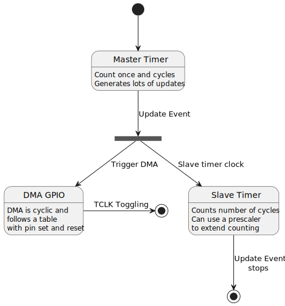

# <big>`TimDmaWave` Template Documentation</big>

This was designed for hardware autonomous **JTCLK** pulse generation. But can be reused to produce any kind of "wave" on a single GPIO port.  
This implementation generates a programmable count of DMA transfers (limited to 65534 transfers) and is ideal when **TIM1** is not available. It also circumvents the 8-bit limitation of the **RCR** register.


# TCLK Strobes

The TCLK signal is an input clock that must be provided to the MSP430 target device from the debugger hardware. This clock is used internally as the system clock of the target device, to load data into memory locations and to clock the CPU. 

For MSP430 devices from the F1xx, F2xx, G2xx, and F4xx families, writing to flash memory requires a custom number of TCLK clocks provided through the TDI pin. This implementation is not applicable for the F5xx or F6xx devices. For those devices, the flash timing is generated internally.

So, glossy-msp430 provides a clock signal in the range of 350 kHz (+/- 100 kHz), for these MSP430 families with the help of `TimDmaWave` template class.


# Requirements and Properties

The following MCU resources are required to implement this class:
- A reference to **system clock** data-type
- A **master** timer
- A **slave** timer
- The frequency of the timer tick to generated each wave toggle.
- The **DMA channel** for the *Update Event* of the master timer to toggle the GPIO pin
- The **DMA Channel** for the *Update Event* of the slave timer that will turn operation off when the programmed toggle count is reached.

> When selecting timers, be careful to check if all those resources are available.

<div hidden>
```
@startuml TimDmaWave_1
state "Master Timer" as Master
Master: Count once and cycles
Master: Generates lots of updates
state fork_update <<fork>>
state "Slave Timer" as Slave
Slave: Counts number of cycles 
Slave: Can use a prescaler 
Slave: to extend counting
state "DMA GPIO" as Gpio
Gpio: DMA is cyclic and
Gpio: follows a table
Gpio: with pin set and reset
state Pin <<end>>
[*] --> Master
Master --> fork_update : Update Event
fork_update --> Slave : Slave timer clock
fork_update --> Gpio : Trigger DMA
Gpio -right-> Pin : TCLK Toggling
Slave --> [*] : Update Event\nstops
@enduml
```
</div>




# Typical usage

The example below shows an example:

```cpp
using namespace bmt;
using namespace bmt::Timer;

// Use PA7 for TCLK signal
typedef AnyOut<Port::PA, 7, Speed::kFast, Level::kHigh> JTCLK;
// Instance of
typedef TimDmaWav<
	SysClk					// Reference to clock tree
	, Timer::kTim3			// Timer that generates transfers
	, Timer::kTim2			// Timer that counts transfers
	, 2 * 450000			// Frequency: two pulses for a cycle (450kHz)
	, 2						// Counter prescaler: each pulse has two borders
	> JtclkWaveGen;

void Do()
{
	// 
	static const uint32_t bsrr_table[] =
	{
		JTCLK::kBitValue_ << 16,	// reset bit
		JTCLK::kBitValue_,			// set bit,
	};
	JtclkWaveGen::Init();
	JtclkWaveGen::SetTarget(&JTCLK::Io().BSRR, bsrr_table, _countof(bsrr_table));
	// Sends 3000 pulses and wait
	JtclkWaveGen::RunEx(3000);
}
#endif
```


# General Internal Description

These are the implementation details of this template class:
- The class takes the clock tree to compute divisors and prescalers and obtain the desired frequency.
- The first timer is configured with the following settings:
  - As master timer
  - Prescaler value computed to obtain the desired update frequency
  - A single count step, so prescaler determines the update frequency
  - Update events will trigger a GPIO DMA transfer
- The DMA assigned to the master timer update event:
  - Uses a simple table to toggle the bit on and off
  - It is in cyclic mode, so table will be repeated to generate the periodic frequency
- The second timer is configured with the following settings:
  - As slave timer
  - Uses master's update event as clock source
  - A prescaler value can be set so it is possible to increase the total amount of counts beyond the limit imposed by timer registers.
  - By default, the prescaler value should match the count of entries of the master DMA table. This way counter reflects the total amount of cycles we want to generate.
  - The update event of the slave timer will stop the master timer.
- This "Stop DMA" unit has following characteristics:
  - When it is triggered, it copy the value of a variable to the `CR1` register of the master timer 
  - The variable is initialized with the `CR1` value before the count is launched. This way counter is turned off when the desired count has reached.
