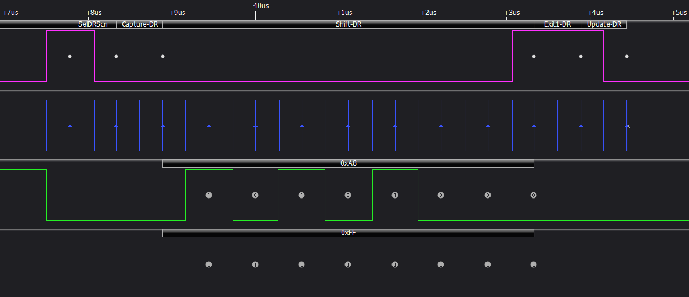

# <big>`TmsAutoShaper` Template Class Documentation</big>

If one looks at the documentation of the JTAG interface it will notice that the **CLK**, **TDI** and **TDO** are compatible with the standard SPI interface, **SCK**, **MOSI** and **MISO** signals. 

The main problem with the SPI bus is that it has no way to generate the **TMS** signal autonomously. This template class was designed to produce the **TMS** signal in an autonomous way for very high SPI frequencies, using a timer for it. 


# Morphology of the **TMS** Signal

The **TMS** signal controls the state of the internal state machine during data transfer. 

This image shows the JTAG state machine implemented on a MSP430 MCU:


## The *Debug-Logic-Reset* State

Normally after a reset, **TMS** is held on high level and when you attach to a MCU after reset the state machine is in *Debug-Logic-Reset*. A rising edge of the **CLK**
line will sample the **TMS** line level and modify the state machine according to that image.

So after a reset, as long as you keep the **TMS** high, clocking the **CLK** input will keep the Debug Logic in the reset state.

Now imagine that you attach to a running MCU and for any reason the Debug logic is not on a reset state. Thus, it is recommended to send at least 6 clocks with the **TMS** signal in high state to ensure that the state machine falls back to the *Debug-Logic-Reset* state.


## The *Run-Test/Idle* State

To enter the state machine on a debug state, we have to clock **CLK** with **TMS** low. Once it enters the *Run-Test/Idle* you can continue clock as many times you wish that the state machine will keep locked in this state.

This is a key characteristic that allows us to use the SPI interface to control the JTAG. On the **STM32F1xx** MCU you have not much flexibility to send variable size data using the SPI interface. you are limited to 8-, 16- and 32-bits. So, we opt to send more SPI bits than necessary, but surround them with filler bits keeping the state machine in *Run-Test/Idle* mode. 


## The *Select-DR-Scan* and *Select-IR-Scan* State Series

These states are used to transfer data or instruction, respectively. The single difference is that an additional `TMS=1` cycle is required for an instruction. 

Note that these state machines are quite complex allowing pauses and alike. Though, for our application, states *Pause-DR*, *Pause-IR*, *Exit2-DR* and *Exit2-IR* will not be used.

Also not clear on that picture, *Capture-DR* and *Capture-IR* requires two cycles.

So in respect of the **TMS** signal, we have a total of two positive cycles. The first positive slope is to enter either *Select-DR-Scan* or *Select-IR-Scan* states. It is either one or two cycles wide.

Then **TMS** stays at low during the entire data transfer, until the last data bit is reached.

The last bit matches to the *Exit1-DR* / *Exit1-IR* states and is followed by an additional *Update-DR* / *Update-IR* cycle to apply the data into the target device register.

This image shows the a typical DR transfer of the `0xA8` value:



>  Note the state description of the top of the image.


# Insertion of the **TCLK** Into the **TDI** Signal.

Many **MSP430** documentation and schematics clearly describes that the **TDI** and **TCLK** shares the same pin. Although it may seem a bit confusing, the trick is just very simple: Cycles where the JTAG state machine is running in the *Run-Test/IDLE* are interpreted as **TCLK**, while all other conditions a **TDI** signal is fetched.

So, transitions of this signal when the JTAG state machine is on *Run-Test/IDLE* state will clock the CPU core. So it is important to keep this level unchanged if we don't want to modify the MCU state.

The `TmsAutoShaper` template class expects an argument with the current pin state before a JTAG transaction happens. 

> The image presented on the previous topic, shows on purpose a case where the previous state of the **TCLK** value was not used, as required by this class.  
Lets explain the reason: Observe the top three signals (TMS, CLK and TDI respectively). Because the JTAG interface updates itself on the rising edge of the clock, the level transient of the TDI line, is interpreted as a clock level change of the **TCLK**, because the JTAG state machine is on the *Run-Test/Idle* state.  Sometimes this is desired, but normally this would be a very subtle error, that interferes the state of the target MCU.


# Defining a `TmsAutoShaper` Data-Type

```cpp
typedef TmsAutoShaper<
    SysClk,             // The clock tree data-type
    > MyTmsGenerator;
```


