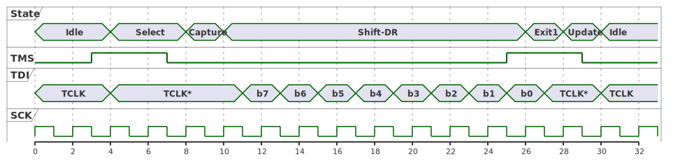

# <big>`TmsAutoShaper` Template Class Documentation</big>

If one looks at the documentation of the JTAG interface it will notice that the **CLK**, **TDI** and **TDO** are compatible with the standard SPI interface, **SCK**, **MOSI** and **MISO** signals. 

The main problem with the SPI bus is that it has no way to generate the **TMS** signal autonomously. This template class was designed to produce the **TMS** signal in an autonomous way for very high SPI frequencies, using a timer for it. 


# Morphology of the **TMS** Signal

The **TMS** signal controls the state of the internal state machine during data transfer. 

This image shows the JTAG state machine implemented on a MSP430 MCU:


## The *Debug-Logic-Reset* State

Normally after a reset, **TMS** is held on high level and when you attach to a MCU after reset the state machine is in *Debug-Logic-Reset*. A rising edge of the **CLK**
line will sample the **TMS** line level and modify the state machine according to that image.

So after a reset, as long as you keep the **TMS** high, clocking the **CLK** input will keep the Debug Logic in the reset state.

Now imagine that you attach to a running MCU and for any reason the Debug logic is not on a reset state. Thus, it is recommended to send at least 6 clocks with the **TMS** signal in high state to ensure that the state machine falls back to the *Debug-Logic-Reset* state.


## The *Run-Test/Idle* State

To enter the state machine on a debug state, we have to clock **CLK** with **TMS** low. Once it enters the *Run-Test/Idle* you can continue clock as many times you wish that the state machine will keep locked in this state.

This is a key characteristic that allows us to use the SPI interface to control the JTAG. On the **STM32F1xx** MCU you have not much flexibility to send variable size data using the SPI interface. you are limited to 8-, 16- and 32-bits. So, we opt to send more SPI bits than necessary, but surround them with filler bits keeping the state machine in *Run-Test/Idle* mode. 


## The *Select-DR-Scan* and *Select-IR-Scan* State Sequences

These states are used to transfer data or instruction, respectively. The single difference is that an additional `TMS=1` cycle is required for an instruction. 

Note that these state machines are quite complex allowing pauses and alike. Though, for our application, states *Pause-DR*, *Pause-IR*, *Exit2-DR* and *Exit2-IR* will not be used.

Also not clear on that picture, *Capture-DR* and *Capture-IR* requires two cycles: one to enter the state and the other to switch to the next state, after **TMS** falls (see picture below). 

So in respect of the **TMS** signal, we have a total of two positive cycles. The first positive slope is to enter either *Select-DR-Scan* or *Select-IR-Scan* states. It is either one or two cycles wide.

Then **TMS** stays at low during the entire data transfer, until the last data bit is reached.

### The *Exit1-DR* and *Exit1-IR* States to End the Sequence

The last bit matches to the *Exit1-DR* / *Exit1-IR* states and is followed by an additional *Update-DR* / *Update-IR* cycle to apply the data into the target device register.

This image shows the a typical DR transfer of the `0xA8` value:


> **Note 1:** the state description of the top of the image.  
> **Note 2:** This example intentionally has a flaw, to illustrate **TCLK** behavior, illustrated on the next topic


# Insertion of the **TCLK** Into the **TDI** Signal.

Many **MSP430** documentation and schematics clearly describes that the **TDI** and **TCLK** shares the same pin. Although it may seem a bit confusing, the trick is just very simple: Cycles where the JTAG state machine is running in the *Run-Test/IDLE* are interpreted as **TCLK**, while all other conditions a **TDI** signal is fetched.

So, transitions of this signal when the JTAG state machine is on *Run-Test/IDLE* state will clock the CPU core. So it is important to keep this level unchanged if we don't want to modify the MCU state.

The `TmsAutoShaper` template class expects an argument with the current pin state before a JTAG transaction happens. 

> The image presented on the previous topic, shows **on purpose** a case where the previous state of the **TCLK** value was not kept, as required by this class.  
Lets explain the reason: Observe the top three signals (TMS, CLK and TDI respectively). Because the JTAG interface updates itself on the rising edge of the clock, the level transient of the TDI line, is interpreted as a clock level change of the **TCLK**, because the JTAG state machine is still on the *Run-Test/Idle* state.  Sometimes this is desired, but normally this would be a very subtle error, that interferes the state of the target MCU.


# Defining a `TmsAutoShaper` Data-Type

```cpp
typedef TmsAutoShaper<
    SysClk,             // The clock tree data-type
    Timer::kTim1,       // TIM1 (TI1 input)
    Timer::Channel::k3, // CCR3 output is used
    0                   // Disable timer input filter
    > MyTmsGenerator;
```


# Principle of Operation

The class consists of the following assumptions:
- We enable shadow registers for the following timer registers:
  - **ARR**
  - **CCR3**
- **TMS** pulse is initially at level 0
- **TI1** input shall be used so we can clock once per input edge. 
- **SCK** output of the SPI device is directly connected to the **TI1** input of the timer.
- **SCK** is initially at level 1. This corresponds SPI operating with `CPHA=1`.
- All JTAG bus operations on the bus are sampled on the rising edge of the clock. This corresponds SPI operating with `CPOL=1` when `CPHA=1`. 
- As soon as we start the timer it counts one unit up. 
- A dummy bit is used at the start to avoid switching **TMS** state at "*count 0*".


## Use of the Preload and Shadow Registers

The STM32 implements preload and shadow registers for the `ARR`, `PSC` and `CCRx` registers (see **14.3.2**, **Figure 60** and **14.3.5** of the RM0008 Rev 21 User's Guide).

The main trick of this template class is that we use the PWM to generate two pulses with different start and width, just by using the shadow register of `CCRx` and `ARR` (just to recall: `CCRx` sets the value where the PWM changes polarity and `ARR` reverses polarity and resets `CNT` counter). 

> The initial pair of values are programmed and the timer is updated, to load them into the real registers (`TIMx_EGR.UG` event); then, the second value pair is loaded, but this time, without the `TIMx_EGR.UG` event. When the timer is enabled and first cycle ends the internal *update event* assigns the shadow register contents to the actual registers and starts the new cycle.


## Programming the Values

So at every edge of the **SCK** signal the timer counter will increase count by one unit and we have to program two **TMS** cycles, using a total of 4 parameters:
- The *Select-DR-Scan* / *Select-IR-Scan* startup sequence:
  - In what count value the **TMS** rises at the first time 
  - How many clock input edges that **TMS** will keep high, considering that the ARR value runs until the next clock edge, when counter reset happens (remember there is no timer with a *0 interval*)
- The *Exit1-DR* / *Exit1-IR* closing sequence:
  - Considering that the PWM resets counter on the previous step, program the next counter value where **TMS** rises again.
  - How many edges we have to keep **TMS** high for the second time.


## Example 1: The DR Transaction

To exemplify a typical use case, lets take a DR transfer of 8-bit data.
Intervals for TMS are **(3, 4]** and **(18, 21]** for the first and second cycles. 

<div hidden>
```
@startuml dr8_xmit_example_dr
concise "State" as C
binary "TMS" as TMS
concise "TDI" as TDI
clock "SCK" as SCK with period 2 offset 0
scale 2 as 54 pixels
@0
C is Idle
TDI is TCLK
TMS is low
@3
TMS is high
@4
C is Select
TDI is "TCLK*"
@5
TMS is low
@6
C is Capture
@8
C is Shift-DR
@9
TDI is b7
@11
TDI is b6
@13
TDI is b5
@15
TDI is b4
@17
TDI is b3
@19
TDI is b2
@21
TDI is b1
@23
TMS is high
TDI is b0
@24
C is Exit1
@25
TDI is "TCLK*"
@26
C is Update
@27
TMS is low
@28
C is Idle 
TDI is TCLK
@29
@enduml
```
</div>


The following points are important to notice:
- The **SCK** clock is sampled through **TI1** timer input and sensitive to both edges, which means timer counter value is increased twice per SPI bit.
- The first pulse starts when counter has value **3** and is sampled by the target when the counter has value **4** (the rising edge). This is represented by the state change, that happens just on the next **SCK** edge. 
- Since the counter is inclusive at the right edge (i.e. value of the `ARR` register) **TMS** pulse widths are subtracted by 1, because count number 4 holds **TMS** high just until the next clock edge.
- On edge 5, timer counter is reset, because of the programmed **ARR** value. 
- Since bus is sampled at the rising edge of the clock, we have to output data at the falling edge, that precedes the instant of the sample. This can be noticed on the **TMS** and **TDI** line transitions when compared to the **State** representation. 
- On the 9th edge, the first data bit is written to the **TDI** bus, but sampled on the 10th **SCK** edge. Note that the sequence is from *msb* to *lsb*.
- The second pulse starts on edge **23**, and signals the last data bit.  
This corresponds to timer counter value **18**, since the counter was reset on the **5th** edge.  
So **23 - 5 = 18**.
- The **TCLK** signal is active only on the *Idle* state. Since the TDI line does not participate on the interval between *Idle* to *Shift-DR* and *Shift-DR* to *Idle*, it is left constant with the current **TCLK** value. 


## Example 2: The IR Transaction

For completeness the diagram below shows an IR transaction:

<div hidden>
```
@startuml dr8_xmit_example_ir
concise "State" as C
binary "TMS" as TMS
concise "TDI" as TDI
clock "SCK" as SCK with period 2 offset 0
scale 2 as 54 pixels
@0
C is Idle
TDI is TCLK
TMS is low
@3
TMS is high
@4
C is Select
TDI is "TCLK*"
@7
TMS is low
@8
C is Capture
@10
C is Shift-DR
@11
TDI is b7
@13
TDI is b6
@15
TDI is b5
@17
TDI is b4
@19
TDI is b3
@21
TDI is b2
@23
TDI is b1
@25
TMS is high
TDI is b0
@26
C is Exit1
@27
TDI is "TCLK*"
@28
C is Update
@29
TMS is low
@30
C is Idle
TDI is TCLK
@31
@enduml
```
</div>



> Except for the width of the first **TMS** pulse, both diagrams are the same. So, intervals programmed for TMS are **(3, 6]** and **(18, 21]**.


# Timer Latencies

The STM32 timer implementation has internal signal propagation latencies that can be noticed when input clock frequency happens on the range of 1/8 the master clock frequency. On this frequency we observe that internal timer latencies are so long that the next edge of the clock happens before the effects of the previous edge applies, causing a phase shift of the edges.

On a STM32F103 running at 72 MHz we observe this effect when SPI communicates at 9 MHz (CLK/8), still supported by the SPI peripheral and the MSP430 JTAG bus. Even though the timer is connected at 72 MHz clock, it requires sufficient cycles to produce the result. Because this effect shifts the reactions by a complete clock phase, it is not possible to use the timer as a TMS signal generator, like in SPI frequencies of 4.5 MHz and below (recall that SPI does not have a very flexible prescaler, so steps are gross). 

> SPI rates beyond 9MHz are not possible on this hardware and would overload the MSP430 JTAG frequency limit. 

To accomplish this, we added a possibility to anticipate the transitions by one cycle, to compensate the inherent latency. 

So, for the examples above, the programmed values are: 
- 8-bit DR transfer: **(2, 3]** and **(17, 21]**
- 8-bit IR transfer: **(2, 5]** and **(17, 21]**


# The <big>`SpiJtagDataShift` Template Class</big>

This template class uses the knowledge discussed above to implement a complete solution, that transfers data in high quality and speed, using SPI peripheral and **TMS** signal using a timer.

> Note that hardware support is required to pump SPI **SCK** output to the timer **TI1** input. This excludes the standard ST-Link design and clones.

# The Benefits of This Template Class

The benefits of this class are:
- Signal has excellent quality, because slopes/pulses are always symmetric
- Selectable transfer rate. 
- Transfers can happen independently of the CPU, which can be used to accomplish other tasks
- Interrupts and DMA can be active without interfering the output. 


## Signal Quality

On a connection with limited band-pass response, the shortest and largest produced pulse determines the success of a transmission. 

A typical bit-banging output has many variations along the different pulse widths that depends on each algorithm. While developing an output using bit-banging we tend to have longer and shorter durations on each edge of the signal. 

For MSP430 JTAG bus, no single pulse can be shorter than **50 ns**.

Some software artifacts will affect the final result: 
- Code complexity for each transmitted bit
- Optimization applied by the compiler
- Internal core optimizations on ARM may reduce the effect of operation because of instruction prefetching and more advanced CPU cores will increase the timing complexities.

Not uncommon, physical limits for cabling, affects the maximal frequency. You will not be able to transmit data without reducing the frequency. 


## Transfer Rate

It can be a challenge to calibrate adjustable transfer rate using bit-banging, except if you stop DMA and interrupts completely, which could be an issue for the final system, specially on slower speeds where locking the CPU could impact in other I/O activities.

SPI offers, even not so flexible as with other brands, a way to program bus frequency. This allows one to set a operating frequency that is compatible to the physical constraints. 


## Release CPU from Data Transfer

Bit-banging typically locks the CPU for the transfer task. you cannot handle any other activity.  Using the SPI bus you can release the CPU from the transfer activity and use solutions like *ping-pong buffers* to prepare the next transfer, reducing latencies. 

Also not every send operation requires that the received packet is inspected, so it is possible to save the time to decode results, if not necessary. 

> Current firmware implementation is synchronous, requiring MCU to stop while transmission happens. A redesign is planed. 


## Keep Interrupts and DMA Active

The possibility not to lock the CPU for bit-banging, allows one to perform additional operations, specially with the USB bus, which is handling other I/O activities. 

This can help increase the overall performance. 


# Using the Template Class

The following prerequisites are required to use the `SpiJtagDataShift` template class. 


## The `ScanType` Enumeration

As already covered before, JTAG allows two types of transfers: The **IR** transfer and the **DR** transfer, to access instruction or data registers, respectively. 

It allows two values and is defined as follows:

```cpp
/// Which of the JTAG register we want to read/write
enum ScanType : uint8_t
{
	kSelectDR_Scan = 1,
	kSelectIR_Scan = 2,
};
```


## The `PhaseOpts` Enumeration

This enumeration allows one to compensate internal timer delays when transmitting very high data rates using the SPI device.

It is defined as follows:

```cpp
/// Clock compensation for very fast streams
enum PhaseOpts : uint8_t
{
	kNormalSpeed,
	kAnticipateClock,	// use early clock transition (high speed)
};
```


## The `JtagStates` Template Structure

This structure contains a description of each field required to build a JTAG transfer: 

```cpp
// Describes the JTAG frame
template <const uint8_t kPayloadSize>
struct JtagStates
{
	// ...
};
```

The template accepts a single parameter that indicates the number of bits we want to transfer. 


## The `SendStream` Class

This is a generic class that requires the presence of a static method called `SendStream`, with the following arguments: 

```cpp
void AnyClass::SendStream(uint16_t count);
```

This executes the trasnmission of the buffer. The buffer address is implicit and depends solely on an internal context.


## Definition of a `SpiJtagDataShift` Data-type

This template has the following parameters:

```cpp
template<
	typename SendStream
	, const ScanType scan_size
	, const uint8_t payload_bitsize
	, typename arg_type
	, const PhaseOpts phase = kNormalSpeed
	, typename container_type = uint32_t
>
class SpiJtagDataShift
{
	// ...
};
```

A typical use case:

```cpp
// Forward declaration for template to work
struct DmaMode_;

// A data-type to transmit 8-bits to the IR register
typedef SpiJtagDataShift
<
	DmaMode_
	, kSelectIR_Scan	// Select IR-Scan JTAG register
	, 8					// 8 bits data
	, uint8_t			// 8 bits data-type
> XMitIr8Type;
```

Assuming that the `DmaMode_` structure will have the required `SendStream` method, the 
`XMitIr8Type` is a data-type able to transmit an 8-bit data to the JTAG *Instruction Register*.


## Methods provided by `SpiJtagDataShift`

These are the methods provided by the template class:


### The `SetupHW()` Method

```cpp
static void SetupHW();
```

This method programs the timer responsible for the generation of the **TMS** pulse, which is controlled by a `TmsAutoShaper` type definition.


### The `Transmit()` Method

```cpp
static void Transmit(arg_type_t data);
```

This method creates a SPI-compatible JTAG data frame, inserting the given data onto this frame properly and sends the contents using the SPI device, to the JTAG target device.

Note that the data is surrounded by specially designed bits to build a JTAG compatible data frame, according to the examples documented in the `TmsAutoShaper` template class above.


### The `Decode()` Method

```cpp
static arg_type_t Decode();
```

SPI/JTAG are buses that receives and transmits data at the same time, according to an internal device context. After a `Transmit()` command is finalized, the results can be retrieved with this method.

Sometimes results can be ignored, so the use of this method is optional. Conveniently ignoring this method, saves MCU cycles and may optimize transfer speed.

