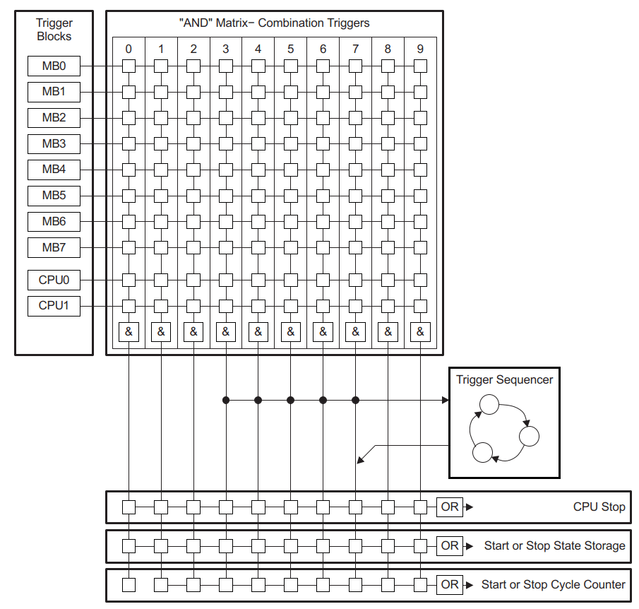
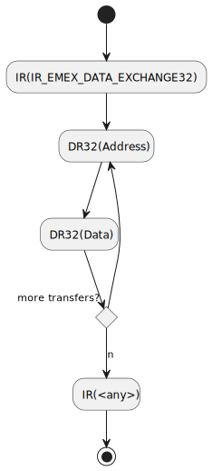

# EEM Documentation

This documentation was taking from the TI SLAU2008Q datasheet and properly extended 
to improve contents.


## (1) Embedded Emulation Module (EEM) Introduction

Every MSP430 microcontroller implements an EEM. It is accessed and 
controlled through either 4-wire JTAG mode or Spy-Bi-Wire mode. Each 
implementation is device-dependent and is described in Section 3, the EEM 
Configurations section, and the device-specific data sheet.

In general, the following features are available:
- Nonintrusive code execution with real-time breakpoint control
- Single-step, step-into, and step-over functionality
- Full support of all low-power modes
- Support for all system frequencies, for all clock sources
- Up to eight (device-dependent) hardware triggers or breakpoints on 
memory address bus (MAB) or memory data bus (MDB)
- Up to two (device-dependent) hardware triggers or breakpoints on CPU 
register write accesses
- MAB, MDB, and CPU register access triggers can be combined to form up 
to ten (device-dependent) complex triggers or breakpoints
- Up to two (device-dependent) cycle counters
- Trigger sequencing (device-dependent)
- Storage of internal bus and control signals using an integrated trace 
buffer (device-dependent)
- Clock control for timers, communication peripherals, and other modules 
on a global device level or on a per-module basis during an emulation 
stop.

Figure 1 shows a simplified block diagram of the largest 
currently-available EEM implementation.

  

For more details on how the features of the EEM can be used together with 
the IAR Embedded Workbench™ debugger or with Code Composer Studio (CCS), 
see Advanced Debugging Using the Enhanced Emulation Module 
([SLAA393](www.ti.com/lit/pdf/SLAA393)) at www.msp430.com. Most other 
debuggers supporting the MSP430 devices have the same or a similar 
feature set. For details, see the user's guide of the applicable debugger.


## (2) EEM Building Blocks


### Triggers

The event control in the EEM of the MSP430 system consists of triggers, 
which are internal signals indicating that a certain event has happened. 
These triggers may be used as simple breakpoints, but it is also possible 
to combine two or more triggers to allow detection of complex events and 
cause various reactions other than stopping the CPU.

In general, the triggers can be used to control the following functional 
blocks of the EEM:
- Breakpoints (CPU stop)
- State storage
- Sequencer
- Cycle counter

There are two different types of triggers – the memory trigger and the 
CPU register write trigger.

Each memory trigger block can be independently selected to compare either 
the MAB or the MDB with a given value. Depending on the implemented EEM, 
the comparison can be =, ≠, ≥, or ≤. The comparison can also be limited 
to certain bits with the use of a mask. The mask is either bit-wise or 
byte-wise, depending upon the device. In addition to selecting the bus 
and the comparison, the condition under which the trigger is active can 
be selected. The conditions include read access, write access, DMA 
access, and instruction fetch.

Each CPU register write trigger block can be independently selected to 
compare what is written into a selected register with a given value. The 
observed register can be selected for each trigger independently. The 
comparison can be =, ≠, ≥, or ≤. The comparison can also be limited to 
certain bits with the use of a bit mask.

Both types of triggers can be combined to form more complex triggers. For 
example, a complex trigger can signal when a particular value is written 
into a user-specified address.


### Trigger Sequencer

The trigger sequencer allows the definition of a certain sequence of 
trigger signals before an event is accepted for a break or state storage 
event. Within the trigger sequencer, it is possible to use the following 
features:

- Four states (State 0 to State 3)
- Two transitions per state to any other state
- Reset trigger that resets the sequencer to State 0.

The trigger sequencer always starts at State 0 and must execute to State 
3 to generate an action. If State 1 or State 2 are not required, they can 
be bypassed.


### State Storage (Internal Trace Buffer)

The state storage function uses a built-in buffer to store MAB, MDB, and 
CPU control signal information (that is, read, write, or instruction 
fetch) in a nonintrusive manner. The built-in buffer can hold up to eight 
entries. The flexible configuration allows the user to record the 
information of interest very efficiently.


### Cycle Counter

The cycle counter provides one or two 40-bit counters to measure the 
cycles used by the CPU to execute certain tasks. On some devices, the 
cycle counter operation can be controlled using triggers. This allows, 
for example, conditional profiling, such as profiling a specific section 
of code.


### Clock Control

The EEM provides device-dependent flexible clock control. This is useful 
in applications where a running clock is needed for peripherals after the 
CPU is stopped (for example, to allow a UART module to complete its 
transfer of a character or to allow a timer to continue generating a PWM 
signal).

The clock control is flexible and supports both modules that need a 
running clock and modules that must be stopped when the CPU is stopped 
due to a breakpoint.


## (3) EEM Configurations

Table 1 gives an overview of the EEM configurations. The implemented 
configuration is device-dependent, and details can be found in the 
device-specific data sheet and these documents:

- Advanced Debugging Using the Enhanced Emulation Module (EEM) With CCS 
([SLAA393](www.ti.com/lit/pdf/SLAA393))
- IAR Embedded Workbench Version 3+ for MSP430 User's Guide 
([SLAU138](www.ti.com/lit/pdf/SLAU138))
- Code Composer Studio for MSP430 User’s Guide 
([SLAU157](www.ti.com/lit/pdf/SLAU157))

**Table 1 - EEM Configurations**

| Feature                     |  XS  |   S  |   M  |   L  |
|:----------------------------|:----:|:----:|:----:|:----:|
| Memory bus triggers         | 2 (=, ≠) |   3  |   5  |   8  |
| Memory bus trigger mask for | 1) Low byte<br/>2) High byte<br/>3) Four upper addr bits | 1) Low byte<br/>2) High byte<br/>3) Four upper addr bits | 1) Low byte<br/>2) High byte<br/>3) Four upper addr bits | All 16 or 20 bits |
| CPU register write triggers |  0   |   1  |   1  |   2  |
| Combination triggers        |  2   |   4  |   6  |  10  |
| Sequencer                   |  No  |  No  |  Yes |  Yes |
| State storage               |  No  |  No  |  No  |  Yes |
| Cycle counter               |  0   |   1  |   1  | 2<br/>(including triggered start or stop) |

In general, the following features can be found on any device:
- At least two MAB or MDB triggers supporting:
  - Distinction between CPU, DMA, read, and write accesses
  - =, ≠, ≥, or ≤ comparison (in XS, only =, ≠)
- At least two trigger combination registers
- Hardware breakpoints using the CPU stop reaction
- At least one 40-bit cycle counter
- Enhanced clock control with individual control of module clocks


## (4) Data Exchange with the EEM module

A set of hardware registers are provided to control emulation. These are 
accessible through the JTAG/SBW emulation port.

The typical for to address these hardware registers is through the 
`IR_EMEX_DATA_EXCHANGE` or `IR_EMEX_DATA_EXCHANGE32` instruction byte,
which should be written to the JTAG instruction register.
When sending one of this instruction byte, EEM is activated in either 
16-bit or 32-bit mode.

Transfer are then performed using the JTAG DR frame using a fixed size, 
16 or 32-bit, depending on the command that started the mode. Devices 
that implements a 16-bit CPU should be accessed using `IR_EMEX_DATA_EXCHANGE`, 
while `IR_EMEX_DATA_EXCHANGE32` shall be used for devices implementing a 
20-bit address bus (CPUX and CPUXv2).

After this mode is activated, DR (Data register) can be repeteadly 
acessed in cycles of two transfers each. So each cycle is a DR pair. The 
first DR is the address of the EEM register and the second DR is the data.

After each pair one can start the next in a bulk until all transfers are 
performed. The mode will end as soon as a new IR is started.

The advantage of this algorithm is that all registers can be adjusted in 
a bulk.

<div hidden>

```
@startuml emex_exchange_flow

(*) --> "IR(IR_EMEX_DATA_EXCHANGE32)"
--> "DR32(Address)" as addr
--> "DR32(Data)"
--> if "more transfers?"
  ----> addr
else
  --> [n] "IR(<any>)"
  --> (*)
endif

@enduml
```

</div>




### Read or Write Operation

When accessing a register on the EEM, to specify a read operation it is 
necessary to add 1 to the register base address. In other words, each 
register repeats twice in the address space. even addresses are used to 
perform a write operation, while odd values retrieves register contents.


## (5) Emulation Hardware Registers

This section briefly describes the EEM register map.


### Trigger blocks TB0 to TB9

Trigger blocks are used as inputs to the **Combination Trigger AND Matrix**, 
sequentially organized in a series of four registers each.

The following table lists addresses for each register.

| Trigger |   MBTRIGxVAL  |   MBTRIGxCTL  |   MBTRIGxMSK  |   MBTRIGxCMB  |
|:-------:|:-------------:|:-------------:|:-------------:|:-------------:|
|   TB0   | `0x00`/`0x01` | `0x02`/`0x03` | `0x04`/`0x05` | `0x06`/`0x07` |
|   TB1   | `0x08`/`0x09` | `0x0A`/`0x0B` | `0x0C`/`0x0D` | `0x0E`/`0x0F` |
|   TB2   | `0x10`/`0x11` | `0x12`/`0x13` | `0x14`/`0x15` | `0x16`/`0x17` |
|   TB3   | `0x18`/`0x19` | `0x1A`/`0x1B` | `0x1C`/`0x1D` | `0x1E`/`0x1F` |
|   TB4   | `0x20`/`0x21` | `0x22`/`0x23` | `0x24`/`0x25` | `0x26`/`0x27` |
|   TB5   | `0x28`/`0x29` | `0x2A`/`0x2B` | `0x2C`/`0x2D` | `0x2E`/`0x2F` |
|   TB6   | `0x30`/`0x31` | `0x32`/`0x33` | `0x34`/`0x35` | `0x36`/`0x37` |
|   TB7   | `0x38`/`0x39` | `0x3A`/`0x3B` | `0x3C`/`0x3D` | `0x3E`/`0x3F` |
|   TB8   | `0x40`/`0x41` | `0x42`/`0x43` | `0x44`/`0x45` | `0x46`/`0x47` |
|   TB9   | `0x48`/`0x49` | `0x4A`/`0x4B` | `0x4C`/`0x4D` | `0x4E`/`0x4F` |

> As already mentioned before the even addresses access the register in
> write mode, while odd values are used to retrieve contents.

Note that **TB8** and **TB9** refers to the CPU register.

#### `MBTRIGxVAL` Register (`TB`*n*+`0x0000`)

This is the reference value to be used for comparison. In case of a 
breakpoint here you would put the address where the CPU has to stop.

A trigger obtain a source value based on the configuration of the 
`MBTRIGxCTL` register. The value obtained is compared against the 
value programmed into `MBTRIGxVAL`.


#### `MBTRIGxCTL` register (`TB`*n*+`0x0002`)

Each memory trigger block can be independently selected to compare either 
the **MAB** or the **MDB** with a given value.  
Depending on the implemented EEM, the comparison can be `=`, `≠`, `≥`, or 
`≤`.  
The comparison can also be limited to certain bits with the use of a 
mask. The mask is either bit-wise or byte-wise, depending upon the 
device.

In addition to selecting the bus and the comparison, the **condition** 
under which the trigger is active can be selected. The conditions include 
**read access**, **write access**, **DMA access**, and **instruction 
fetch**.

|   15  |   14  |   13  |   12  |   11  |   10  |   9   |   8   |
|:-----:|:-----:|:-----:|:-----:|:-----:|:-----:|:-----:|:-----:|
|   x   |   x   |   x   |   x   |   x   |   x   |   x   |   x   |
| **7** | **6** | **5** | **4** | **3** | **2** | **1** | **0** |
|   x   |  TRG  |  TRG  |  CMP  |  CMP  |  TRG  |  TRG  |  MDB  |

- **MDB (b0)**: This bit can be set to one of the following values:
  - **MAB (0x0000)**: Indicates the source to obtain a value ids the 
  address bus.
  - **MDB (0x0001)**: INdicates the source to obtain a value is the
  data bus.
- **TRG (b6-b5,b2-b1)**: These bits programs the event type used as 
source of the information:
  - **TRIG_0 (`0x0000`)**: The event that activates the trigger is the 
  **Instruction Fetch**, that is the instant where the CPU loads an 
  *op-code*. This is typically the use case for a breakpoint, in case,
  if the **MAB** address equal to the `MBTRIGxVAL`.  
  Depending on the MDB bit you can compare the `MBTRIGxVAL` against a 
  specific *op-code*.
  - **TRIG_1 (`0x0002`)**: TI documentation states *Instruction Fetch Hold*, 
  which is quite vague.
  - **TRIG_2 (`0x0004`)**: An access to the MAB or MDB which is not an 
  *Instruction Fetch*.
  - **TRIG_3 (`0x0006`)**: Don't care/Undefined.
  - **TRIG_4 (`0x0020`)**: An access to the MAB or MDB where *no 
  Instruction Fetch* is happening but in a *Read* operation.
  - **TRIG_5 (`0x0022`)**: An access to the MAB or MDB where *no 
  Instruction Fetch* is done but for a *Write* cycle.
  - **TRIG_6 (`0x0024`)**: This event indicates that a *Read* has 
  happened.
  - **TRIG_7 (`0x0026`)**: This event indicates that a *Write* has 
  happened.
  - **TRIG_8 (`0x0040`)**: This event is triggered when *no Instruction 
  Fetch* and also *no DMA access* happens.
  - **TRIG_9 (`0x0042`)**: This event is triggered if the bus access 
  occurs through DMA Access (Read or Write).
  - **TRIG_A (`0x0044`)**: This event occurs on all bus accesses, except 
  if caused by DMA.
  - **TRIG_B (`0x0046`)**: This event occurs on a write bus access, 
  except thouse caused by DMA.
  - **TRIG_C (`0x0060`)**: This event occurs for read bus access, except 
  on an Instruction Fetch and also not a DMA.
  - **TRIG_D (`0x0062`)**: This event occurs on a read bus access, 
  excluding those caused by a DMA.
  - **TRIG_E (`0x0064`)**: This event occurs on a read bus access caused 
  by a DMA.
  - **TRIG_F (`0x0066`)**: This event occurs on a write bus access caused 
  by a DMA

The following table shows the relation of the access mode to the signals 
Fetch, R/W and DMA.

| Label  | Operation                                   | Fetch | R/W | DMA |
|--------|---------------------------------------------|-------|-----|-----|
| TRIG_0 | Instuction fetch                            |   1   | (R) | (0) |
| TRIG_1 | Instruction fetch hold                      |   1   | (R) | (0) |
| TRIG_2 | No instruction fetch                        |   0   |  x  |  x  |
|        |                                             |   1   |  x  |  1  |
| TRIG_3 | Don't care                                  |   X   |  x  |  x  |
| TRIG_4 | No intruction fetch & read                  |   0   |  R  |  x  |
|        |                                             |   1   |  R  |  1  |
| TRIG_5 | No instruction fetch & write                |   X   |  W  |  x  |
| TRIG_6 | Read                                        |   X   |  R  |  x  |
| TRIG_7 | Write                                       |   X   |  W  |  x  |
| TRIG_8 | No intruction fetch & no DMA access         |   0   |  x  |  0  |
| TRIG_9 | DMA access (read or write)                  |   X   |  x  |  1  |
| TRIG_A | No DMA access                               |   X   |  x  |  0  |
| TRIG_B | Write & no DMA access                       |   X   |  W  |  0  |
| TRIG_C | No instruction fetch & read & no DMA access |   0   |  R  |  0  |
| TRIG_D | Read & no DMA access                        |   X   |  R  |  0  |
| TRIG_E | Read & DMA access                           |   X   |  R  |  1  |
| TRIG_F | Write & DMA access                          |   X   |  W  |  1  |

- **CMP (b4-b3)**: This field controls the type of comparison to be made: 
  - **CMP_EQUAL (`0x0000`)**: The trigger value must be equal to  
  `MBTRIG0VAL`.
  - **CMP_GREATER (`0x0008`)**: The trigger value must be greater than 
  `MBTRIG0VAL`.
  - **CMP_LESS (`0x0010`)**: The trigger value must be less than 
  `MBTRIG0VAL`.
  - **CMP_NOT_EQUAL (`0x0018`)**: The trigger value must be different 
  than `MBTRIG0VAL`.


#### `MBTRIGxMSK` register (`TB`*n*+`0x0004`)

Each memory trigger block can be independently selected to compare either 
the MAB or the MDB with a given value. Depending on the implemented EEM, 
the comparison can be =, ≠, ≥, or ≤. 

The comparison can also be **limited to certain bits with the use of a 
mask**. The mask is either **bit-wise** or **byte-wise**, depending upon 
the device. 

In addition to selecting the bus and the comparison, the condition under 
which the trigger is active can be selected. The conditions include read 
access, write access, DMA access, and instruction fetch.

|   23  |   22  |   21  |   20  |   19  |   18  |   17  |   16  |
|:-----:|:-----:|:-----:|:-----:|:-----:|:-----:|:-----:|:-----:|
|   x   |   x   |   x   |   x   |  MSK  |  MSK  |  MSK  |  MSK  |
| **15** | **14** | **13** | **12** | **11** | **10** | **9** | **8** |
|  MSK  |  MSK  |  MSK  |  MSK  |  MSK  |  MSK  |  MSK  |  MSK  |
| **7** | **6** | **5** | **4** | **3** | **2** | **1** | **0** |
|  MSK  |  MSK  |  MSK  |  MSK  |  MSK  |  MSK  |  MSK  |  MSK  |

This is the mask register, which is up to 20 bits, dependending on the 
CPU model.

The `EEM_defs.h` predefines some common values:
- **NO_MASK (`0x00000`)**
- **MASK_ALL (`0xFFFFF`)**
- **MASK_XADDR (`0xF0000`)**
- **MASK_HBYTE (`0x0FF00`)**
- **MASK_LBYTE (`0x000FF`)**


#### `MBTRIGxCMB` register (`TB`*n*+`0x0004`)

Triggers can be combined to form more complex triggers. Once a condition 
is met, you can signal it to one of the matrix outputs.

Depending on the device you have up to 10 outputs:

|   15  |   14  |   13  |   12  |   11  |   10  |   9   |   8   |
|:-----:|:-----:|:-----:|:-----:|:-----:|:-----:|:-----:|:-----:|
|   x   |   x   |   x   |   x   |   x   |   x   |  EN9  |  EN8  |
| **7** | **6** | **5** | **4** | **3** | **2** | **1** | **0** |
|  EN7  |  EN6  |  EN5  |  EN4  |  EN3  |  EN2  |  EN1  |  EN0  |

This register uses the same definitions as the **BREAKREACT** register, 
described below.


### `BREAKREACT` (`0x80`)

This is the break reaction register, that individually controls the 
**CPU Stop** feature of the EEM. Each bit activates one line that is 
OR-ed to stop the CPU.

Note that the implementation of each bit depends on the size of the 
**Combination triggers AND-Matrix**. Each bit corresponds to the each 
ordered output of the Matrix.

|   15  |   14  |   13  |   12  |   11  |   10  |   9   |   8   |
|:-----:|:-----:|:-----:|:-----:|:-----:|:-----:|:-----:|:-----:|
|   x   |   x   |   x   |   x   |   x   |   x   |  EN9  |  EN8  |
| **7** | **6** | **5** | **4** | **3** | **2** | **1** | **0** |
|  EN7  |  EN6  |  EN5  |  EN4  |  EN3  |  EN2  |  EN1  |  EN0  |

- **EN0**: This is the output 0 of the AND-Matrix. This output is present 
on all devices.
- **EN1**: This is the output 1 of the AND-Matrix. This output is present 
on all devices.
- **EN2**: This is the output 2 of the AND-Matrix. This output is present 
on all devices, except the **XS** parts.
- **EN3**: This is the output 3 of the AND-Matrix. This output is present 
on all devices, except the **XS** parts.
- **EN4**: This is the output 4 of the AND-Matrix. This output is present 
on the **M** and **L** devices.
- **EN5**: This is the output 5 of the AND-Matrix. This output is present 
on the **M** and **L** devices.
- **EN6**: This is the output 6 of the AND-Matrix. This output is only 
present on the **L** devices.
- **EN7**: This is the output 7 of the AND-Matrix. This output is only 
present on the **L** devices.
- **EN8**: This is the output 8 of the AND-Matrix. This output is only 
present on the **L** devices.
- **EN9**: This is the output 9 of the AND-Matrix. This output is only 
present on the **L** devices.


### `GENCTRL`: General Debug Control Register (`0x82`/`0x83`) *

> The `MX_GENCNTRL` is an alias for `GENCNTRL`.

This is the general debug control register for the EEM module:

|   15  |   14  |   13  |   12  |   11  |   10  |   9   |   8   |
|:-----:|:-----:|:-----:|:-----:|:-----:|:-----:|:-----:|:-----:|
|   x   |   x   |   x   |   x   |   x   |   x   |   x   |   x   |
| **7** | **6** | **5** | **4** | **3** | **2** | **1** | **0** |
|  STP  |  RST  |   x   |  TRG  |  FEA  |  CLK  |  CST  |   EN  |

Thease are the values:
- **EEM_EN (`0x0001`)**: Enables the EEM module (`GCC_EXTENDED` only?)
- **CLEAR_STOP (`0x0002`)**: This signal is pulse once during the halt of 
the MCU  (`GCC_EXTENDED` only?)
- **EMU_CLK_EN (`0x0004`)**: (`GCC_EXTENDED` only?)
- **EMU_FEAT_EN (`0x0008`)**: TODO
- **DEB_TRIG_LATCH (`0x0010`)**: TODO
- **EEM_RST (`0x0040`)**: TODO: Resets the EEM.
- **E_STOPPED (`0x0080`)**: TODO: Indicates the CPU has stopped

**TODO**: This has also effect on `IR_EMEX_WRITE_CONTROL`. (A mirror?) 
(CPUXv2 only?)


### `GENCLKCTRL`: EEM General Clock Control Register (`0x88`/`0x89`)

The EEM (Extended) General Clock Control allows one to configure the 
behavior of the system clocks (i.e., **ACLK**, **MCLK**, **SMCLK**, 
**TACLK**) when the device is stopped by JTAG (i.e., when the device is 
not running or being single stepped). The default behavior of the clocks 
is to stop	when the device is stopped by JTAG.

|   15  |   14  |   13  |   12  |   11  |   10  |   9   |   8   |
|:-----:|:-----:|:-----:|:-----:|:-----:|:-----:|:-----:|:-----:|
|   x   |   x   |   x   |   x   |   x   |   x   |   x   |   x   |
| **7** | **6** | **5** | **4** | **3** | **2** | **1** | **0** |
|   x   |   x   | TACLK |  FLLO |  MCLK | SMCLK |  ACLK | SMCLK |

Bits of the EEM General Clock Control register (F41x):
- **SMCLK/TCE_SMCLK (`0x01`)**: Clock SMCLK with TCLK.
- **ACLK/ST_ACLK (`0x02`)**: Stop ACLK
- **SMCLK/ST_SMCLK (`0x04`)**: Stop SMCLK
- **MCLK/TCE_MCLK (`0x08`)**: Clock functional MCLK with TCLK.
- **FLLO/JT_FLLO (`0x10`)**: Switch off FLL
- **TACLK/ST_TACLK (`0x20`)**: Stop TACLK

Bits of the EEM Extended General Clock Control register (F43x/F44x):
- **SMCLK/ECLK_SYN (`0x01`)**: Emulation clock synchronization.
- **ACLK/ST_ACLK (`0x02`)**: Stop ACLK.
- **SMCLK/ST_SMCLK (`0x04`)**: Stop SMCLK.
- **MCLK/ST_MCLK (`0x08`)**: Stop MCLK
- **FLLO/JT_FLLO (`0x10`)**: Switch off FLL.
- **TACLK/FORCE_SYN (`0x20`)**: Force JTAG synchronization.

The default configuration for **CPUXv2** is:

`MCLK_SEL0 + SMCLK_SEL0 + ACLK_SEL0 + STOP_MCLK + STOP_SMCLK + STOP_ACLK`

and cannot be changed.

The default configuration for **CPU** and **CPUX** models is:

`ST_TACLK + ST_SMCLK + ST_ACLK`

> A reset is required for those options to take effect.


### `MODCLKCTRL0`: EEM Module Clock Control Register 0 (`0x8A`)

Clock for selected modules switch off (logic AND operation) (only for 
extended clock control, else ignored)

|   15  |   14  |   13  |   12  |   11  |   10  |   9   |   8   |
|:-----:|:-----:|:-----:|:-----:|:-----:|:-----:|:-----:|:-----:|
|   x   |  MCLK | SMCLK |  ACLK |  ADC  | FLASH |  SER1 |  SER0 |
| **7** | **6** | **5** | **4** | **3** | **2** | **1** | **0** |
| TPORT |  TCNT |  LCDF | BASTM |  TIMB |  TIMA |  WDT  |   x   |

- **CC_ALLRUN (`0`)**: All module clocks are running on emulation halt
- **CC_WDT (`0x0002`)**: Stop clock for Watch Dog Timer on emulation halt
- **CC_TIMER_A (`0x0004`)**: Stop clock for TimerA on emulation halt
- **CC_TIMER_B (`0x0008`)**: Stop clock for TimerB on emulation halt
- **CC_BASIC_TIMER (`0x0010`)**: Stop clock for Basic Timer on emulation halt
- **CC_LCD_FREQ (`0x0020`)**: Stop clock for LCD frequency on emulation halt
- **CC_TIMER_COUNTER (`0x0040`)**: Stop clock for 8 bit Timer/Counter on emulation halt
- **CC_TIMER_PORT (`0x0080`)**: Stop clock for Timer Port on emulation halt
- **CC_USART0 (`0x0100`)**: Stop clock for USART0 on emulation halt
- **CC_USART1 (`0x0200`)**: Stop clock for USART1 on emulation halt
- **CC_FLASH_CNTRL (`0x0400`)**: Stop clock for Flash Control on emulation halt
- **CC_ADC (`0x0800`)**: Stop clock for ADC on emulation halt
- **CC_ACLK (`0x1000`)**: Stop ACLK on extern pin on emulation halt
- **CC_SMCLK (`0x2000`)**: Stop SMCLK on extern pin on emulation halt
- **CC_MCLK (`0x4000`)**: Stop MCLK on extern pin on emulation halt

Default initialization value in MSP430.dll for CPUXv2 is `0x0417`, which 
corresponds to `FLASH` + `BASTM` + `TIMA` + `WDT` + 1.

Note that by CPU and CPUX these values are taken from the device 
database. On CPUXv2 this is partially cached by a questionable procedure.

> A reset is required for those options to take effect.


### `EVENT_REACT` (`0x94`/`0x95`)

This is the event reaction register, where each bit enables a connection 
to the **AND-matrix Combination registers**, used to trigger a cycle 
counter.

> **NOTE:** This register is not used in the **MSP430.dll**.


### `EVENT_CTRL` (`0x96`/`0x97`)

|   15  |   14  |   13  |   12  |   11  |   10  |   9   |   8   |
|:-----:|:-----:|:-----:|:-----:|:-----:|:-----:|:-----:|:-----:|
|   x   |   x   |   x   |   x   |   x   |   x   |   x   |   x   |
| **7** | **6** | **5** | **4** | **3** | **2** | **1** | **0** |
|   x   |   x   |   x   |   x   |   x   |   x   |   x   |  EVT  |

- **EVENT_TRIG (`0x0001`)** TODO: Enables the feature?

> This register is not used on the current **MSP430.dll** implementation.


### `STOR_REACT` (`0x98`/`0x99`)

This is the store reaction register, that individually controls the 
data storage feature of the EEM. Each bit enables the respective line 
that is OR-ed to trigger a state storage.

The state storage function uses a built-in buffer to store MAB, MDB, and 
CPU control signal information (that is, read, write, or instruction 
fetch) in a nonintrusive manner. The built-in buffer can hold up to eight 
entries. The flexible configuration allows the user to record the 
information of interest very efficiently.


### `STOR_ADDR` (`0x9A`/`0x9B`)

This register is used to setup the address of the trace buffer before 
reading data using the `STOR_DPORT` register.

|   15  |   14  |   13  |   12  |   11  |   10  |   9   |   8   |
|:-----:|:-----:|:-----:|:-----:|:-----:|:-----:|:-----:|:-----:|
|   x   |   x   |   x   |  ITRG |  ITRG |  ITRG |   x   |   x   |
| **7** | **6** | **5** | **4** | **3** | **2** | **1** | **0** |
|   x   |   x   |   x   |  IDX  |  IDX  |  IDX  |   x   |   x   |

- **IDX**: The index of the trace buffer that we want to access. Data 
should be retrieved using the `STOR_DPORT` register.
- **ITRG**: The current index where data is being captured when a 
trigger happens. If the buffer is programmed in the *One shot* mode then 
you are required to reset the trace buffer before you are able to capture 
more data. See `STOR_CTL::STOR_ONE_SHOT` and `STOR_CTL::STOR_RESET`. This 
also the case when the `STOR_CTL::STOR_FULL` bit is set.

This algorithm shown the condition to reset the trace buffer:
```cpp
writePos = STOR_ADDR >> 10;
if (STOR_CTL & STOR_ONE_SHOT)
{
	if((STOR_CTL & STOR_FULL) || (writePos == 0))
	{
		STOR_CTL = (STOR_CTL & ~STOR_EN) | STOR_RESET;
		// Now trace buffer has all 8 entries available
	}
}
```

Basically to read the current stored trace samples you should follow this 
algorithm:
```cpp
// No FIFO implemented on Variable Watch
assert((STOR_CTL & 0x06) != STOR_MODE_VAR_WATCH)
// Obtain index of last transfer
readPos = lastReadPos;
writePos = STOR_ADDR >> 10;
isFull = (STOR_CTL & STOR_FULL);
if ((readPos != writePos) || isFull)
{
	do
	{
		// Replace read index using a 3-bit mask and update register
		STOR_ADDR = (STOR_ADDR & ~(7 << 2)) | (readPos << 2);
		// Increment, keeping counter in the 0-7 range
		readPos = (readPos+1) & 0x07;
		// Read values MAB, MDB und control
		mabValue = STOR_DPORT;
		mdbValue = STOR_DPORT;
		ctrlValue = STOR_DPORT;
		// TODO: Do something with the values
	}
	while(readPos != writePos)
}
```

For *Variable Watch* algorithm is simpler, since there is no queue. 
Triggers store samples in the programmed trace buffer cell, so a linear 
buffer read is recommended:
```cpp
// Variable Watch just read current contents
assert((STOR_CTL & 0x06) == STOR_MODE_VAR_WATCH)
isDirty = (STOR_CTL & STOR_WRIT);
if (isDirty)
{
	// Read all positions
	for (int readPos = 0; readPos < 8; ++readPos)
	{
		// Replace read index using a 3-bit mask and update register
		STOR_ADDR = (STOR_ADDR & ~(7 << 2)) | (readPos << 2);
		// Read values MAB, MDB und control
		mabValue = STOR_DPORT;
		mdbValue = STOR_DPORT;
		//ctrlValue = STOR_DPORT; // not used
		// TODO: Do something with the values
	}
}
```


### `STOR_DPORT` (`0x9C`/`0x9D`)

> This register is missing in current **EEM_defs.h** header file and was 
> obtained directly from **MSP430.DLL** source files.

This register is used to retrieve data stored in the trace buffer. Note 
that access should be performed in pairs: the first 16 or 32-bit value 
returns the **MAB** value and the second the **MDB** value.

> Note that **CPUX** and **CPUXv2** implements 32-bit EEM registers
> while legacy CPU only 16-bit transfers are allowed.

|   31  |   30  |   29  |   28  |   27  |   26  |   25  |   24  |
|:-----:|:-----:|:-----:|:-----:|:-----:|:-----:|:-----:|:-----:|
|   x   |   x   |   x   |   x   |   x   |   x   |   x   |   x   |
|   23  |   22  |   21  |   20  |   19  |   18  |   17  |   16  |
|   x   |   x   |   x   |   x   |  MxB  |  MxB  |  MxB  |  MxB  |
|   15  |   14  |   13  |   12  |   11  |   10  |   9   |   8   |
|  MxB  |  MxB  |  MxB  |  MxB  |  MxB  |  MxB  |  MxB  |  MxB  |
| **7** | **6** | **5** | **4** | **3** | **2** | **1** | **0** |
|  MxB  |  MxB  |  MxB  |  MxB  |  MxB  |  MxB  |  MxB  |  MxB  |

- **MxB**: After setting the address of the trace buffer, the first 
access returns the **MAB** and the second access returns the **MDB**.

> It is not known if write access is allowed for this register.


### `STOR_CTL` (`0x9E`/`0x9F`)

This register controls the trace buffer. The trace buffer has space for 
up to 8 samples. Each position of this buffer contains the 16-bit value 
present on the MAB and the 16-bit value present on the MDB. Data is 
sampled according to a flexible set of trigger configurations.

|   15  |   14  |   13  |   12  |   11  |   10  |   9   |   8   |
|:-----:|:-----:|:-----:|:-----:|:-----:|:-----:|:-----:|:-----:|
|   x   | WATCH | WATCH |   x   |   x   |   x   |  FULL |  WRIT |
| **7** | **6** | **5** | **4** | **3** | **2** | **1** | **0** |
|  TEST | RESET |  STOP | START | ONESH |  MODE |  MODE |   EN  |

- **EN: `STOR_EN` (`0x01`)**:
- **MODE**:
  - **`STOR_MODE0`/`STOR_MODE_TRIGGER` (`0x0000`)**: Store on enabled 
  triggers
  - **`STOR_MODE1`/`STOR_MODE_INSTR_FETCH` (`0x0002`)**: Store on 
  Instruction Fetch
  - **`STOR_MODE2`/`STOR_MODE_VAR_WATCH` (`0x0004`)**: Variable Watch
  - **`STOR_MODE3`/`STOR_MODE_ALL_CYCLES` (`0x0006`)**: Store all bus 
  cycles
- **`STOR_MODE_CLEAR` (`0x0006`)**:
- **ONESH: `STOR_ONE_SHOT` (`0x0008`)**: Stores data continuously 
  or until buffer is full.
- **START: `STOR_START_ON_TRIG`/`STOR_START_TRIG` (`0x0010`)**:
- **STOP: `STOR_STOP_ON_TRIG`/`STOR_STOP_TRIG` (`0x0020`)**:
- **RESET: `STOR_RST`/`STOR_RESET` (`0x0040`)**: Clears the trace buffer 
  and unlocks it to store more samples. This is should be set after the 
  `STOR_WRIT` flag is signalled. The trace buffer is copied to an 
  intermediate buffer. This buffer consists of 8 samples that can be read 
  with the help of `STOR_ADDR` and `STOR_DPORT` registers.
- **TEST: `STOR_TEST` (`0x0080`)**:
- **WRIT: `STOR_WRIT` (`0x0100`)**: Flags that indicates that the trace 
  buffer was written. Read this register to poll buffer state.
- **FULL: `STOR_FULL` (`0x0200`)**:
- **WATCH**:
  - **`VAR_WATCH0` (`0x0000`)**: Two
  - **`VAR_WATCH1` (`0x2000`)**: Four
  - **`VAR_WATCH2` (`0x4000`)**: Six
  - **`VAR_WATCH3` (`0x6000`)**: Eight

#### Examples

> The following examples uses a C-style meta-language, but keep in mind 
> that there is no direcrt way to assign value in memory, like a usual C 
> program.  
> Values are read using a JTAG link, then through the 
> `IR_EMEX_DATA_EXCHANGE32` JTAG instruction, exchanged with the emulator 
> registers.

To set *Store on trigger*:
```cpp
STOR_CTL &= ~STOR_MODE_CLEAR;
STOR_CTL |= STOR_MODE_TRIGGER;
```

To set *Store on Instruction Fetch*:
```cpp
STOR_CTL &= ~STOR_MODE_CLEAR;
STOR_CTL |= STOR_MODE_INSTR_FETCH;
```

To set *Store on Clock*:
```cpp
STOR_CTL &= ~STOR_MODE_CLEAR;
STOR_CTL |= STOR_MODE_ALL_CYCLES;
```

To enable Variable Watch:
```cpp
STOR_CTL &= ~STOR_MODE_CLEAR;
STOR_CTL |= STOR_MODE_VAR_WATCH | STOR_EN | STOR_RESET;
STOR_CTL |= 0xe000; //Watch triggers 0-15
```

See files: `DLL430_v3\src\TI\DLL430\EM\StateStorage430\StateStorage430.h`,
`DLL430_v3\src\TI\DLL430\EM\StateStorage430\StateStorage430.cpp`,
`DLL430_v3\src\TI\DLL430\EM\VariableWatch\VariableWatch430.h`,
`DLL430_v3\src\TI\DLL430\EM\VariableWatch\VariableWatch430.cpp`,
`DLL430_v3\src\TI\DLL430\EM\Trace\Trace430.h`,
`DLL430_v3\src\TI\DLL430\EM\Trace\Trace430.cpp`


Read this register (i.e. address `0x9F`) to control the state of the 
trace buffer. Example in `_hal_WaitForStorage` in 
`Bios\src\hal\macros\WaitForStorage.c`.


### `NXTSTATE0` (`0xA0`)

> This register is missing in current **EEM_defs.h** header file and was 
> obtained directly from **MSP430.DLL** source files.

This register contains the first part of sequencer steps.

|   15  |   14  |   13  |   12  |   11  |   10  |   9   |   8   |
|:-----:|:-----:|:-----:|:-----:|:-----:|:-----:|:-----:|:-----:|
|  TID3 |  TID3 |  NS3  |  NS3  |  TID2 |  TID2 |  NS2  |  NS2  |
| **7** | **6** | **5** | **4** | **3** | **2** | **1** | **0** |
|  TID1 |  TID1 |  NS1  |  NS1  |  TID0 |  TID0 |  NS0  |  NS0  |

- **NS*n***: Next step.
- **TID*n***: Trigger ID.


### `NXTSTATE1` (`0xA2`)

> This register is missing in current **EEM_defs.h** header file and was 
> obtained directly from **MSP430.DLL** source files.

This register contains the second part of sequencer steps.

|   15  |   14  |   13  |   12  |   11  |   10  |   9   |   8   |
|:-----:|:-----:|:-----:|:-----:|:-----:|:-----:|:-----:|:-----:|
|  TID7 |  TID7 |  NS7  |  NS7  |  TID6 |  TID6 |  NS6  |  NS6  |
| **7** | **6** | **5** | **4** | **3** | **2** | **1** | **0** |
|  TID5 |  TID5 |  NS5  |  NS5  |  TID4 |  TID4 |  NS4  |  NS4  |

- **NS*n***: Next step.
- **TID*n***: Trigger ID.


#### `SEQ_CTL` (`0xA6`)

> This register is missing in current **EEM_defs.h** header file and was 
> obtained directly from **MSP430.DLL** source files.

This register controls the sequencer.

|   15  |   14  |   13  |   12  |   11  |   10  |   9   |   8   |
|:-----:|:-----:|:-----:|:-----:|:-----:|:-----:|:-----:|:-----:|
|   x   |   x   |   x   |   x   |   x   |   x   |   x   |   x   |
| **7** | **6** | **5** | **4** | **3** | **2** | **1** | **0** |
|   x   |  RST  |   x   |   x   |   x   |  LEVS |  RSTE |  ENA  |

- **ENA / `SEQ_ENABLE` (`0x0001`)**: Enables the sequencer
- **RSTE / `SEQ_RESET_EN` (`0x0002`)**: Select breakpoint as a reset 
trigger to set start state 0. Configure sequencer to reset on specified 
trigger.
- **LEVS / `SEQ_LEVEL_SENSITIVE` (`0x0004`)**: Bit not used on the 
current **MSP430.DLL**.
- **RST / `SEQ_RESET` (`0x0040`)**: Reset bit. Note that this seems to 
be a software flag, as it is filtered out before sending to the hardware. 

Reference: `DLL430_v3\src\TI\DLL430\EM\Sequencer\Sequencer430.cpp`


#### `CCNT0CTL` (`0xB0`) / CCNT1CTL (`0xB8`)

This register is the general control for the cycle counter.

|   15  |   14  |   13  |   12  |   11  |   10  |   9   |   8   |
|:-----:|:-----:|:-----:|:-----:|:-----:|:-----:|:-----:|:-----:|
|   x   |   x   |  CLR  |  CLR  |  STP  |  STP  |  STT  |  STT  |
| **7** | **6** | **5** | **4** | **3** | **2** | **1** | **0** |
|   x   |  RST  |   x   |   x   |   x   |  MOD  |  MOD  |  MOD  |

- **MOD** can be one of the following values:
  - **CCNTMODE0 (`0x0000`)**: Counter stopped
  - **CCNTMODE1 (`0x0001`)**: Increment on reaction
  - **CCNTMODE4 (`0x0004`)**: Increment on instruction fetch cycles
  - **CCNTMODE5 (`0x0005`)**: Increment on all bus cycles (including DMA 
  cycles) (**default**)
  - **CCNTMODE6 (`0x0006`)**: Increment on all CPU bus cycles (excluding 
  DMA cycles)
  - **CCNTMODE7 (`0x0007`)**: Increment on all DMA bus cycles
- **RST (`0x0040`)** Reset counter
- **STT** can be one of the following values:
  - **CCNTSTT0 (`0x0000`)**: Start when CPU released from JTAG/EEM
  - **CCNTSTT1 (`0x0100`)**: Start on reaction `CCNT1REACT` (only 
  `CCNT1`) 
  - **CCNTSTT2 (`0x0200`)**: Start when other (second) counter is started 
  (only if available)
  - **CCNTSTT3 (`0x0300`)**: Start immediately
- **STP** can be one of the following values:
  - **CCNTSTP0 (`0x0000`)**: Stop when CPU is stopped by EEM or under 
  JTAG control
  - **CCNTSTP1 (`0x0400`)**: Stop on reaction `CCNT1REACT` (only `CCNT1`) 
  - **CCNTSTP2 (`0x0800`)**: Stop when other (second) counter is started 
  (only if available)
  - **CCNTSTP3 (`0x0C00`)**: No stop event
- **CLR** can be one of the following values:
  - **CCNTCLR0 (`0x0000`)**: No clear event
  - **CCNTCLR1 (`0x1000`)**: Clear on reaction `CCNT1REACT` (only 
  `CCNT1`) 
  - **CCNTCLR2 (`0x2000`)**: Clear when other (second) counter is started 
  (only if available)
  - **CCNTCLR3 (`0x3000`)**: Reserved

This feature is available for devices implementing the 
`EMEX_EXTRA_SMALL_5XX` EEM or higher.

> The default mode on current **MSP430.DLL** implementation is `CCNTMODE5`.


#### `CCNT0L` (`0xB2`) / CCNT0H (`0xB4`) / CCNT1L (`0xBA`) / CCNT1H (`0xBC`)

These registers stores the 24-bit counters 0 and 1.


#### `CCNT1REACT` (`0xBE`)

This register contains the reaction value only implemented in `CCNT1`, 
for the specific configurations: `CCNTSTT1`, `CCNTSTP1` and `CCNTCLR1`. 

The **cycle counter** provides one or two 40-bit counters to measure the 
cycles used by the CPU to execute certain tasks. On some devices, the 
cycle counter operation can be controlled using triggers. This allows, 
for example, conditional profiling, such as profiling a specific 
section of code. 

