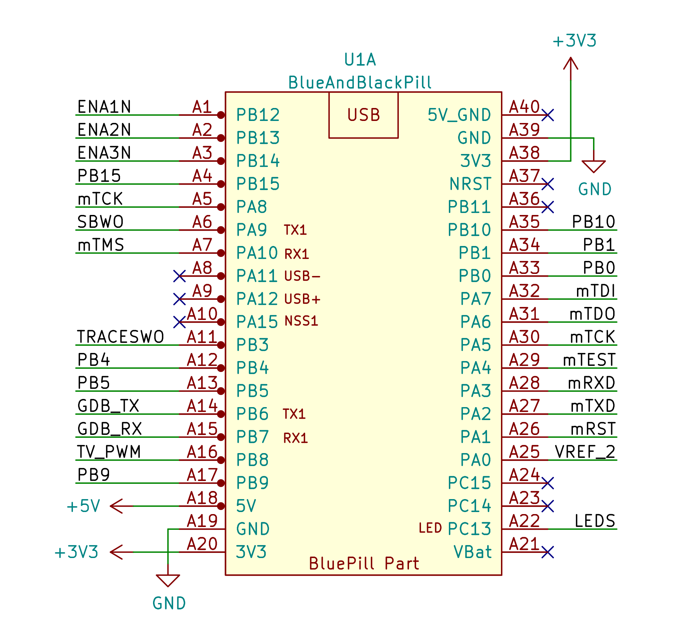

# Changes to BluePill/BlackPill Prototype Board

## 08/12/2022 &ndash; Version 2

**Implementation:** Fabrication on Dec/2022

## Consolidated Pinout

### MCU: Target Board Voltage Control

|   Pin   |   Label   | Description                            |
|:-------:|:---------:|:--------------------------------------:|
|   PA0   |  VREF_2   | ADC1 Ch0: Read target voltage samples  |
|   PB8   |  TV_PWM   | TIM4_CH3: PWM for DC voltage generator |

### MCU: JTAG/SBW Bus Interface

|   Pin   |   Label   | Description                            |
|:-------:|:---------:|:--------------------------------------:|
|   PA1   |   JRST    | GPIO to control the JTAG RST line      |
|   PA4   |   JTEST   | GPIO to control the JTAG TEST line     |
|   PA5   |   JTCK    | SPI1_SCK to control the JTAG CLK line  |
|   PA6   |   JTDO    | SPI1_MISO to control the JTAG TDO line |
|   PA7   |   JTDI    | SPI1_MOSI to control the JTAG TDI line |
|   PA8   |  JTCK_IN  | TIM1_CH1 to sample JTAG clock          |
|   PA10  |   JTMS    | TIM1_CH3 to generate TMS waveform      |

### MCU: JTAG/SBW Control Lines

|   Pin   |   Label   | Description                            |
|:-------:|:---------:|:--------------------------------------:|
|   PA9   |   SBWO    | Controls direction of SBW data line    |
|   PB12  |   ENA1N   | Control lines common to JTAG and SBW   |
|   PB13  |   ENA2N   | Control lines required by JTAG         |
|   PB14  |   ENA3N   | Control lines required by UART         |

JTAG connector lines are negative logic signals and will have the 
following scenarios:

| SBWO  | ENA1N | ENA2N | ENA3N | Function                          |
|:-----:|:-----:|:-----:|:-----:|:---------------------------------:|
|   1   |   1   |   1   |   1   | HiZ; bus is disabled              |
|   1   |   1   |   1   |   0   | UART active; Debug inactive       |
|   1   |   0   |   1   |   0   | UART active; bus initialization   |
|   1   |   0   |   0   |   0   | UART active; JTAG active          |
|  0/1  |   1   |   0   |   0   | UART active; SBW active           |
|   1   |   0   |   1   |   1   | UART inactive; bus initialization |
|   1   |   0   |   0   |   1   | UART inactive; JTAG active        |
|  0/1  |   1   |   0   |   1   | UART inactive; SBW active         |

### MCU: Target Board USART Interface

|   Pin   |   Label   | Description                           |
|:-------:|:---------:|:-------------------------------------:|
|   PA2   |   JTXD    | USART TXD line for target board       |
|   PA3   |   JRXD    | USART RXD line for target board       |

### MCU: USB Interface

|   Pin   |   Label   | Description                              |
|:-------:|:---------:|:----------------------------------------:|
|   PA11  |  USB_DM   | USBD- signal of the USB device (onboard) |
|   PA12  |  USB_DP   | USBD+ signal of the USB device (onboard) |

### MCU: SWD Interface for the Debug Probe Firmware Development

|   Pin   |   Label   | Description                           |
|:-------:|:---------:|:-------------------------------------:|
|   PA13  |   SWDIO   | SWDIO signal in BluePill board        |
|   PA14  |   SWCLK   | SWCLK signal in BluePill board        |
|   PB3   |    SWO    | TRACE SWO signal for debug purpose    |

### MCU: UART for Development Phase

|   Pin   |   Label   | Description                           |
|:-------:|:---------:|:-------------------------------------:|
|   PB6   |   GDB_TX  | USART TXD line for GDB communication  |
|   PB7   |   GDB_RX  | USART RXD line for GDB communication  |

### MCU: Other Functions

|   Pin   |   Label   | Description                           |
|:-------:|:---------:|:-------------------------------------:|
|   PB2   |   BOOT0   | Bootloader (onboard)                  |
|   PC13  |   LEDS    | Red (active low) and Green LED (active high) |

### MCU: Unassigned Pins

|   Pin   |   Label   | Description                           |
|:-------:|:---------:|:-------------------------------------:|
|   PA15  |  SYS_JTDI | Unused                                |
|   PB0   |    PB0    | Unused                                |
|   PB1   |    PB1    | Unused                                |
|   PB4   |    PB4    | Unused                                |
|   PB5   |    PB5    | Unused                                |
|   PB9   |    PB9    | Unused                                |
|   PB10  |    PB10   | Unused                                |
|   PB11  |    PB11   | Unused                                |
|   PB15  |    PB15   | Unused                                |
|   PC14  |    PC14   | Unused                                |
|   PC15  |    PC15   | Unused                                |
|   VBAT  |    VBAT   | Unused                                |
|   NRST  |    NRST   | Unused                                |

## List of changes since V1-patched

### MCU: JTAG Bus Interface

|   Pin   |   Label   | Description                               |
|:-------:|:---------:|:-----------------------------------------:|
|   PA9   |   SBWO    | GPIO to control JTAG output buffer        |
|   PB12  |   ENA1N   | Enables TEST, RST and TCK JTAG signals    |
|   PB13  |   ENA2N   | Enables TDI and TMS JTAG signals          |
|   PB14  |   ENA3N   | Enables UART communication for the target |

### MCU: LEDs

The other change applied on this board version is the use of a single 
line to control two LEDs, like in the STLinkV2 device. The reason for 
this change is that a future version of this device will be designed 
using a 32-pin package and pin count is a priority. The newer chip will 
also feature a compact form factor, which requires compact chip packages. 

|   Pin   |   Label   | Description                           |
|:-------:|:---------:|:-------------------------------------:|
|   PC13  |    LEDS   | Controls Red and Green LEDs           |

The following states are now possible:
- PC13 output not driven (Hi-Z): LEDS are off.
- PC13 output level high: Red LED is on
- PC13 output level low: The green LED mounted on the BluePill board is 
on.

### DC Voltage Translator

During the development of the firmware using the initial design, a 
strange instability was noticed with random behavior.  After long 
research it came to be a *ringing* problem with the **TXS0108E** 
device, that is sensible to parasitic capacitance on the JTAG cable. 
Attempts to use the **TXB0108** (pin-to-pin compatible) was also 
disastrous. Changes on series resistors have influence on this issue and 
also side channels. The *ringing* effect is caused when the automatic 
detection of these logic chips *understands* that the direction of the 
signal has changed, caused by a reflection effect due to parasitic 
charges.  
It switches direction and a collision happens with the MCU output pin. 
For a couple of nanoseconds a short circuit happens until it reverts the 
direction of the line again. The parasitic capacitor charges reflects the 
signal change and the process restarts again. An oscillator effect is 
then produced.  
Usually power supplies starts to collapse because of the brief short 
circuits at a very high frequency multiplies the effect causing random issues.

[A description of the problem is described here](https://learn.sparkfun.com/tutorials/level-shifter---8-channel-txs0108e-hookup-guide/troubleshooting).

The conclusion is that those chips are of no use if not applied to an 
*ideal setup* and tuned circuit, which involves track lengths and 
possibly other physical aspects. By the way, I saw later that the first 
hardware version of the BMP also used them. And they gave up!

So a redesign using conventional level translator chips were used. 
Basically, the **74LS125** which are working at the target voltage, but 
have 5V-tolerant input pins. An for signals that has to be converted from 
the target connector up to the MCU, or When direction control is also 
required, as with the case of the SBW link, the **74LVC2T45** is used. 
This one is a complete level translator solution, including both supply 
voltages a direction control pin.

### General

A minor fix was added to the **VREF_2** circuit and the DC Voltage 
Regulator circuit was also slightly tuned.

To ensure that the final product is compact this prototype board will 
also feature small resistor arrays for the impedance match.

### MCU: New Unassigned Pins

|   Pin   |   Label   | Description                           |
|:-------:|:---------:|:-------------------------------------:|
|   PB9   |    PB9    | Was red LED, now unassigned           |
|   PB10  |    PB10   | Was JTCK for SBW, now unassigned      |
|   PB15  |    PB15   | Was SBWO, now unassigned              |

### Other functions

| Function                          |    Value     |
|-----------------------------------|:------------:|
| DC Voltage Regulator              |  AD8531ARTZ  |
| ESD Protection                    | SRV05-4HTG-D |
| JTAG Impedance matching resistors |   100 &ohm;  |
| UART Impedance matching resistors |   100 &ohm;  |
| Voltage Level Translation         |   TXS0108E   |

-------------

## 06/Aug/2022 &ndash; Initial Version

**Implementation:** A PCB with this schematics was fabricated. 

### MCU: Target Board Voltage Control

|   Pin   |   Label   | Description                            |
|:-------:|:---------:|:---------------------------------------|
|   PA0   |  VREF_2   | ADC1 Ch0: Read target voltage samples  |
|   PB8   |  TV_PWM   | TIM4_CH3: PWM for DC voltage generator |

### MCU: JTAG Bus Interface

|   Pin   |   Label   | Description                            |
|:-------:|:---------:|:---------------------------------------|
|   PA1   |   JRST    | GPIO to control the JTAG RST line      |
|   PA4   |   JTEST   | GPIO to control the JTAG TEST line     |
|   PA5   |   JTCK    | SPI1_SCK to control the JTAG CLK line  |
|   PA6   |   JTDO    | SPI1_MISO to control the JTAG TDO line |
|   PA7   |   JTDI    | SPI1_MOSI to control the JTAG TDI line |
|   PA8   |  JTCK_IN  | TIM1_CH1 to sample JTAG clock          |
|   PA9   |   JTMS    | TIM1_CH2 to generate TMS waveform      |
|   PA10  |   JENA    | GPIO to control JTAG output buffer     |
|   PB10  |   JTCK    | GPIO for Spy-Bi-Wire                   |
|   PB13  |   JTCK    | SPI2_SCK for Spy-Bi-Wire               |
|   PB14  |  SBW_IN   | SPI2_MISO for Spy-Bi-Wire              |
|   PB15  |  SBW_OUT  | SPI2_MOSI for Spy-Bi-Wire              |

### MCU: Target Board USART Interface

|   Pin   |   Label   | Description                           |
|:-------:|:---------:|:--------------------------------------|
|   PA2   |   JTXD    | USART TXD line for target board       |
|   PA3   |   JRXD    | USART RXD line for target board       |

### MCU: USB Interface

|   Pin   |   Label   | Description                           |
|:-------:|:---------:|:--------------------------------------|
|   PA11  |  USB_DM   | USBD- signal of the USB device        |
|   PA12  |  USB_DP   | USBD+ signal of the USB device        |

### MCU: SWD Interface for the Debug Probe Firmware Development

|   Pin   |   Label   | Description                           |
|:-------:|:---------:|:--------------------------------------|
|   PA13  |   SWDIO   | SWDIO signal in BluePill board        |
|   PA14  |   SWCLK   | SWCLK signal in BluePill board        |
|   PB3   |    SWO    | TRACE SWO signal for debug purpose    |

### MCU: UART for Development Phase

|   Pin   |   Label   | Description                           |
|:-------:|:---------:|:--------------------------------------|
|   PB6   |   GDB_TX  | USART TXD line for GDB communication  |
|   PB7   |   GDB_RX  | USART RXD line for GDB communication  |

### MCU: Other Functions

|   Pin   |   Label   | Description                           |
|:-------:|:---------:|:--------------------------------------|
|   PB2   |   BOOT0   | Bootloader                            |
|   PB9   |   LEDG    | Green LED                             |
|   PC13  |   LEDR    | Red LED                               |

### MCU: Unassigned Pins

|   Pin   |   Label   | Description                           |
|:-------:|:---------:|:--------------------------------------|
|   PA15  |  SYS_JTDI | Reserved for JTAG TDI signal          |
|   PB0   |    PB0    | Unused                                |
|   PB1   |    PB1    | Unused                                |
|   PB4   |    PB4    | Unused                                |
|   PB5   |    PB5    | Unused                                |
|   PB11  |    PB11   | Unused                                |
|   PB12  |    PB12   | Unused                                |
|   PC14  |    PC14   | Unused                                |
|   PC15  |    PC15   | Unused                                |
|   VBAT  |    VBAT   | Unused                                |
|   NRST  |    NRST   | Unused                                |

### Other functions

| Function                          |    Value     |
|-----------------------------------|:------------:|
| DC Voltage Regulator              |  AD8531ARTZ  |
| ESD Protection                    | SRV05-4HTG-D |
| JTAG Impedance matching resistors |   100 &ohm;  |
| UART Impedance matching resistors |   100 &ohm;  |
| Voltage Level Translation         |   TXS0108E   |

## 23/08/2022 &ndash; TMS/JENA signals and Others

**Implementation:** Patches on the original PCB

List of changes:

### MCU: JTAG Bus Interface

|   Pin   |   Label   | Description                            |
|:-------:|:---------:|:---------------------------------------|
|   PA9   |   JENA    | GPIO to control JTAG output buffer     |
|   PA10  |   JTMS    | TIM1_CH3 to generate TMS waveform      |

### General

- Added resistor on VCC pin of SRV05-4 to avoid ringing on the voltage 
translator
- Changed JTAG impedance matching resistors to 47 &ohm;.
- Changed UART impedance matching resistors to 100 &ohm;.
- Swap of TXD and RXD signals on the JTAG connector (board was not 
patched since current firmware does not support this function).
- Changed value of resistor for SBW function (under development).
- Fixed schematics symbols used for 10 &micro;F capacitors to 
non-polarized device.

