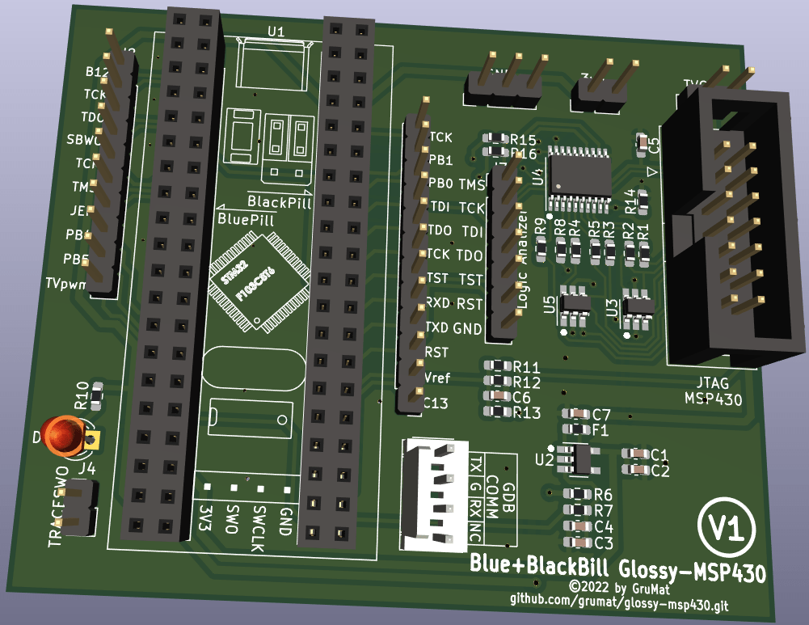
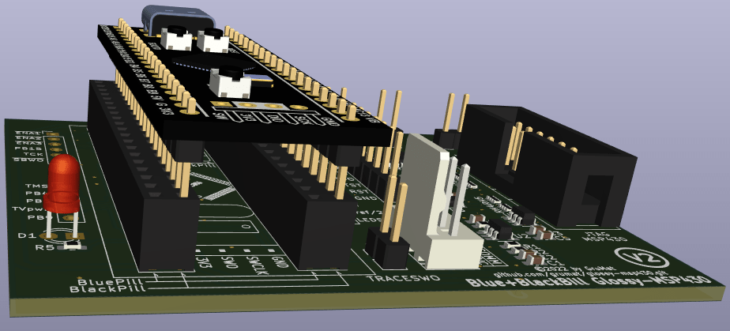
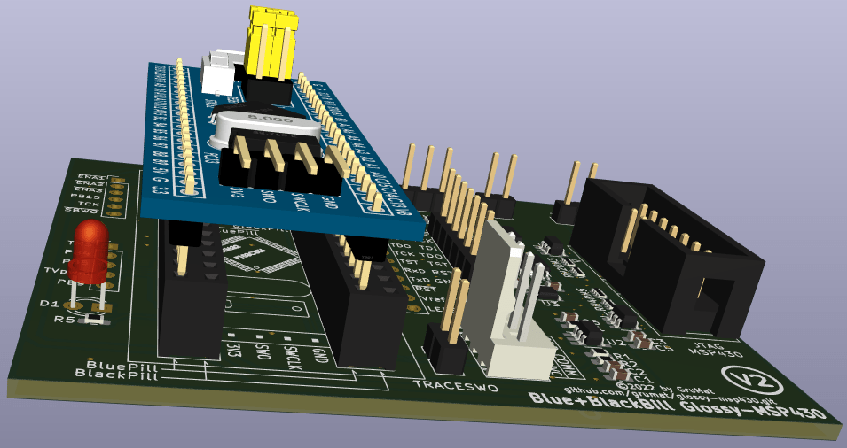
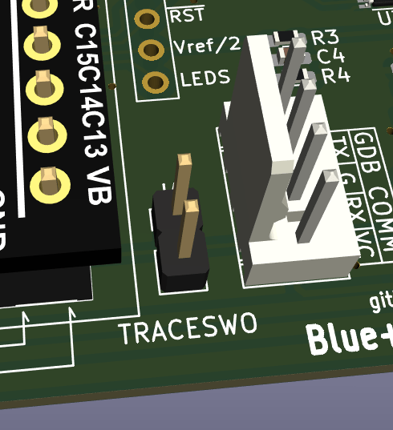
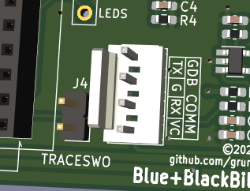
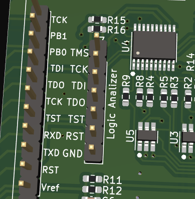
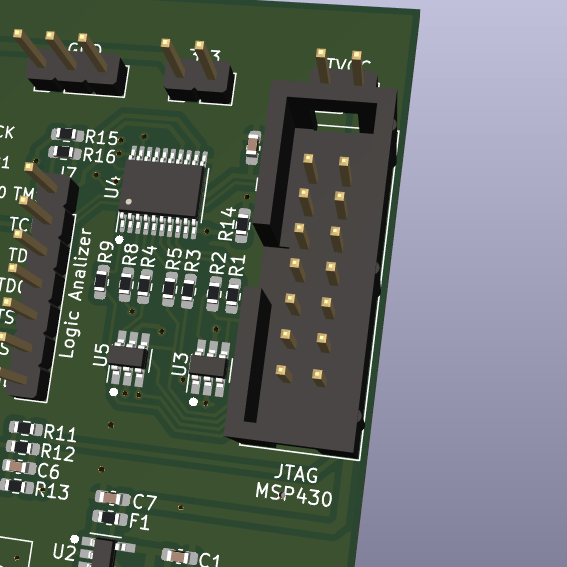

# Initial Hardware Development using STM32 BluePill/BlackPill #

This prototype board replaces the 
[STM32 Bluepill proto-board](../BluePill-BMP/README.md) as a result of 
the chip crisis started on early 20's, which caused a overwhelming cases 
of STM32F103 clones and counterfeits.

> This project is moving to more recent releases of the STM32 as there 
> is barely a chance that the STM32F103 will ever get manufactured 
> again. Or it may happen that very limited production batches will be 
> sold at a premium price, for those searching for original parts.

For the development of the project we need access to the hardware pins 
and interfaces that realizes our project. So, one of the easiest way 
to go is the *STM32 Blue and Black Pill* prototyping board. This board 
is based on one of the two existing options: The STM32 BluePill and the STM32 BlackPill boards, easily found on eShops. 

This prototype board offers the following advantages:

- Dual board support
- Unbeatable cost/performance combo
- Lots of documentation and community support
- Higher clock rates when compared to most *Arduino-like* alternatives, 
with a comparable budget.
- Lots of interface pins
- Possibility to drive JTAG at rates above 4 MHz, supported by the MSP430 
JTAG interface
- Integrated USB port to implement a VCP.
- Programmable target voltage.
- Voltage level translator, to drive MSP boards with less than 3.3V.
- Terminal for a Logic analyzer.
- Access to most circuit elements for voltage monitoring.

# Feature Description

The BluePill/BlackPill prototype has the following features:
- SPI1 pins is used as communication port allowing to use SPI for JTAG 
transfers. Bit banging is obviously available as a standard GPIO:
  - MISO for **TDI**
  - MOSI for **TDO**
  - SCK for **TCK**
- TMS is controlled by Timer 1 Channel 3 or bit-banging
- A copy of SCK signal is fed into Timer 1 Channel 1 to allow for **TMS 
automated signal generation**.
- Other JTAG signals such as TEST and RST use regular GPIO pins for bit 
bang.
- The design all JTAG interface signals share the same GPIO port, 
allowing for bit-bang using a single port access, either by software or 
timer controlled DMA.
- SPI2 pins are reserved for the **SBW** interface, using a resistor to share 
both input and output data lines (under development).
- A **GBD port** is provided on USART1 (see note below).
- **TRACESWO** is fixed at PB3 and can be connected to a debug emulator 
that supports it, or optionally a FTDI device, which allows very high COM 
port speeds.
- USART2 is connected to the JTAG port, at the moment not used, but 
reserved for the **debug COM port** for the target board. This feature 
will be added when the VCP code is finally developed.  
This pinout extends the original TI proposal, but it is suggested for BSL 
programming by many other references on the internet.
- **PA0** is configured exactly as in the ST-Link schematics and is tied 
to the ADC input to read I/O voltage, which in this case will always be 
50% of VRef input.
- Firmware will sample the PA0 input before setting the output voltage using the Timer 4 Channel 3 PWM output on **PB8**.
- A dedicated jumper set is provided to connect a **Logic Analyzer**, 
which is a very useful tool to check the pulse streams and shapes. For 
bit-banging output, widths are a critical part, as the STM32 sometimes 
generates too fast widths, which causes failures. Pulses cannot be 
shorter than 50 ns.
- Other jumpers are available for 3.3V and GND power lines and also 
access to other STM32 pins which could help other development tests.

## Notes Regarding VCP Emulation

To avoid debug firmware debug capabilities on the early stage of firmware 
development, a GBD port is provided on USART1.  
This is because a PC hosting a VCP will require that firmware is always responsive to handle minimal USB protocol transfers. A breakpoint will 
halt the CPU and cause a drop in the USB link because USB host will stop 
receiving the minimal USB protocol frames. So no step by step debugging 
would be possible.

Currently, firmware uses an independent COM port hardware, so CPU flow 
may be stopped by breakpoints and communication link are keep online by a 
dedicated hardware.

Note that the main impact of this combination is performance. Serial port 
will limit transfers to the serial line bps. In a VCP serial port packets 
are essentially virtual and don't have to be serialized anymore. Data 
payloads are handled immediately, topping the transfer performance.

# The BlackPill Socket

At the core of these prototype, a BlackPill development board is fitted 
into the main socket. Note that this socket uses dual row sockets, 
because it was designed to accommodate either a BlackPil or a BluePill 
board. The BlackPill should be fitted into the **right** pin row. 

The detailed view can be seen on the picture below:

# The BluePill Socket

Support for the older Bluepill board is also possible. For this option you should fit the board into the socket, aligned to the **left** row.

The detailed view can be seen on the following picture:

# The TRACESWO Output

The development of a big firmware is almost not possible without a 
tracing facility. SWO is the standard way to go. So this output has a 
dedicated access on the board, near to the SWD jumpers of the Blackpill 
(or Bluepill) board.

Speeds of SWO may be an issue and experimentation proves that values 
listed on specs are far above the practical limits, when debugging and 
VCP is also shared simultaneously.

Regardless, a Black Magic Probe provides an input pin for the SWO. Just 
connect a wire to the pin marked on the board.

# GBD Serial Port

Note that on the final product, GDB connection is provided using a VCP, 
which couples the tool at the max possible transfer speed.  
The advantage of the VCP is that regardless of the BAUD rate of the VCP, there is actually no serial line where this BAUD rate is applied. The 
packets of the VCP driver are handled internally and directly causes 
actions on the firmware, producing top speed.

On the other side, a VCP firmware needs to be online so that communication 
is not shutdown by the USB host.  
This means that on the when analyzing JTAG protocol and signals, a 
breakpoint would harm the VCP link and lots of communication issues would 
happen.

To avoid this effect, a simple serial port is used during the development. 
When the JTAG communication is matured the VCP will be added and the existing GDB serial port will be deactivated.

> This connector is only part part of the prototype board.

# Second LED

Two LEDs are provided to improve usability. One LED is already provided on 
the Blue/Black Pill board and a second was added to the board.

One LED will indicate when a JTAG link was established, advising that 
JTAG cable shall not be disconnected while the link is powered. The 
second will blink at every command received by the host, indicating that 
communication is active.

# The LogicAna Connector

For a bus with a complex logic like the JTAG it is very handy to control 
JTAG signals using a Logic Analyzer. So the board offers a dedicated 
connector for this purpose.

# The JTAG Connector

This is the connector used to connect the MSP430 board. and follows the standard TI JTAG layout with additional pins for a serial VCP connection 
like proposed by Elprotronic.

Pins **TDO**, **TDI**, **TMS**, **TCK**, **RST** and **TEST** follows the 
same convention used by a standard MSP-FET, including both **TDO** and 
**TCK** which are also used for the Spy-bi-Wire connection.

The [MSP430 JTAG/BSL connectors](https://content.elprotronic.ca/docs/JTAG-BSL-Pinout.pdf) from Elprotronic covers the fusion of JTAG and 
BSL into the same connector. At the end BSL uses a serial link, which is 
exactly appropriate for the VCP wiring. Note that like usual on a serial 
connection **TXD** and **RXD** interconnection needs to be crossed. So 
the **pin 12** needs to be connected to a **RXD** pin on the MSP430, while the pin 14 will be tied to TXD pin on the target MCU.

So for example, to establish a UART link to the **USART0** of a classic 
**MSP430F149** part, connect **JTAG.12** to the **P3.5/URXD0** and 
**JTAG.14** to the **P3.4/UTXD0** of the MCU.

Now for the **Pin 2 TVCC** line, this prototype board can supply up to 
**100 mA** which is enough for almost every daughter-board available.  
The **VCC Sense** pin is a reference entry for the cases that a board is self powered. Then this reference voltage is used to adjust the TVCC 
output voltage so that voltage levels are compatible.

This rule is also valid when connecting a MSP430 to the official TI JTAG 
device.

# Voltage Regulator

Note that the Firmware can source a programmable voltage to the **TVCC** 
line to supply the voltage translator circuit that can also be used to 
attach a MSP430 daughter-board using the **JTAG connector**.  
This behavior is also seen on the official TI MSPFET and the older 
MSPFET430UIF.

The **TVCC** supply voltage is protected by a **100 mA** polyfuse, which 
should be enough for most practical cases.

# Voltage Translator

A voltage translator was added to this test board, walking a step further 
if compared to the older BluePill prototype board, which allows for the 
development of the firmware part that handles programmable supply 
voltages. 

> At the time of this writing firmware still produces a fixed 3.3 V output 
> on the **TVCC** line, which is used as reference for the target.

The circuit is based on the Texas Instruments TXS0108E circuit. This 
circuit which is capable of transferring signal at a 100 MHz rate, which 
is quite good for our application.

# Power Supplies

It is very often required to control supply voltages during firmware 
development, so the board has access to the **GND**, **3.3V** and the 
**TVCC**.

Other interesting signals required for the implementation of the 
**TVCC** supply voltage are **Vref** and **TVpwm**.  
**Vref** has to be sampled by the ADC and a timer should be used to 
generate a high frequency PWM signal proportional to the input to generate 
the **TVCC**.

# A Typical Use Case

The image below shows a typical use case of a firmware debug session:

> USB cable should be connected to the Black Magic Probe, the BluePill 
> and the Logic Analyzer.

Each element of this picture are detailed next.

## Blue/Black Pill Development board

At the center you see the development board described on this topic.

In this setup a BluePill is seated at the shared connector. Connections 
cables are provided for the GDB UART port, the SWD debug port, TRACESWO, 
the Logic Analyzer, the MSP430 target board.

## Debug Unit (Black magic Probe - ARM edition)

At the left you you see a STLink-clone converted to a Black Magic Probe 
(ARM) according to 
[this article](https://github.com/grumat/glossy-msp430/wiki/Convert-stlink-to-bmp) 
in our wiki.

> In this particular conversion, the top connector, originally a SWIM 
> connector was converted to a 3.3V UART port. An internal hardware 
> modification was required for this functionality and this port is used 
> as the GDB debug port. 
> [Check the article](https://github.com/grumat/glossy-msp430/wiki/Convert-stlink-to-bmp).

Attached to the 20-pin ARM JTAG connector, an adapter board is used to 
facilitate the wiring of the **SWD+SWO** connections. The output of this 
adapter board has five wires running to the debug port of the 
BluePill/BlackPill and the SWO jumper on the Development board. 
Note that the VCC is not required, even if it was wired, but the adapter 
board has a switch to select the VCC function. Details to that SWD 
adapter board can be found [here](../SWD-Adapter/README.md).

## The Logic Analyzer

The logic analyzer **LA2016** has 16 inputs, but we need just 6 inputs and 
a GND wire. All other cables are simply left unconnected.

An USB cable needs to be connected between the unit and the PC, so the 
bundled software is able to capture the JTAG pulses.

This is an example of the `0x28` **Shift IR** command, while the MSP board 
returns the `0x91` identification byte:

> The SPI chanel sends 3 bytes to perform this transmission, while the 
> TMS signal was properly generated using a timer and DMA transactions. 
> Since SPI requires byte aligned transfers we use TMS neutral states so 
> that the some of the clock pulses have no effect on the payload.

## The MSP430 Target Board

On this repository you will find schematics and PCB for some MSP430 
devices.

In this picture a [MSP Proto Board](../Target_Proto_Boards/MSP_Proto/README.md) 
is connected using a standard MSP430 14-pin flat cable. This uses the 
standard pinout for MSP430 JTAG emulators, such as the TI MSP-FET.

The particular device used in this case, is the **MSP430F2417** and the 
target board uses the 3.3V power supply provided by the BluePill board.

# General Development Environment

The PC development is done using Visual Studio 2022 using the VisualGDB 
plugin. A standard ARM debugger is connected to the 4 debug jumpers of 
the BluePill/BlackPill, which allows us to download and debug the firmware, an additional wire is used for the SWO signal to receive trace messages.

At the moment the debugger used is a Black Magic Probe (the normal ARM 
Cortex version), but one can use a J-Link or STLink.
