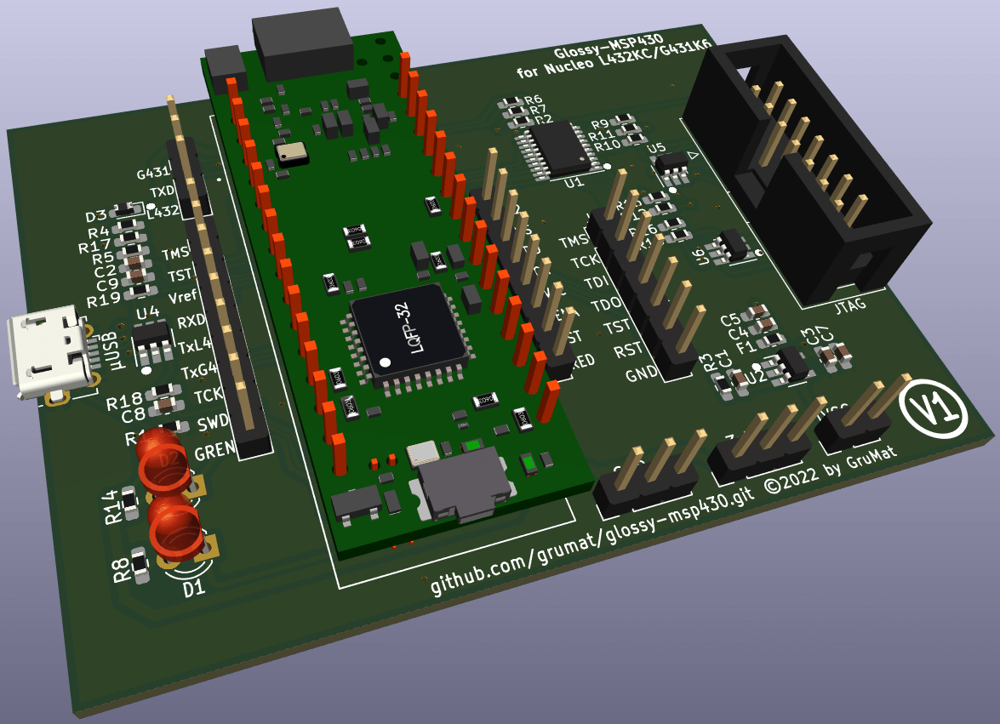
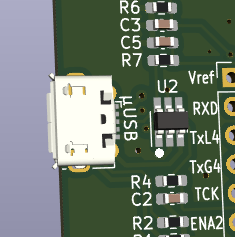
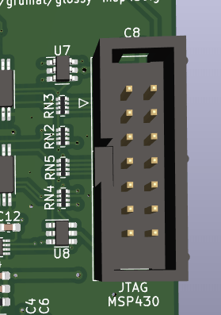
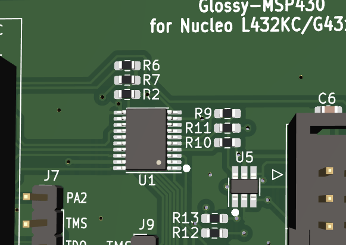
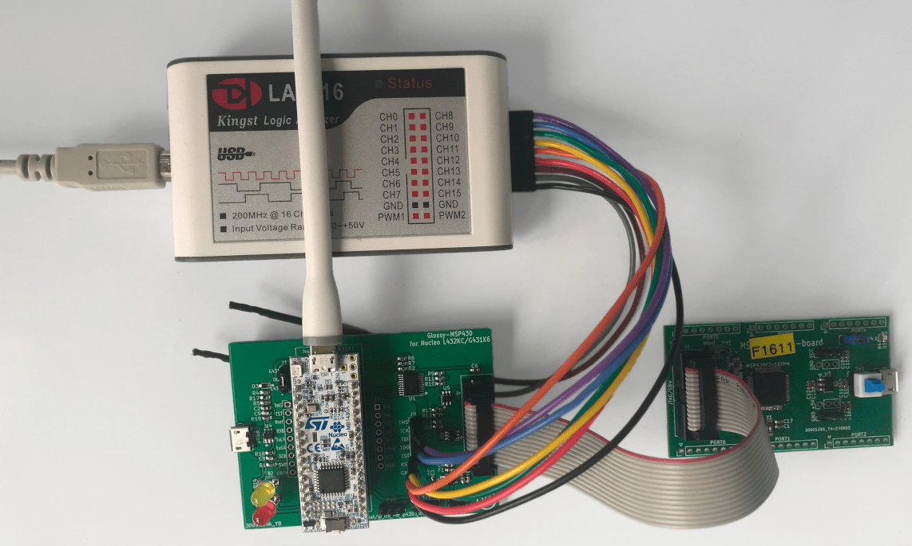

# Initial Hardware Development using Nucleo-32 STM32L432KC or STM32G431KB

Since the chip crisis an alternative was considered to replace the STM32F103
series since official sources are out of stop and chinese sources are 
unreliable, providing mostly clones or counterfeits. Still accessible are 
newer releases of STM32 like the STM32L432KC or STM32G431KB, through the 
Nucleo-32 development boards.

This is a still cheap and powerful solution, while the chips offers more 
efficient design than the older Cortex M3 designs:

### TODO: **REVIEW TOPIC**

- ~~Lots of documentation and community support~~
- ~~Higher clock rates when compared to STM32F103 alternatives~~
- ~~Enhanced peripherals~~
- ~~Possibility to *bit-bang* pin at a rate near 10 MHz, which is the upper limit of the MSP430 JTAG interface~~
- ~~A SPI peripheral, also able to run on those high clock speeds, which is a real alternative to the *bit bang* option~~
- ~~Possibility to DMA timer transitions and emulate the TMS signal at high 
speeds and take advantage of the SPI interface at 9MHz bit rate.~~
- ~~Possibility to timer a DMA to bit bang GPIO port at these high rates (clock generation for the Flash erase command).~~
- ~~Integrated USB port to implement a VCP.~~

> Note that this new design also includes voltage regulators and bus 
> voltage translators to allow for JTAG interfaces at lower voltages.

## Feature Description

### TODO: **REVIEW TOPIC**

The STM32L432KC prototype has the following features:
- ~~SPI2 pins is used as communication port allowing to use
SPI for JTAG transfers. Bit banging is obviously available as a standard GPIO:~~
  - MISO for TDI
  - MOSI for TDO
  - SCK for TCK
- ~~TMS is controlled by Timer 4 Channel 1 or bit-banging~~
- ~~A copy of SCK signal is fed into Timer 4 Channel 2 to
allow for TMS automated signal generation.~~
- ~~Other JTAG signals such as TEST and RST use regular 
GPIO pins for bit bang. In the design all signals share 
the same GPIO port, allowing for bit-bang using a single
port access, either by software or timer controlled DMA.~~
- ~~A GBD port is provided on USART1, as USB COM emulation 
would limit SWD debug capabilities during the early stage 
of development. Currently firmware uses an independent COM 
port hardware, so CPU flow may be stopped by breakpoints 
and communication resources are keep online.~~
- ~~TRACESWO is fixed at PB3 and can be connected to a
debug emulator that supports it, or optionally a FTDI
device, which allows very high COM port speeds.~~
- ~~USART3 is connected to the JTAG port, at the moment not 
used, but reserved for the debug COM port for the target 
board. This feature comes when the USB firmware part is 
finally developed.~~
~~This pinout is suggested for BSL programming by many other 
references on the internet.~~
- ~~PA0 is configured exactly as in the ST-Link schematics
and is tied to the ADC input to read I/O voltage, which 
in this case will always be 50% of 3.3V. On other schematics
this wiring will be kept for this function as they have 
variable I/O.~~
- ~~A dedicated jumper set is provided to connect a Logic 
Analyzer, which is a very useful tool to check the pulse 
streams and shapes. For bit-banging output, widths are a
critical part, as the STM32 sometimes generates too fast
widths, which causes failures. Pulses cannot be shorter 
than 50 ns.~~
- ~~Other jumpers are available for 3.3V and GND power lines 
and also access to other STM32 pins which could help other 
development tests.~~

~~This is the board without the Nucleo-32 and the FTDI 
proto-boards:~~

## The Nucleo-32 Socket

### TODO: **REVIEW TOPIC**

~~At the core of these prototype, a Nucleo-32 development 
board is fitted. It is a very common development resource
and most hobbyists will have one laying around.~~

~~The PC development is done using Visual Studio 2022
using the VisualGDB plugin. A Standard ARM debugger is
connected to the 4 debug jumpers of the Nucleo-32, which
allows us to download and debug the firmware.~~

~~At the moment the debugger is a Black Magic Probe (the 
normal ARM Cortex version), but one can use a J-Link or
STLink.~~

~~The chosen I/O pins to communicate with the MSP430 target
board are 5V tolerant. This is not a must, but could help 
handle 3.6V voltages, which is a valid range for MSP430. 
Not a feature that we plan to use, but a possible 
consideration if requirements change in the future.~~

## Configuring STM32L432KC or STM32G431KB

## The TRACESWO Output

### TODO: **EMBEDDED FEATURE**

The development of a big firmware is almost not possible
without a tracing facility. SWO is the standard way to go.
So this output has a clear access on the board.

~~Speeds of SWO may be an issue and experimentation proves
that values listed on specs are far above the practical 
limits.~~

~~Regardless, a Black Magic Probe provides an input pin for 
the SWO. Just connect a wire to the pin marked on the board.~~

> ~~Alternatively, it is possible to install a standard FTDI 
> serial proto-board in the provided socket. In this case
> you can read the message tracing using a serial port.~~

# USB Connector

### TODO: **Complete Topic**

# GBD Serial Port

### TODO: **EMBEDDED FEATURE**

~~Note that on a standard Black Magic Probe, GDB connection
is provided using a VCP, which couples the tool at the max 
possible transfer speed. The advantage of the VCP is that 
regardless of the BAUD rate of the VCP, there is actually 
no serial line where this BAUD rate is applied. The packets
of the VCP driver are handled internally and directly causes 
actions on the firmware, producing top speed.~~

~~On the other side, a VCP firmware needs to be online so that
communication is not shutdown by the USB host.  
This means that on the when analyzing JTAG protocol and 
signals, a breakpoint would harm the VCP link and lots of
communication issues would happen.~~

~~To avoid this effect, a simple serial port is used during 
the development. When the JTAG communication is matured the
VCP will be added and the existing GDB serial port will be 
deactivated.~~

# Indicator LEDs

### TODO: **REVIEW TOPIC**

~~Two LEDs are provided to improve usability. One LED is
already provided on the Blue Pill and a second was added 
to the board.~~

~~One LED will indicate when a JTAG link was established, 
so that no one disconnects the JTAG link while this is 
active. THe second will blink at every command received by 
the host.~~

# The LogicAna Connector

For a complex bus like the JTAG it is very handy to control JTAG signals 
using a Logic Analyzer. So the board offers a dedicated connector for 
this purpose.

# The JTAG Connector

~~This is the connector used to connect the MSP430 board. 
Since the Blue Pill comes with a decent 3.3V regulator 
you are allowed to connect simple boards without an 
additional power source, specially because a MSP430 is
a ultra low power MCU.~~

> ~~Please note that the **Vcc** pin supplies a fixed 
> voltage of 3.3V. Not a real problem, since almost 
> every MSP430 devices supports this operating 
> voltage.~~

# Voltage Translator

# A Typical Use Case

~~The image below shows a typical use case of a 
firmware debug session:~~

~~~~

~~Each element of this picture are detailed next.~~

## Blue Pill Development board

~~At the center you see the development board described
on this topic.~~

~~In this setup a Nucleo-32 is seated at the provided 
connector. Connections cables are provided for the SWD
debug port, the GDB UART port, TRACESWO, the Logic 
Analyzer, the MSP430 target board and a USB cable, 
currently used as power supply.~~

## Debug Unit (Black magic Probe - ARM edition)

~~At the left bottom you see a STLink-clone converted 
to a Black Magic Probe (ARM).~~

~~In this particular conversion, the top connector, 
originally a SWIM connector was converted to a 3.3V 
UART port. An internal hardware modification was 
required for this functionality and this port is used 
as the GDB debug port.~~

~~USB cable connects the unit to the PC, so that the 
VisualGDB software can perform the firmware download as 
development occurs. As this provides the control of the 
debug session.~~

~~Attached to the 20-pin ARM JTAG connector, an adapter 
board is used to facilitate the wiring of the SWD 
connection. The output of this adapter board has four 
wires running to the debug port of the Nucleo-32. Note 
that the VCC is not required, even if it was wired, 
but the adapter board has a jumper to select the VCC 
function.~~

~~At the back of the adapter board I made a MOD to add  
an additional jumper binding two wires to the TRACESWO 
connection points, on the space reserved for the 
optional FTDI-232 board, which is not mounted here, 
since BMP already supports this functionality.~~

## The Logic Analyzer

The logic analyzer **LA2016** has 16 inputs, but we need just 6 inputs 
and a GND wire. All other cables are simply left unconnected.

The USB cable connects the unit to the PC so the bundled software is able 
to capture the JTAG pulses.

## The MSP430 Target Board

On this repository you will find schematics and PCB for some MSP430 
devices.

In this picture a [MSP Proto Board](../Target_Proto_Boards/MSP_Proto/README.md) 
is connected using a standard MSP430 14-pin flat cable, and the pinout 
is compatible with other existing JTAG emulators, such as the TI MSP-FET.

The particular device used in this case, is the **MSP430F2417** and the 
target board uses the 3.3V power supply provided by the Nucleo-32 board.
