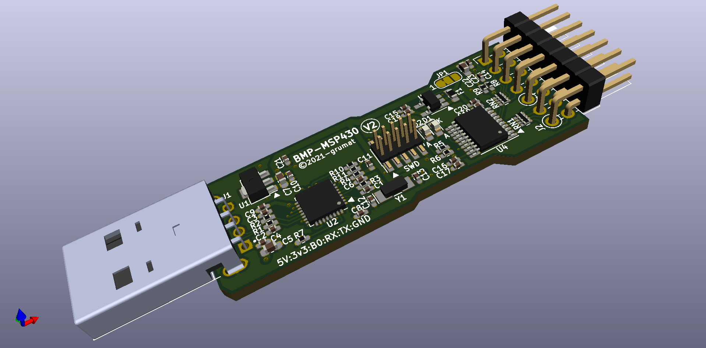

# BMPMSP2-stick

The second option uses the same principle, but is a more compact option, and uses the form factor of the ST-Link *baite* version.

I've just bough on Amazon or AliExpress both ST-Link devices and replaced the contents by the PCB's. The PCB's were produced by JLCPCB, which already mounted the SMD components, helping much on the final result.
