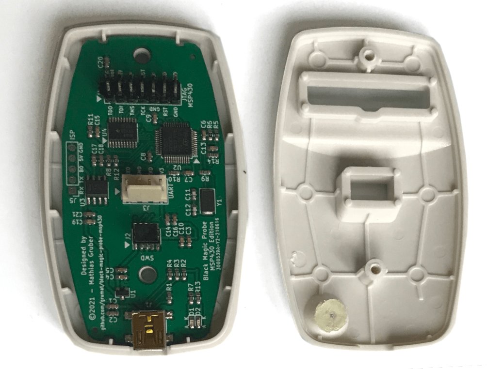
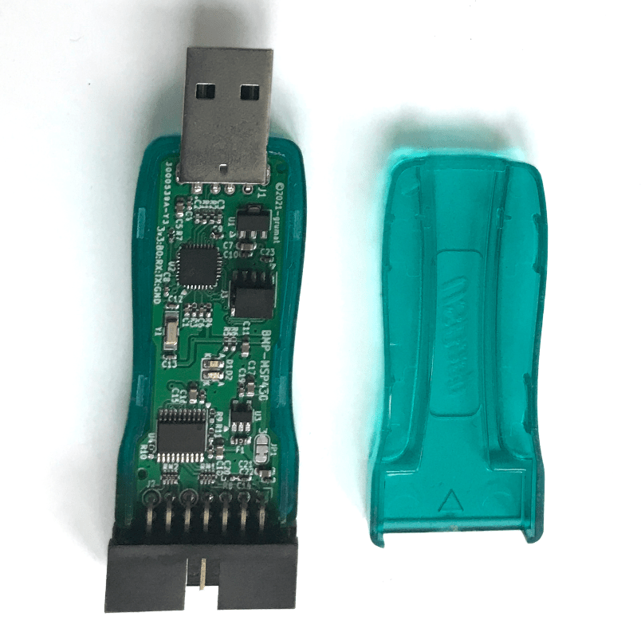
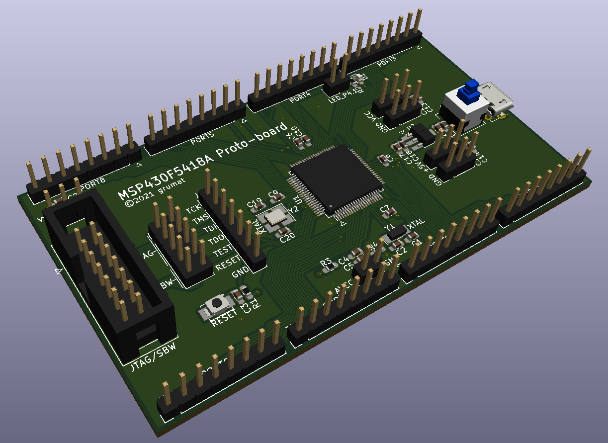

# Hardware Platform

At the current point there two alternatives to be used as a platform 
to run the firmware developed here.

The first is an accessible option that can be developed using simple 
prototype boards and its primary goal is to serve as the main firmware 
development platform.

A second was prepared when we start to move to a more modern version of 
the STM32 family, since the old STM32F103 is probably not a priority 
these days since there are so many cheaper alternative sources.

Two other hardware designs are physical prototypes which are part of a 
probe on how to apply them on a professional plastic case.

Note that for all options you will find a KiCad project on the repo, including some useful adapters.

Last but not least, it is planed to support regular ST-Link V2 clones - 
I means use the chinese hardware provided with them - but at the cost of 
some important features:
- no support to target supply voltages other than 3.3V
- no standard MSP JTAG connector
- slower JTAG signals using bit banging
- UART function will only be possible when applying patches on the PCB.

So, a low cost option is possible to make tests before going to a more 
featured but costly option.

## Firmware Development Platform

Two designs were made for the firmware development, based on the STM32 Blue-Pill, Black-Pill or some of the STM Nucleo-32 boards.  
These are **functional prototypes** which uses larger boards, that allows 
for hardware patches, in the case some specific hardware feature has to 
be improved.

Both designs are based on a main board that feature a compatible socket 
to fit one of these common prototype boards.

See this illustration:

  
[Details for this option can be found here](BlackPill-BMP/README.md).

And for the Nucleo-32 variant:

[Details for this option can be found here](L432KC/README.md).

Both design contains pins for the connection of a Logic Analyzer, which 
is an essential tool in the development stage. Surely if one wants just test the firmware this is also the best option.

All these platforms has a fixed 3.3V regulator that are capable to supply 
power to a simple MSP430 board without an additional power supply and 
they incorporate a programable voltage output and voltage level 
translator so all kind of MSP430 boards that works up to 3.3V can be 
attached to the JTAG port.

## Production quality designs

The general use of a emulator device requires some robustness which 
requires a nice plastic case. So I searched websites for common emulators 
used for the ARM platform, as they are very affordable, and decided for
two main options.

The first option is to use the plastic case from the ST-Link clone. This 
design contains two output port, originally targeted to the **STM8** and 
**STM32** connectors, which in my case will be used for **VCP** and 
**MSP430 JTAG** ports.

So at this point a **physical prototype** was designed to check this option:

  
[Details here](MSPBMP/README.md).

The second design uses a more compact option, but at the cost of the additional VCP connector.

It uses a more rare alternative to the ST-Link called *baite* variant, 
which are sold in a green transparent plastic case. Alternatively one can buy the [USBASP](https://www.avrfreaks.net/sites/default/files/forum_attachments/20190528_231028.jpg) for the AVR, which uses the same plastic case.

The challenge in this option is that TI JTAG connector uses a **14-pin** 
connector and these *baite* plastic cases are designed for a **10-pin** 
connector.  
A change on the original design was necessary: The JTAG connector was 
moved to **the outer edge** of the plastic case, and as I received the 
prototype board from the manufacturing it ends to be a perfect fit.

This physical prototype is shown below:

  
[Details here](MSPBMP2-stick/README.md).

## Target Prototype Boards ##

Besides the series of affordable targets of the *LaunchPad series*, some 
larger targets requires prototype boards for the development of the 
firmware.

On the repo you will find KiCad prototypes for:

- Generic legacy MSP430 board, for many variants, such as **MSP4301611**, 
**MSP430F249** and many others. This board has pads for dual pin-outs and 
instead of just the option of a MCU at the top, an alternative pin-out 
was added at the bottom, that is compatible with the **MSP430G2955** and 
similar variants.   
So a single PCB manufacturing provides really lots of alternatives:  
  
[Details here](Target_Proto_Boards/MSP_Proto/README.md).

- An option was designed for a newer model using the **FRAM** based on **MSP430FR2476**.  
  
[Details here](Target_Proto_Boards/FR2476/README.md).

- An additional option was designed for the **MSP430F5418A** family, 
which is still based on flash memory, but uses the **CPUXv2** of the 
MSP430.
  
[Details here](Target_Proto_Boards/F5418/README.md).

This diversity is required as JTAG protocols for each family have minor 
differences and we aim more compatibility.
