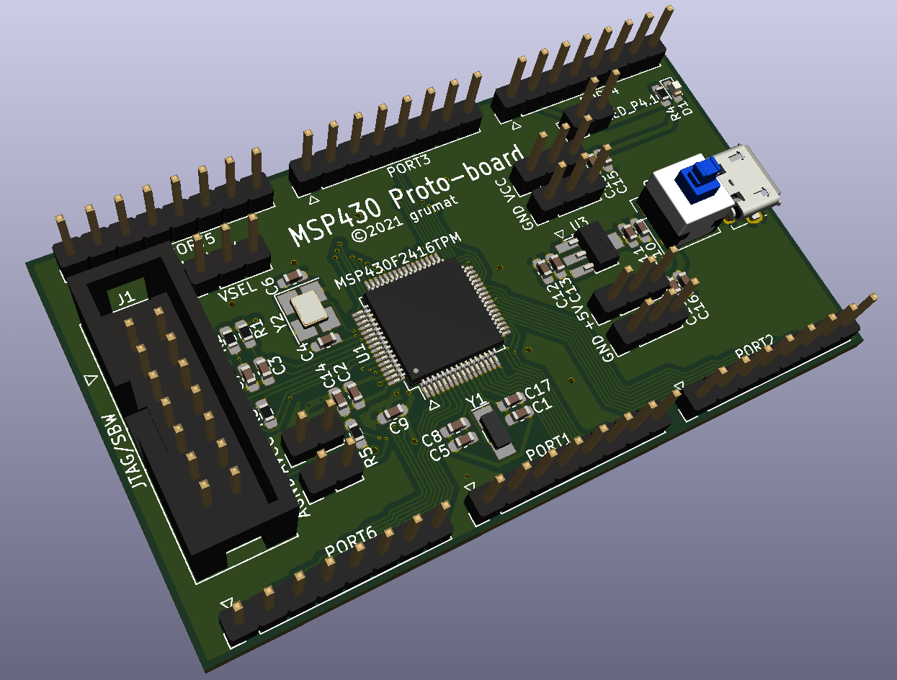

# Hardware Platform

At the current point there are two alternatives to be used as a platform 
to run the firmware developed here.

The first is an accessible option that can be developed using simple 
prototype boards and its primary goal is to serve as the main firmware 
development platform.

A second was prepared to start a move to a more modern version of 
the STM32 family, since the old STM32F103 is probably not a priority 
these days, since there are so many cheaper alternative sources.

Two other hardware designs are physical prototypes which are part of a 
check on how to apply them onto a professional looking plastic case.

Note that for all options you will find a KiCad project on the repo, 
including some useful adapters.

Last but not least, it is planned to support regular ST-Link V2 clones - 
yes, use a ready and cheap chinese hardware - but at the cost of some 
important features:
- no support to target supply voltages other than 3.3V
- no standard MSP JTAG connector
- slower JTAG signals using bit banging
- UART function will only be possible when applying patches on the PCB.

Nevertheless, a low cost option is possible to make tests before going to 
a more featured but costly option.

# Firmware Development Platforms

Two designs were made for the firmware development, based on the STM32 
Blue-Pill, Black-Pill and also some of the STM Nucleo-32 boards.  
These are **functional prototypes** which uses larger boards, that allows 
for hardware patches, in the case some specific hardware feature has to 
be improved.

Both designs are based on a main board that feature a compatible socket 
to fit one of these common prototype boards.

See this illustration:

  
[Details for this option can be found here](BlackPill-BMP/README.md).

And for the Nucleo-32 variant:

[Details for this option can be found here](L432KC/README.md).

Both design contains pins for the connection of a **Logic Analyzer**, 
which is an essential tool in the development stage. Surely if one wants 
just test the firmware this is also the best option, since BLuePills are quite common.

All these platforms has a fixed 3.3V regulator that are capable to supply 
power to a simple MSP430 board without an additional power supply and 
they incorporate a programable voltage output and voltage level 
translator so all kind of MSP430 boards that works up to 3.3V can be 
attached to the JTAG port.

> **Important Info:** Currently, only the **BluePill** is supported. At 
> a second phase, **Nucleo-32 L432KC** will be supported, followed by the 
> **Nucleo-32 G431**. Since the chip crisis, BlackPills are rather rare 
> and offers no real advantage over the other COrte-M4 based devices. 
> Although a hardware support was already designed, advantages are quite 
> questionable now.

# Production Quality Designs

The general use of a emulator device requires some robustness which 
requires a nice plastic case. So I searched websites for common emulators 
used for the ARM platform, as they are very affordable, and decided for
two main options.

## The STLink V2 Form Factor

The first option is to use the plastic case from the ST-Link clone. This 
design contains two output port, originally targeted to the **STM8** and 
**STM32** connectors, which in my case will be used for **VCP** and 
**MSP430 JTAG** ports.

So at this point a **physical prototype** was designed to certify 
viability of this option:

  
[Details here](MSPBMP/README.md).

> At the time of this writing a redesign is being fabricated by JLCPCB. 
> This new design has an updated circuit diagram. A physical model will 
> become reality in the next couple of months, after implementation of 
> the VCP support.

## The *Baite* Form Factor

The second design uses a more compact option, but at the cost of the 
additional VCP connector.

It uses a more rare alternative to the ST-Link called *baite* variant, 
which are sold in a green transparent plastic case. Alternatively one can 
buy the [USBASP](https://www.avrfreaks.net/sites/default/files/forum_attachments/20190528_231028.jpg) 
for the AVR, which uses the same plastic case.

The challenge in this design is that TI JTAG connector has **14-pins** 
and the original *baite* plastic case fits a **10-pin** connector.  
A change on the original requirement was necessary: The JTAG connector 
was moved straight to **the outer edge** of the plastic case, like in the 
picture below. To keep the PCB stable inside this case a rectangular 
shape was not allowed. So, exact grooves were added to the board outline 
to provide mechanical stability.

This physical prototype is shown below:

  
[Details here](MSPBMP2-stick/README.md).

> The definitive version of this build form was already started and a 
> *Work In Progress* schematic+PCB is already on the Repo. But note that 
> a final build will only happen when the prototype (see below) is 
> running flawlessly. This option has a higher cost for babrication 
> because it uses really tiny resistors and capacitors (0402 series), 
> which forces me to order the SMT mounting service at JLCPCB, which 
> definitely increases costs. An early birth problem is not allowed. 
> The Nucleo-32 prototype will consolidate this design.

# Target Prototype Boards

Besides the series of very known affordable targets of the *LaunchPad 
series*, some larger MSP430 targets requires prototype boards for the 
development of the firmware. Worth to mention is that *Launchpads* 
have Spi-bi-Wire units and the current development aims to implement 
JTAG before SBW, for a more focused work (SBW is a multiplexed version 
of the JTAG, which means there is room for improvements).

On the repo you will find KiCad prototypes for:

- Generic legacy MSP430 board, for many variants, such as **MSP430F1611**, 
**MSP430F249** and many others. This board has pads for dual pin-outs and 
instead of just the option of a MCU at the top, an alternative pin-out 
was added at the bottom, that is compatible with the **MSP430G2955** and 
similar variants.   
So a single PCB manufacturing provides really lots of alternatives, 
covering families specification of the **SLAU049** and the **SLAU144** 
user guides:  
  
[Details here](Target_Proto_Boards/SLAU049_SLAU144/README.md).

- An option was designed for the **MSP430F5418A** family, 
which is still based on flash memory, but uses the **CPUXv2** of the 
MSP430. This board will help cover **SLAU208** user guide device 
specification. 
  
[Details here](Target_Proto_Boards/SLAU208_F5418/README.md).

- For the **SLAU272** and **SLAU367** family of devices, another board 
was designed for the **TSSOP-38** package. These device features the 
newer **FRAM** technology, which has considerable impact on the firmware 
design: 
  
[Details here](Target_Proto_Boards/SLAU272_SLAU367/README.md).

- A very reduced set of chips were developed having high precision A/D's, 
which are governed by the **SLAU335** users guide and quite similar to 
the **MSP430F2xxx** family. A prototype board was also developed to cover 
them, as shown in the following picture:
  
[Details here](Target_Proto_Boards/SLAU335/README.md).

- An additional option was designed for a newer model using the **FRAM** 
based on **MSP430FR2476**. These generation is documented on the 
**SLAU445** Users Guide. 
  
[Details here](Target_Proto_Boards/SLAU445_FR2476/README.md).

This diversity is required as JTAG protocols for each family have minor 
differences and we aim more compatibility.
