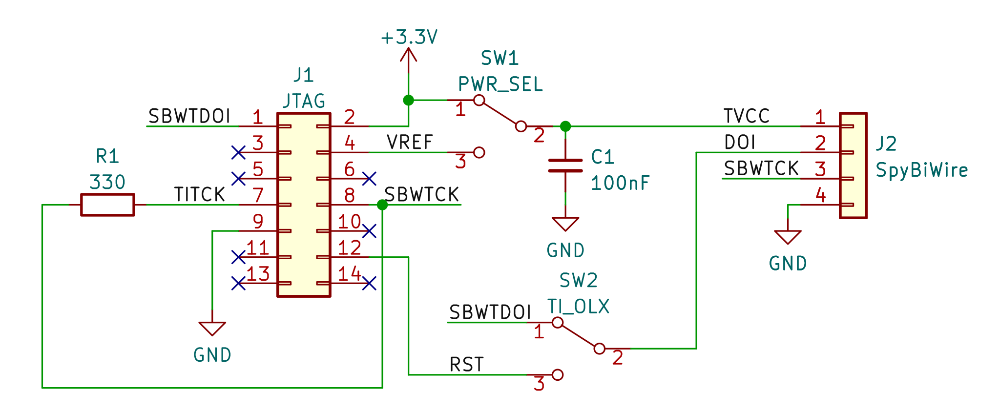

# SBW Adapter Board

This is a simple adapter board that is used to facilitate the wiring for 
Spi-bi-Wire interface, proving a more robust interface.

The schematics is quite simple and shown below:

The board has two switches to allow for specific use. 

## Power Switch

One switch allows you to select the function of the **TVCC** pin. One 
option is to use it as **power supply** for the daughter board and the 
other option it is configured as **voltage reference** of a self powered 
daughter board.

> The function is marked on the silk-screen.

## TI / Olimex Emulator

The standard wiring for the Spi-Bi-Wire is obviously from the TI emulator, 
which uses the **Data I/O** to the **pin 1** (TDO) of the JTAG connector. 
On the Olimex emulator this function is performed by **pin 12** (RST).

> Since Olimex is quite cheep but fast emulator it is worth the use. It is 
> a pity that it has no support.

