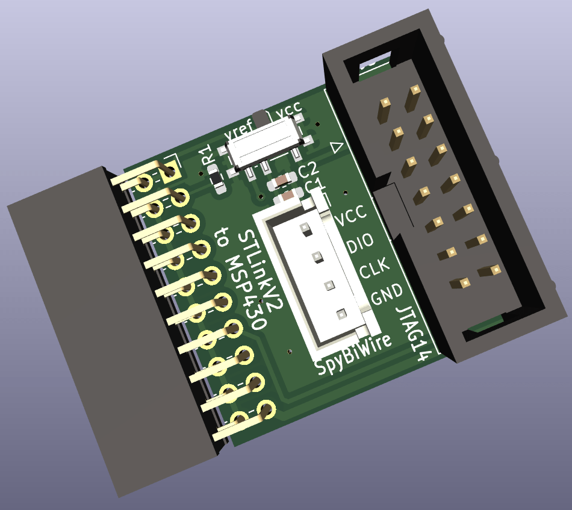
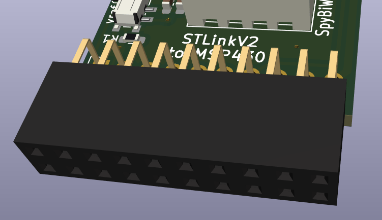
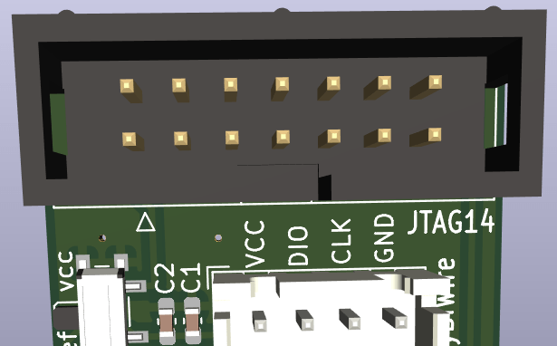
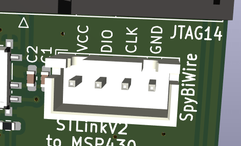

# STLink-to-MSP430 Adapter Board

This is an adapter currently not in use, that was designed as a resource 
to migrate Glossy-MSP430 firmware to a regular STLink clone using a fixed 
3.3V realm.

The idea behind this future project is to produce an entry level option 
for those willing to experiment Glossy-MSP430 without the effort to 
develop hardware prototypes.

The schematics are shown below:

This board does not feature any active component, so it is just a solid 
and compact solution to avoid a bunch of wires.

## Power Selection Switch

Since MSP430 target boards can be designed with or without an active 
power supply, provided on pins 2 or 4 of a standard MSP430 flat cable, a 
switch was added to the adapter board to select the power supply strategy 
that will be used.

For self powered target board, this switch should be moved to the 
**vref** position. In the example of the picture, switch is on the 
**vcc** position, then the STLink will power the target board.

## The **TEST** Pin Pull Down

A weak pull-down resistor was added to ensure that the **TEST** pin of 
the MSP430 has a stable level. This is **optional**, since devices 
featuring the TEST pin also have an embedded pull-down resistor.

## The JTAG-20 Port

The JTAG 20-pin port is designed to fit a generic STLink device. Do not 
attempt to use it on a JLink or other ARM debugger, since pinout may 
differ in the aspect of the power supply.

# The JTAG-14 Port

The JTAG-14 port is compatible to a TI MSP430 port and should be able to 
interface any target board following this pinout.

**DO NOT USE THIS CONNECTOR FOR SBW CONNECTION!** See section below.

> Please note that STLink can only provide 3.3V signals, even if you 
> attempt to use an original unit, which contains a voltage translator.  
> This is because STLink benefits from the fact that STM32 JTAG pins are 
> always **5V tolerant pins**, which means that the voltage translator 
> inside the original STLink is used to translate lower voltages to the 
> 3.3V realm. But output voltages are always at the 3.3V realm, which 
> means it could damage an MSP430 device powered with less than 3V.

# The Spy-Bi-Wire Port

For the SBW (Spy-Bi-Wire) port, the custom firmware will use the same pinout of the ARM SWD interface, which differs from what an MSP-FET uses.

For this reason it is necessary to **always** use a dedicated connector: 

The table below compares the different SBW connections for different 
debuggers:

|       |    TI    |  Olimex  | STLink (Glossy MSP430) |
|-------|:--------:|:--------:|:----------------------:|
|  DIO  | TDO      | RST      |           TMS          |
|  CLK  | TCK/TEST | TCK/TEST |           TCK          |

So for this adapter, connections shown on the last column are used.
