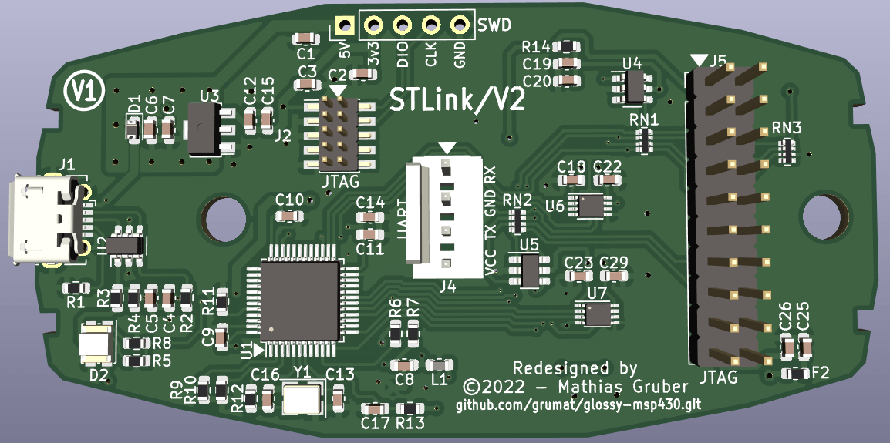
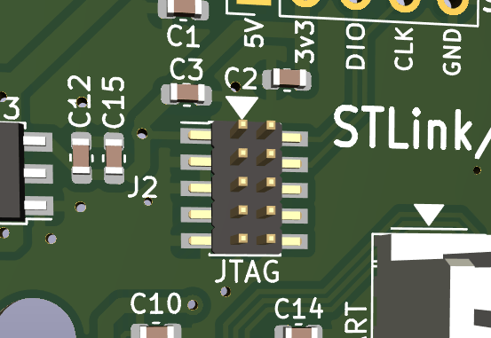

# STLink V2

This is a picture of a typical STLinkV2:

## Introduction 

This project is a redesign of the original STLinkV2 project, using the 
same components of the **Glossy MSP430**. The reasons for this redesign 
are:
- The original STLinkV2 cannot be found anymore, as it was replaced by 
a **Version 3** using a much faster controller
- Clones have no support for variable target voltages.
- Also no support for an UART connection, which in this version, borrows 
the **SWIM** connector for that purpose.
- Last but not least, test the **Geehy APM32F103CBT6** MCU as a 
replacement, since original **STM32F103CBT6** is impossible to find. 

## Use Cases 

Two specific use cases are planned: 
- Install the [Black Magic Probe firmware](https://github.com/blackmagic-debug/blackmagic) 
on them
- Develop the port of **Glossy MSP430** firmware to these devices.

## Important Note About Variable Target Voltage on a STLinkV2

Although support for variable voltage is present on an Original STLinkV2 
it is not possible to use this feature outside the STM32 world. The 
reason is that STM32 chips have 5V-tolerant pins on the JTAG bus and this 
device considers this as true. All outputs are on a 3.3V realm, 
regardless of the voltage applied on pin 1/2:

Voltage translators installed on this design are only used to translate 
input signals, since it is not possible to identify logic true value on a 
1.8V link.

So even if I code a **Glossy MSP430** firmware port for this platform, it 
is not possible to use a STLinkV2 with a MSP430 using 3V or lower supply 
voltage, because the MSP430 MCU will suffer over-voltage on the debug 
pins. 

## A Brief Project Presentation

This is the 3D model:

The board can directly replace clones you've bought in AliExpress or 
Amazon. 

For the development of the **Glossy MSP430** firmware a standard ARM 
10-pin connector was added:

But for a regular SWD access you can also have access using regular 
jumper cables:

And the SWIM connector was modified to implement a UART port:

Note that the VCC pin is a power input pin, which is also connected to 
pins 1 and 2 of the JTAG connector. Keep in mind that they should belong 
to the same power supply realm.

## Other features

This design also features some nice adds that are typically not present 
on a clone:
- ESD protection for the USB bus (**U2**)
- EMI protection for the USB bus (**C4** and **C5**)
- ESD protection for the JTAG bus (**U4** and **U5**)
- Voltage translation chips (**U6** and **U7**)
- 200 mA Fuse protection for the 3.3V output, when using the emulator to 
supply voltage to a target board (JTAG pin 19).
- A Micro-USB connector instead of Mini-USB.

