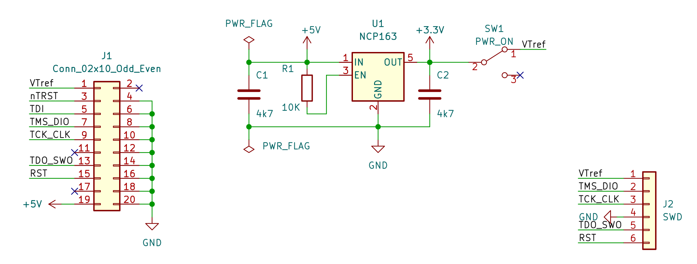

# SWD Adapter Board

This is a simple adapter board to help connect a SWD board to a standard 
20-pin JTAG connector.

The schematics are shown below:

Beyond the standard **DIO** and **CLK** signals, the board offers access 
to the **SWO** input. An access to the **RST** output is also provided, 
which is very common on the BlackPill board variant.

Note that the pin layout favors connection to the popular BluePill using 
a standard 4 pin flat cable, without twisting any wire.

## Optional Power Supply Switch

Most JTAG emulator provide on the **pin 19** a power output. On a JLink 
this pin provides 5V, which is too much and on the ST-Link this value is 
3.3V which is perfect.

The solution was to add a power regulator with a very low voltage dropout 
(100 mV), so you can connect this board on both emulators and still 
supply voltage to a daughter board. When using a this board on the JLink 
the output voltage is precisely 3.3V. On a ST-Link this output voltage will be 3.2V, which is acceptable.

Naturally, for self-powered boards, this function should be disabled by 
turning this switch off.
