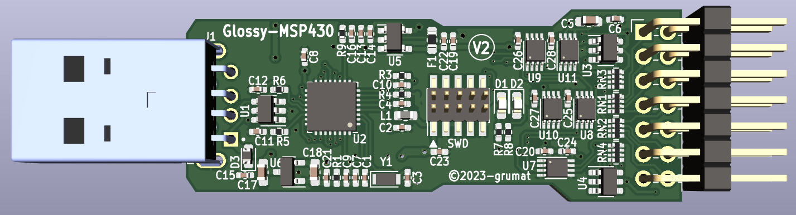
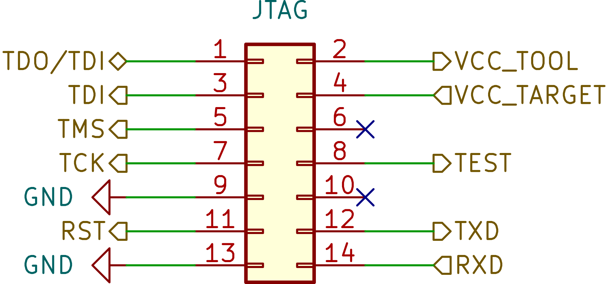

# **Glossy MSP430 &ndash; The Stick Form Factor**

> ***Preliminary Preliminary Preliminary Preliminary Preliminary***  
> ***Preliminary Preliminary Preliminary Preliminary Preliminary***  
> ***Preliminary Preliminary Preliminary Preliminary Preliminary***

This manual describes the use and the features of the Glossy MSP430 debug 
probe for MSP430™ microcontrollers (MCUs). It includes information about 
the debugger probe hardware and software. It documents frequently asked 
questions on how to enable and disable certain features.

# Glossy MSP430 Stand-Alone Debug Probe

The Glossy MSP430 (see picture below) is a powerful debug probe for 
application development supporting all MSP430 microcontrollers.  
The Glossy MSP430 provides a USB interface to program and debug the 
MSP430 MCUs in-system through the JTAG interface or the pin-saving 
Spy-Bi-Wire (2-wire JTAG) protocol. Furthermore, the USB interface can 
be used for Backchannel UART communication.

The Glossy MSP430 development tool supports development with all MSP430 
MCUs and is designed for use with PCBs that contain MSP430 MCUs; for 
example, the MSP430 target socket boards.

## General Features

The Glossy MSP430 debug probe includes the following features:
- Support for GDB 7 and newer;
- Automatically recognize old MSPGCC GDB version and switches protocol;
- Operating systems: OS X, Linux, Windows;
- Software configurable supply voltage between 1.8 V and 3.6 V at 100 mA;
- External voltage detection;
- Supports all MSP430 boards with JTAG header;
- Supports both JTAG and Spy-Bi-Wire (2-wire JTAG) debug protocols;
  - Spy-Bi-Wire pinout is compatible to TI MSPFET debug unit;
- Software breakpoints in flash, FRAM, and RAM
- Application backchannel UART included (VCP) in the JTAG connector;
- Flash and FRAM programming support;
- Debug probe firmware field update is supported;
- Five JTAG clock speeds up to 10 MHz.

# Stick Form Factor (Baite Plastic Case)

This is the primary hardware version for the Glossy MSP430 emulator. This 
is a build option for a rugged, compact and professional looking device, 
which repurposes the plastic case of common *Baite* AVR tools, which are 
quite cheap and still easy to be found on eBay, Amazon or AliExpress.

The idea is to buy such a cheap clone and discard the chinese PCB and 
replace it with the solution provided by this KiCad Project.

This a picture of a typical *Baite* device:

This project is completely based on the L432KC prototype board schematics 
and it will be the first release in accordance with the physical 
requirement.

# Board Assembly Instructions

This board uses SMD parts with 0402 SMD size, which is not an easy task 
for manual assembly. So the basic SMD elements are assembled by JLCPCB as 
part of the order.

But SMD parts with bigger body size still have to be done manually. 

The assembly instructions can be found on the 
[FABRICATION.md](FABRICATION.md) file.

## First Time Firmware Install

Before installing the board into the plastic case, you need to install a 
firmware with the new version of the debugger.

For this, you should put the MCU in DFU mode, by shorting the appropriate 
jumper and connecting to the PC. The you can write a fresh firmware file.

## Taking *Baete* Device Apart

This case has now screws. The top and bottom case parts are just joined 
together using a regular friction. You have to slowly push them apart.
Remove the big stick underneath. Eventually there will be glue residue 
stuck to the plastic case. Use alcohol to remove it.

## Reassembling the New Glossy MSP430

This is quite simple: Swap the PCB boards, removing the *Baete* PCB, 
then insert the Glossy MSP430 PCB. Close the plastic case.

> Note that the Glossy MSP430 board is larger than the *Baete* PCB. On 
> the new PCB, connector is placed outside the case, so it was possible 
> to use th standard 14-pin connector instead of the 10-pin connector 
> of the original *Baete* design. 

# Glossy MSP430 Debug Probe Overview

The following table is an overview of the capabilities and features for 
the Glossy MSP430 debug probe.

> **CAUTION**  
> Never disconnect the JTAG or emulator USB cable during an active debug 
> session. Make sure to perform a free-run before disconnecting the JTAG 
> connector to avoid current consumption or functionality issues. And 
> always terminate a running debug session properly, by clicking on the 
> "Terminate" icon, before disconnecting the target device.

| Feature                                            | Support |
|:---------------------------------------------------|:-------:|
| Supports all programmable MSP430 and CC430 devices |    Y    |
| Allows JTAG access protection (fuse blow)          |    N    |
| Adjustable target supply voltage                   |    Y    |
| 4-wire JTAG                                        |    Y    |
| 2-wire JTAG (SBW: Spy-Bi-Wire)                     |    Y    |
| BSL tool or mode                                   |    N    |
| Backchannel UART (VCP)                             |    Y    |
| Support for Windows                                |    Y    |
| Support for MacOS                                  |    Y    |
| Support for Linux                                  |    Y    |
| EnergyTrace™ technology                            |    N    |

# Using the Power Supply Feature of the Glossy MSP430

There are two different scenarios to configure the power supply when 
connecting a target board to the Glossy MSP430.

## Power Supplied by Glossy MSP430

The Glossy MSP430 debug probe can supply targets with up to 100 mA 
through pin 2 of the 14-pin JTAG connector.

### The Polyfuse Current Protection

**NOTE:** Connection of a target board while power supply is active may 
cause a peak current that triggers the embedded *polyfuse* protection 
causing connection problems. Firmware tries to detect such scenarios 
and turns power supply output off for a while, to let fuse reset.

MSP430 target boards usually have a jumper to select the power supply 
mode. Removing this jumper, waiting a bit and reinsert it may help 
reset the fuse.

**Example:** If the target board has a capacitor on the VCC line with a 
capacity of more than 10 µF, it may cause an inrush current during 
capacitor charging that may exceed 60 mA. In this case, the current 
should be limited by the design of the target board, or an external power 
supply should be used.

Target VCC is selectable in a range between 1.8 V and 3.6 V in steps of 
0.1 V.

## Self Powered Target Board

Alternatively, the target can be supplied externally. In this case, the 
external voltage should be connected to **pin 4** of the 14-pin JTAG 
connector. Glossy MSP430 adjusts the level of the JTAG signals to
automatically match the external VCC.

> **NOTE:** Only pin 2 (Glossy MSP430 tool supplies target) or pin 4 
> (target is externally supplied) must be connected. Both connections are 
> not supported at the same time.
> 
> Even if an external supply powers the target device on the target 
> socket module and any user circuitry connected to the target socket 
> module, the Glossy MSP430 tool continues to be powered from the PC 
> through the USB interface.

### Weak Voltage Reference

Note that a weak 3.3V voltage reference is also internally connected to 
the pin 4, so if no voltage level is provided by the target board, 3.3V 
will be used.

# Hardware Installation

This section describes how to install the drivers for Glossy MSP430 debug 
probe. The drivers are needed to enable the IDE (integrated development 
environment) to use the debug probe that is connected to the system.

Except for Windows 7, Glossy MSP430 drivers are automatically installed 
by the Operating System. It just requires standard CDC drivers.

# Software, Glossy MSP430 and Hardware Integration

This section includes all specifications and features for the Glossy 
MSP430 debug probe. The debug probe hardware and different debug mode 
configuration and setting are described.

The Figure below is an overview of the MSP development ecosystem showing 
the relations between IDE, GCC Toolchain, debug probe and the MSP device 
itself.

## The IDE

For embedded development using the Glossy MSP430 debug probe it requires 
an IDE that is able to interoperate with the GCC Toolchain. There are 
many options nowadays, like VSCode, Eclipse, Code::Blocks and the Visual 
Studio + VisualGDB plugin.

## The GCC Toolchain

The GCC Toolchain is a complete open source C/C++ compiler, which is able 
to produce high quality binary code. With the exception of the GCC 8.3.1 
release, they are very stable and optimized.

> The GCC 8.3.1 version does not produce a good bit shift operation for 
> the legacy MSP430 CPU core, so I generally cannot recommend. But for a
>  CPUv2 (20 bit address support) this is probably not an issue.

Another tool installed with the toolchain is the **GDB debugger**. This 
debugger is able to connect to a target using the 
[GDB Remote Serial Protocol](https://sourceware.org/gdb/onlinedocs/gdb/Remote-Protocol.html),
either through a network socket or a serial communication port.

> TI offers a very good port of the [Mitto Systems GCC toolchain](https://www.ti.com/tool/MSP430-GCC-OPENSOURCE), 
> besides one can also use the now very outdated [MSPGCC](https://sourceforge.net/projects/mspgcc/). 
> 
> Another good source of prebuilt MSP430 compilers can be found on the 
[SysProgs website](https://gnutoolchains.com/msp430/).

## Glossy MSP430 and the MCU

On the other hand, the Glossy MSP430 debugger connects to a MSP430 MCU 
through a JTAG interface. It also implements a virtual serial port using 
its USB connection. This communication port understands the 
*GDB Remote Serial Protocol* and translates GDB requests into JTAG 
instructions, controlling the MCU.

# Software Breakpoints in Flash, FRAM, and RAM

The Glossy MSP430 debugger supports the use of software breakpoints in 
Flash, FRAM, and RAM. Software breakpoints let the user set up to 32 
breakpoints during an active debug session.

Without software breakpoints enabled, the number of breakpoints that can 
be set is limited to the number of hardware breakpoints available by the 
specific MSP MCU. The Glossy MSP430 debugger prefer the use of hardware 
breakpoints as much as possible. However, if the MSP breakpoint logic 
runs out of hardware breakpoints, software breakpoints are used 
automatically.

A software breakpoint is a smart feature, that programs into the desired 
code position an invalid CPU instruction (i.e. a 16-bit value that cannot 
exists in a normal program) and through one of the hardware breakpoints, 
monitors the *Instruction Fetch* operation to stop the CPU when this 
particular 16-bit value is fetched.

The firmware contains a memory manager that replaces memory positions 
where breakpoint exists to accommodate the proper 16-bit value, when 
running, reading or fetching these positions, so that the original 
programmed behavior is always followed.

> **NOTE:** When the debug session is closed, all software breakpoints 
> are erased and the original memory content is restored.

# JTAG Access Protection (Fuse Blow)

The Glossy MSP430 does **not** have the hardware provision to blow JTAG 
fuses. So it is not recommended as a production tool, since you cannot 
lock the access to the MCU and provide IP protection.

# Glossy MSP430 Debug Clock Speed

The Glossy MSP430 allows you to configure the protocol speed in five 
different rates, according to the following table:

| Interface | Level 1 | Level 2  | Level 3  | Level 4  | Level 5  |
|-----------|---------|----------|----------|----------|----------|
| SBW (*)   | 156 KHz |  313 kHz |  625 KHz | 1.25 MHz |  2.5 MHz |
| JTAG      | 625 KHz | 1.25 MHz |  2.5 MHz |   5 MHz  |  10 MHz  |

(*) Under development: Values are prognostics.

# Backchannel UART

When connecting the Glossy MSP430 into a PC two communication ports are 
added to the OS device list. Enumeration of these devices depends on the 
host OS, but usually the first device refers to the GDB port, that 
implements a *GDB Remote Serial Protocol*.

A second communication port is added that implements common low voltage 
serial port, accessible for your target board in a properly designed JTAG 
connector.

It is important to note that the voltage realm of the target will be 
used. This means that the voltage on the pin 2 of the JTAG connector 
supplies the in/out buffer components on the UART interface.

# LED Signals

The Glossy MSP430 shows its operating state using a single dual color 
LED. The next table shows all possible states:

| Color |  State   | Function                                        |
|:-----:|:--------:|:------------------------------------------------|
|  Off  |   ---    | Power off or not functional.                    |
| Green |    On    | Awaiting GDB connection.                        |
| Green | Blinking | Ongoing communication on one of the VCP port.   |
|  Red  |    On    | Active JTAG/SBW debug session.                  |
|  Red  | Blinking | Active Debug session and ongoing communication. |

> Do not disconnect the target board while a debug session is active.

# JTAG and UART Target Connector

The image below shows the pinout of the Glossy MSP430 JTAG and the UART 
connectors:

## Glossy MSP430 Pin States After Power Up

The following table describes the electrical state of every JTAG pin 
after debug probe power up.

| Pin | Name       | After Power Up | JTAG Active   | SBW Active    |
|:---:|:-----------|:--------------:|:-------------:|:-------------:|
|  1  | TDO/TDI    | Hi-Z, PU       | In, TDO       | In and Out, SBWTDIO |
|  2  | VCC_TOOL   | 3.3V           | Target Vcc    | Target Vcc    |
|  3  | TDI        | Hi-Z, PU       | Out, TDI      | Hi-Z, PU      |
|  4  | VCC_TARGET | In, Vcc sense  | In, Vcc sense | In, Vcc sense |
|  5  | TMS        | Hi-Z, PU       | Out, TMS      | Hi-Z, PU      |
|  6  | n/c        | not connected  | not connected | not connected |
|  7  | TCK        | Out, Vcc       | Out, TCK      | Out, SBWTCK   |
|  8  | TEST       | Out, GND       | Out, Vcc      | Out, Vcc      |
|  9  | GND        | Ground         | Ground        | Ground        |
| 10  | n/c        | not connected  | not connected | not connected |
| 11  | RST        | Out, Vcc       | Out, RST      | Out, GND      |
| 12  | TXD        | Hi-Z, PU       | n/a           | n/a           |
| 13  | GND        | Ground         | Ground        | Ground        |
| 14  | RXD        | Hi-Z, PU       | n/a           | n/a           |

Term and Abbreviations (in alphabetical order):
- **Hi-Z:** High impedance
- **n/a:** Does not apply to JTAG or SBW state
- **PD:** Weak Pull Down to Ground
- **PU:** Weak Pull Up to Target VCC
- **RST:** Test Reset
- **RXD:** UART receive data
- **TCK:** Test Clock
- **TDI:** Test Data In
- **TDO:** Test Data Out
- **TEST:** Test bus activate
- **TMS:** Test Mode Select
- **TXD:** UART transmit data
- **VCC_TARGET:** Firmware adjustable voltage that sources the target 
board. Do not connect to `VCC_TOOL`; these are mutually exclusive functions
- **VCC_TOOL:** Input used to read samples of the target reference voltage.  Do not connect to `VCC_TARGET`; these are mutually exclusive functions

> Note that state for the TXD and RXD pins on the table does not depends 
> JTAG or SBW use.  
> These lines are activated only when the backchannel UART is opened on 
> the host (i.e. a PC software opens the COM port).

# Specification

| Attribute              | Value                | Comments               |
|------------------------|----------------------|------------------------|
| **Mechanical**         |                      |                        |
| Size (without cables)  | NN x NN x NN         | Units in mm            |
| JTAG cable length      | 20 cm (max)          |                        |
| **Interface**          |                      |                        |
| USB Interface          | USB 2.0, full speed  | max. 500 mA            |
| Target Interface       | JTAG 14-pin          | See pinout above       |
| **JTAG and UART Interface** | **Electrical**  |                        |
| Target Output Voltage  | 1.8 to 3.6 Volts     | Output on Pin 2        |
| Target Output Current  | 100 mA               | Protected by Polyfuse  |
| External Target Supply | 1.8 to 3.6 Volts     | Input on Pin 4         |
| JTAG Fuse Blow         | Unsupported          |                        |
|                        | **Timing**           |                        |
| JTAG Clock Speed       | up to 10 MHz         | Selectable by Software |
| SBW Clock Speed | up to 10 MHz | RC on target RESET pin limits the clock speed |
|                        | **Data Rate**        |                        |
| Flash write speed (JTAG) | Up to NN kB/s      |                        |
| Flash write speed (SBW) | Up to NN kB/s       |                        |
| FRAM write speed (JTAG) | Up to NN kB/s       |                        |
| FRAM write speed (SBW) | Up to NN kB/s        |                        |
| Baud rate (UART)       | From 4800 bps        | Software selectable    |
|                        | up to 115200 bps     |                        |

