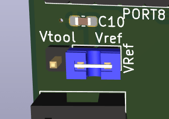
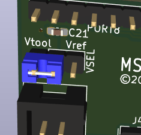
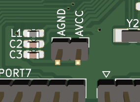

# MSP430F5418 Proto Board#

> For testing devices of family **SLAU208**.

The proto-board for the MSP430F5418 family is target for more complex 
devices using the **LQFP80** package. The main firmware development was 
made around this parts, as they offer both JTAG and SBW debug links and 
more complexity.

This board offers many configuration options as these chips support 
**JTAG** and SBW. Then you have additional configuration jumpers to fine 
tune your application.

The pictures shows a 3D model of this prototype board:


These are the features:
- Support for a couple of LQFP80 Flash parts: the MSP430F5437, 
MSP430F5437A, MSP430F5435, MSP430F5435A, MSP430F5418 and 
MSP430F5418A.
- Standard 14-pin JTAG connector
- Configurable support for JTAG and Spi Bi Wire. SBW can be 
configured for standard TI emulators and the Olimex 
MSP430-JTAG-Tiny-V2 emulators.
- Serial port on the JTAG connector.
- Support for power supply from JTAG connector or internal 
3.3V regulator using a Micro USB cable.
- A **24 MHz** ceramic resonator is provided for the main CPU clock. 
- **32768 KHz** crystal is provided for RTC and low power operations.
- Reset button.
- A simple analog voltage filter circuit (ADC support).
- Test led on **P4.1** configurable by jumper.
- All IO ports wired to accessible header pins.
- Header pins for **VCC**, **USB +5V**, **AVCC**, **GND** and **AGND**. 
- Header for a Logic Analizer on the JTAG signal.


# Users Guide

The following points describes general use of this board.


## External USB power supply

To use the external power supply connect a powered **µUSB cable** into 
**J4**. For this case the switch **SW2** will control the power.

Before connecting a JTAG cable into **J19**, ensure that the **VSEL** 
jumper shorts the **Vref** position.




## Powering from the JTAG tool

If you are just connecting the proto-board without additional hardware, 
then the power supply of the emulator will be enough to supply the 
installed chip and it is easier to use the emulator as source.

For this option just connect the JTAG tool to the **J19** JTAG connector 
and move the jumper on **VSEL** to the **Vtool** position. When the JTAG 
is connected and running, it will supply the board with its own power 
supply.



> Note that the switch **SW2** and the **+5V** jumper has no effect on 
> this configuration.


## Selecting JTAG or SBW Modes

Since pin-outs may differ when using JTAG or SBW the **J10** allows you 
to accomplish this. 

The silk screen indicates three jumpers set that needs to be shorted for 
the standard JTAG interface.

If you choose Spy-By-Wire, then, as indicated on the silk-screen, two 
jumpers are required.

> These options are mutually exclusive: **do not connect multiple options at the same time**.

You may also use this board with the **Olimex MSP430-JTAG-Tiny-V2** 
emulator. For this case just connect the central jumper.


### JTAG Configuration

For the JTAG mode the three jumpers connects the following pins:
- TDO &rarr; TDO (P1.7)
- TCK &rarr; TCK (P1.4)
- RST &rarr; RESET


> Note that these chips offers pins for the **PJ.0**, **PJ.1**, **PJ.2** 
> and **PJ.3** ports shared with the JTAG bus. This board does not 
> provide a jumper connection for them.  
> When using the SBW bus you are allowed to program them, but you will 
> not be able to interface them.


### Spy-By-Wire Configuration - TI pin-out

TI SBW uses the following connections:
- TDO &rarr; RESET
- TCK &rarr; TEST


> The Glossy-MSP430 device uses the TI pin layout.


### Spy-By-Wire Configuration - Olimex pin-out

Olimex SBW uses the following connections:
- RST &rarr; RESET


## Logical Analyzer Port

As this board is intended for the development of the firmware, a 
dedicated connection is provided to interface a logical analyzer. This is 
the **J5 / LogicAna** header.


Note that signal names are provided on the silk-screen.

This is a typical example of the use of the Logic Analyzer:


## Reset Button

The Reset button can be used at to restart the device, although it is 
advised not to interrupt a JTAG connection by pressing this button. Some 
references states that MCU may enter an undefined state.


## Analog Power Supply

The Analog supply pins are sourced from the digital power supply, applied 
to a basic noise filter stage. A jumper is provided to access **AVCC** 
and **AGND**. You cannot draw much current from them.




## Other Voltage Supplies

The board exposes all power supplies through jumpers. It is advised to 
follow good practice rules, as there are no kind of protection. 


The +5V pins are connected to a USB bus or power adapter. Low quality 
power sources may be a cause of issues.


## Using the LED function

To use the LED, just connect the **LED_P4.1** jumper.


A test program for the LED test could be:

```cpp
#include <msp430.h>

void Delay()
{
	long counter = 0;
	while (counter++ < 5000)
		asm("nop");
}

void MainLoop()
{
	WDTCTL = WDTPW | WDTHOLD;
	
	P4DIR |= (1 << 1);
	
	for (;;)
	{
		P4OUT |= (1 << 1);
		Delay();
		P4OUT &= ~(1 << 1);
		Delay();
	}
}

int main()
{
	MainLoop();
}
```


