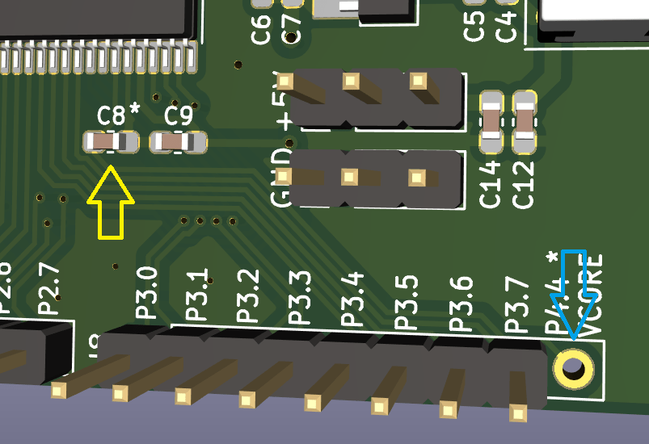
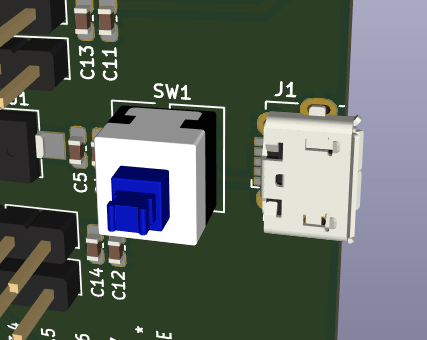
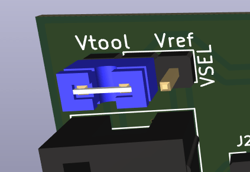
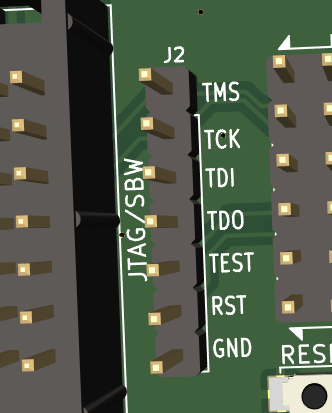
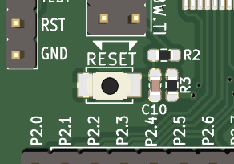
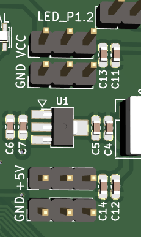
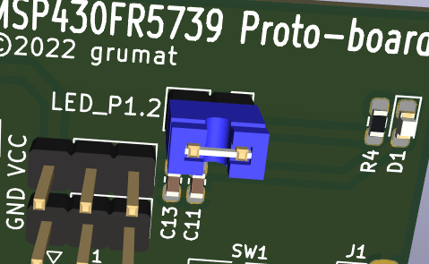

# MSP430FR5739/MSP430FR5858 Proto Board

> For testing devices families **SLAU272** and **SLAU367**.

The proto-board for the MSP430FR5739 + MSP430FR5858 family is target for 
the newer FRAM devices with **TSSOP-38**. There are not so many options 
with this pin-out, but FRAM changes JTAG operations quite a lot, so it is 
worth the investment for the development of an embracing emulator 
firmware. 

This board offers many configuration options as these chips support JTAG 
and SBW and many reserved pins for legacy parts can now operate as GPIO. 
Then you have more jumpers and solder jumpers than on other prototype 
boards.

The pictures shows a 3D model of this prototype board:


These are the features:
- Support for a couple of TSSOP-38 FRAM parts: the MSP430FR5730, 
MSP430FR5731, MSP430FR5732, MSP430FR5733, MSP430FR5734, MSP430FR5735, 
MSP430FR5736, MSP430FR5737, MSP430FR5738, MSP430FR5739, MSP430FR58471, 
MSP430FR5847, MSP430FR5848, MSP430FR5849, MSP430FR5857, MSP430FR5858, 
MSP430FR5859, MSP430FR58671, MSP430FR5867, MSP430FR5868 and MSP430FR5869. 
- Standard 14-pin JTAG connector.
- JTAG bus access for a logic analyzer.
- Configurable support for JTAG and Spi By Wire. SBW can be configured 
for standard TI emulators and Olimex MSP430-JTAG-Tiny-V2 emulators.
- Serial port on the JTAG connector.
- Support for power supply from JTAG connector or internal 3.3V regulator 
using a Micro USB cable.
- A 16 MHz crystal is provided.
- Reset button.
- A simplistic analog voltage support is provided for ADC use.
- Test led on **P1.2** configurable by jumper.
- All IO ports wired to accessible header pins.
- Header pins for **VCC**, **USB +5V** and **GND**.


# Users Guide

The following points describes general use of this board.


## Configuring the Board According to MCU model

This board supports two distinct MSP430 families having **TSSOP-38** 
package. Although they have almost identical pin-out, there is a slight 
design difference, which favors the newer parts. Parts starting with the 
**MSP430FR57xx** code are governed by the **SLAU272** users guide. In the 
other hand parts starting with the **MSP430FR58xx** numbering refers to 
**SLAU367** users guide.

It is important to check when the components are soldered to configure 
the board according to the part used.

For parts from **SLAU272** family:
- Solder the **C8** capacitor with a *470nF* value. The component is marked with an asterisk [**`*`**] in the boards silkscreen.
- The port 3 jumper should be mounted with an 8-pin header, leaving the 
**P4.4/VCORE** free. According to the specs the VCORE output is used internally for voltage regulation and no load should be applied on this 
pin, so **leave this pin unsoldered and disconnected**.



For parts from **SLAU367** family:
- **C8** should not be mounted. If for any reason the component was 
mounted, remove it. On MCUs of this family this pin is assigned to 
**P4.4** and switching a signal with this component soldered will cause 
additional load which increases in proportion to the switching speed, which is equivalent to a *short circuit*.
- For the port 3 header jumpers use a **9-pin** header to allow access to 
the **P4.4** function.


## External USB power supply

To use the external power supply connect a powered µUSB cable into 
**J1**. For this case the switch **SW1** will control the power supply.



Before connecting a JTAG cable into **J7**, ensure that the **VSEL** 
jumper shorts the **Vref** position.


## Powering from the JTAG tool

If you are just connecting the proto-board without additional hardware, 
then the power supply of the emulator will be enough to supply the 
installed chip and it is easier to use the emulator as source.

For this option just connect the JTAG tool to the **J7** JTAG connector 
and move the jumper on **VSEL** to the **Vtool** position. When the JTAG 
is connected and running it will supply the board.



> Note that the switch **SW1** and the **+5V** jumper has no effect on 
> this configuration and should be left disconnected or turned off.


## Selecting JTAG or SBW Modes

Since pin-outs may differ for different debug emulators the board offers 
three different options in the **J3** jumper.

The silk screen indicates four jumpers that needs to be shorted for the 
standard JTAG interface.

If you choose Spy-Bi-Wire, then you have two options: The silk-screen at 
the center indicates two jumpers for the standard TI connection or two 
jumpers for the Olimex MSP430-JTAG-Tiny-V2 emulators, shared with the standard JTAG jumpers.

> These options are mutually exclusive: **do not enable multiple options 
> at the same time**.


### JTAG Configuration

For the JTAG mode the four jumpers connects the following pins:
- TDO &rarr; TDO (PJ.0)
- TCK &rarr; TCK (PJ.3)
- RST &rarr; RESET
- TEST &rarr; TEST


> Note that these chips offers pins for the **PJ.0**, **PJ.1**, **PJ.2** 
> and **PJ.3** ports shared with the JTAG bus. This board does not 
> provide a jumper connection for them.  
> When using the SBW bus you are allowed to program them, but you will 
> not be able to interface them.


### Spy-By-Wire Configuration - TI pin-out

TI SBW uses the following connections:
- TDO &rarr; RESET
- TCK &rarr; TEST


> The **Glossy-MSP430** emulator uses the TI pin layout.


### Spy-By-Wire Configuration - Olimex pin-out

Olimex SBW uses the following connections:
- RST &rarr; RESET
- TEST &rarr; TEST


### Connection for the Logic Analyzer

During firmware development it is very desired to have the ability to 
read out the digital waves for the **JTAG** bus, since timing is a very 
critical factor.

This board offers an access to all signal required for debug:




## Reset Button

The Reset button can be used to restart the device. It is not advised to 
interrupt a running JTAG connection by pressing this button. Some 
references states that attached MCU may enter an undefined state.




## Other Voltage Supplies

The board exposes all power supplies through jumpers. It is advised to 
follow good practice rules, as there are no kind of protection.  
The **+5V** outputs are connected to a USB bus and will only be present 
if a cable is connected and supplying power.



## Using the LED function

To use the LED, just short the **LED_P1.2** jumper.



A test program for the LED test could be:

```cpp
#include <msp430.h>

void Delay()
{
	long counter = 0;
	while (counter++ < 5000)
		asm("nop");
}

void MainLoop()
{
	WDTCTL = WDTPW | WDTHOLD;
	
	P1DIR |= (1 << 2);
	
	for (;;)
	{
		P1OUT |= (1 << 2);
		Delay();
		P1OUT &= ~(1 << 2);
		Delay();
	}
}

int main()
{
	MainLoop();
}
```


