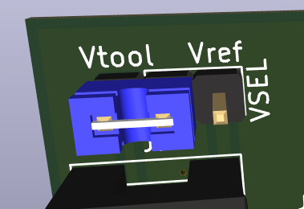
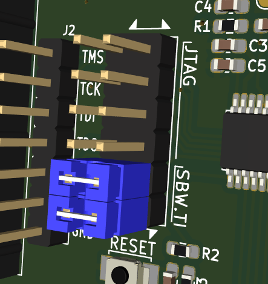
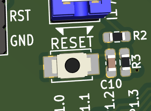
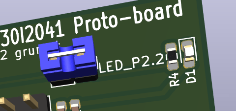

# MSP430i2041 Proto Board (SLAU335)

> For testing **SLAU335** devices family

The proto-board for the MSP430i2041 family is target for the application 
specific devices with **TSSOP-28** package. This is a special family 
designed for metering and are equipped with extraordinary 24-bit D/A, so 
there are not so many options available. 

This board offers a set of configurable options that will be covered by 
this documentation.

The pictures shows a 3D model of this prototype board:


These are the features:
- Support for the single series of chips having a **TSSOP-28** pin-out: 
the MSP430i2020, MSP430i2021, MSP430i2030, MSP430i2031, MSP430i2040, 
and the MSP430i2041. 
- Standard 14-pin JTAG connector.
- JTAG bus access for a logic analyzer.
- Configurable support for JTAG and Spi By Wire.
- Support for power supply from JTAG connector or internal 3.3V regulator 
using a Micro USB cable.
- Reset button.
- A simple analog voltage support is provided for ADC support
- Test led on **P2.2** configurable by jumper.
- All IO ports wired to accessible header pins.
- Header pins for **VCC**, **USB +5V** and **GND**.


# Users Guide

The following points describes general use of these boards.


## Configuring the Board According to MCU model

This board supports all distinct MSP430i20xx parts of this family having 
**TSSOP-28** package. Although they have almost identical pin-out, note 
that the analog frontend is different, and analog channels that are 
accessible, depends on the soldered chip.

Note that there is a dedicated jumper set for the analog inputs, to allow 
for access to these inputs. So for example, if you solder a MSP430i2031, 
only 3 analog inputs are available, so two inputs are not available and 
pins have no other function.


Like the picture above, you are allowed to solder a shorter jumper to 
avoid improper use.


## External USB power supply

To use the external power supply connect a powered µUSB cable into 
**J1**. For this case the switch **SW1** will control the power.


Before connecting a JTAG cable into **J7**, ensure that the **VSEL** 
jumper shorts the **Vref** position.


## Powering from the JTAG tool

During most simple tests with the board the best option is to power it 
from the JTAG emulator.

For this option just connect the JTAG tool to the **J7** JTAG connector 
and move the jumper on **VSEL** to the **Vtool** position. When the JTAG 
is connected and running it will supply the board with its internal power 
supply.



Note that the switch **SW1** and the **+5V** jumper has no effect on this 
configuration and should be left disconnected or turned off.


## Selecting JTAG or SBW Modes

Since pin-outs may differ for different debug emulators the board offers 
three different options in the **J3** jumper.

The silk screen indicates four jumpers that needs to be shorted for the 
standard JTAG interface.

If you choose Spy-Bi-Wire, only two jumpers are necessary.

> These options are mutually exclusive: **do not enable multiple options 
> at the same time**.


### JTAG Configuration

For the JTAG mode the four jumpers connects the following pins:
- TDO --> TDO (P1.7)
- TCK --> TCK (P1.4)
- RST --> RESET
- TEST --> TEST


### Spy-By-Wire Configuration - TI pin-out

TI SBW uses the following connections:
- TDO --> RESET
- TCK --> TEST



> The MSPBMP device uses the TI pin layout.


### Connection for the Logic Analyzer

During firmware development it is very essential to ability to read out 
the digital waves for the **JTAG** bus, since timing is a very critical 
factor.

This board offers an access to all signal required for debug:


## Reset Button

The Reset button can be used to restart the device. It is not advised to 
interrupt a running JTAG connection by pressing this button. Some 
references states that attached MCU may enter an undefined state.




## Other Voltage Supplies

The board exposes all power supplies through jumpers. It is advised to 
follow good practice rules, as there are no kind of protection. The 
**+5V** pins are connected to a USB bus or power adapter. Low quality 
power sources may be a cause of issues.


## Using the LED function

To use the LED, just short the **LED_P1.2** jumper.



A test program for the LED test could be:

```cpp
#include <msp430.h>

void Delay()
{
	long counter = 0;
	while (counter++ < 5000)
		asm("nop");
}

void MainLoop()
{
	WDTCTL = WDTPW | WDTHOLD;
	
	P2DIR |= (1 << 2);
	
	for (;;)
	{
		P2OUT |= (1 << 2);
		Delay();
		P2OUT &= ~(1 << 2);
		Delay();
	}
}

int main()
{
	MainLoop();
}
```


