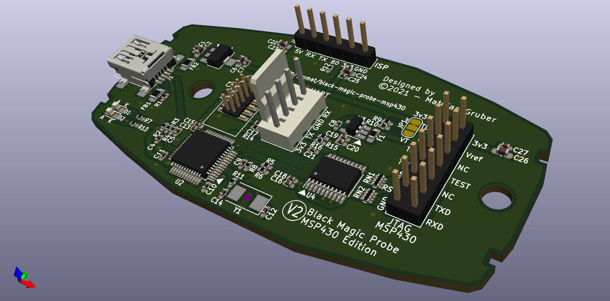

# Black Magic Probe - MSP430 Edition

## Primary Goal ##
This project aims to create a tool similar to the **Black Magic Probe** seen for the ARM processor, but for the Texas Instruments MSP430 MCU line.

The project is roughly based on the Daniel Beer's **mspdebug** but with many mix-ins from the **slau320aj - MSP430™ Programming With the JTAG Interface** and
the **MSP Debug Stack 3.15.1.1**.

New coding is performed in C++ with a self tailored *template library*.

The development is made using the outstanding **VisualGDB** and **Visual Studio Community 2019**, which IMHO is currently the best development combination available for embedded development. Unfortunately *VisualGDB* is not a free product but it is worth every buck I paid. So a *makefile* alternative is planned for those that only wants to build the binaries.

## Hardware Platform ##

The initial hardware platform is the *Blue Pill* as it is really a very cheap and fast solution.

Note that using the *Blue Pill* you are at a fixed supply rate of 3.3V, which may not be compatible to all MSP430 designs out there.

A decent hardware alternative was developed to allow one for a professional looking solution, and flexible target supply voltages was provided.
The design is based on the ST-Link V2 form factor, so you can buy some cheap ST-Link V2 clone, discard the main-board of the clone and install a new hardware on it to reuse the housing, which is very pretty and has an additional connector that can be used as a serial port.

A preliminary KiCad project is already on the repo.

An alterative design is also being considered, which would use the *baite* version of the ST-Link V2 clone. This has the disadvantage that no handy UART connector is possible.

Last but not least, it is planed to support ST-Link V2 clones using the clone hardware provided with them, but at the cost of some important features, such as low power supply, no standard MSP JTAG connector and possibly no UART function.

## Secondary Goal ##

New coding is performed in C++ with a self tailored *template library* and it serves to demonstrate how modern C++ can outperform C development with the use of the ``constexpr`` keyword.

The ``constexpr`` keyword sits like a *glove* to embedded development as most peripheral register addresses are pure constants.

So very complex logic decisions are simplified wherever possible during compile time for every ``constexpr`` in the template library and code is simplified to single liners.

