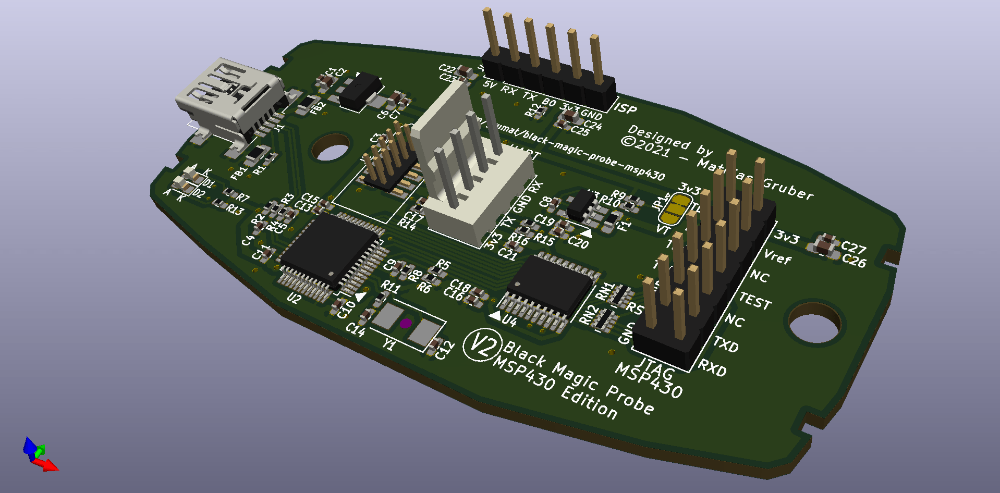
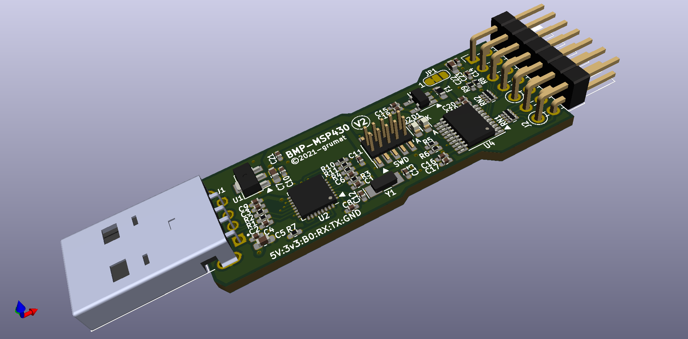

# **Glossy MSP430** - A Remote GDB Debugger for MSP430

## Primary Goal

This project aims to create a tool similar to the [Black Magic Probe](https://github.com/blacksphere/blackmagic) found on the ARM processor, but for the Texas Instruments MSP430 MCU line.

The project is roughly based on the Daniel Beer's **mspdebug** but with many mix-ins from the **slau320aj - MSP430™ Programming With the JTAG Interface** and the **MSP Debug Stack 3.15.1.1**.

Coding is performed in C++ with a self tailored *template library* acting as a *Hardware Abstraction Layer*, refactoring C code if necessary.

The development is made using the outstanding **VisualGDB** and **Visual Studio Community 2022**, which IMHO is currently the best development combination available for embedded development. Unfortunately *VisualGDB* is not a free product but it is worth every buck I paid for. So a *makefile* alternative is planned for those that only wants to build the binaries.

## What is the Glossy MSP430

The **Glossy MSP430** is a modern, in-application debugging tool for embedded microprocessors. It implements the [GDB Remote Serial Protocol](https://www.embecosm.com/appnotes/ean4/embecosm-howto-rsp-server-ean4-issue-2.html), which allows you see what is going on *inside* an application running on an embedded **MSP430 microprocessor** while it executes. It is able to 
control and examine the state of the target microprocessor using a **JTAG** or **Spy-Bi-Wire** (SBW) port and on-chip debug logic provided by the microprocessor. The probe connects to a host computer using a standard USB interface. The user is able to control exactly what happens using the GNU source level debugging software, GDB.

### The Special Motivation

The first impression of such a project, is the "Yet another On Chip Debugger". But this is a very simplistic view. If you evaluate standard MSP430 interfaces, the typical *MSP430.dll+probe combo*, you will notice that the amount of operations that a probe is capable to do in each request is too simplistic and fine grained. The main logic is coded inside the MSP430.dll.

This ends up in lots of small USB packets, which indeed uses a half-duplex principle for the communication. The Windows driver stack-based structure, may be extremely flexible, but at the cost of performance, it ends that you cannot saturate an USB bus without using huge data payloads. Fact is that a 12Mb USB link will constantly idle in the current *MSP430.dll* architecture. This adds latencies between every short messages.

GDB on the other side uses a higher level protocol and the JTAG probe requires more embedded intelligence to fully attend a request, reducing the number of in and outs to complete a request.  
As a result, faster responses are expected and that is exactly what you experience with the **Black Magic Probe** solution for the ARM platform. 

Another important point: This is a my hobby project and no boss or time schedules are priorities here. I am reading and reviewing all STM32 hardware documentation, to extract all possible performance for this application. For example, bit banging is the fastest way to develop a JTAG/SBW protocol and currently I've finished development of a JTAG implementation based on a combination of SPI+DMA+Timer to generate the **TMS signal logic** and the result of this work added the following benefits:
- Transmit a request at **9 MHz** using a STM32F103 controller (**72MHz / 8 = 9MHz**). This is at least double the speed of the best case scenario for bit-banging (by the way, MSP430 JTAG interface limits this interface to **10MHz**).
- Easy possibility to select lower speed to **4.5**, **2.25**, **1.13** and **0.56 MHz** and improve connection when using lengthy cables or low supply voltages.
- On newer STM32 variants it is possible to reach the **10 MHz** limit by choosing MCU clocks of **80** or **160 MHz**.
- Possibility to use DMA to feed data to the SPI device while MCU is decoding the next request, which shortens the latency between requests.

The wiki contains details on this work.

## Differences of the Glossy MSP430 and the Black Magic Probe

The following specifications where added or changed to accomplish the MSP430 version:
- JTAG pin-outs using TI 14-pin standard.
- Instead of SWD, the MSP430 uses the Spy-Bi-Wire as a two wire protocol. 
- The **TRACESWO** is not present on a MSP430 MCU.
- Variable JTAG/SBW transfer speeds.
- Control of supply voltage, like on the MSP430-FET.

Summarizing, these are the features:
- Identifies almost 500 parts from the MSP430 families: MSP430F1xx, MSP430F2xx, MSP430Gxxx, MSP430F4xx, MSP430F5xx, MSP430FRxxx. [completed]
- Connects to the target processor using the JTAG interfaces. [completed]
- Connects to the target processor using the Spy-Bi-Wire (SBW) interfaces. [in progress — device-ID and descriptor read working on FR5418A/FR5994; flash and full regression pending]
- Provides full debugging functionality, including: flash memory breakpoints, memory and register examination, flash memory programming, etc. [partially functional]
- Interface to the host computer is a standard USB CDC ACM device (virtual serial port), which does not require special drivers on Windows, Linux or OS X. [TBD]
- Implements the GDB extended remote debugging protocol for seamless integration with the GNU debugger and other GNU development tools. [almost complete]
- Implement an asynchronous design of the JTAG protocol, for implementations using DMA (like SPI, JTAG receives while it sends data; but not all commands requires a response; very bad for synchronous accesses) [TBD]
- Implements USB DFU class for easy firmware upgrade as updates become available. [TBD]
- Works with Windows, Linux and Mac environments. [TBD]

With the gdb partnership, the *Glossy MSP430* allows you to:

- Load your application into the target Flash memory, FRAM or RAM.
- Single step through your program.
- Run your program in real-time and halt on demand.
- Examine and modify CPU registers and memory.
- Obtain a call stack backtrace.
- Set up to 8 hardware assisted breakpoints.

## Software Platform

This repository has a VS2022 solution which contains various projects. 
In general this project can be divided in some distinct efforts:
- A Hardware Abstraction Layer
- The firmware source code
- A chip device database (a catalog having ~500 MSP430 variants). The original XML database can be found in [ChipInfo/ExtractChipInfo/MSP430-devices/devices](ChipInfo/ExtractChipInfo/MSP430-devices/devices)
- Unit Tests

A considerable effort was done to compact all required chip database information into a microcontroller with 128KB of Flash memory.

[Click here for details](Solution.md).

## Hardware Platform

> Please note that current development state is very preliminary and  focused on one primary objective: Performance of the JTAG link. Although most of the infra-structure for the debugger was already ported integration of them are still pending. SBW support is now in bring-up — device identification and descriptor read work on the bench — but it remains a tricky task due to the multiplexed nature of the data line: the single SBWDIO wire is tied to the target RST/NMI reset RC, which caps the practical wire rate well below the silicon maximum (around 1.2 MHz on the proto targets).

Two robust hardware alternative were planned with a rugged and professional look. For both options support for flexible target supply voltages was considered.

Prototypes board were fabricated, but current circuitry evolved since and schematics and PCB design are kept for physical model, where mechanical dimensions are the main target.

For development, larger boards were developed, based on development boards. These larger boards have testpoints and connections to help monitoring of supply voltages, signals and a logic analyzer. The line started with the **BluePill** and **BlackPill**, plus a pair of STM32 **Nucleo** boards.

> **Lineup decision (mid-2026):** the project is converging on **two final targets** — an **STM32G431 (LQFP48)** sized to fit inside a reused **ST-Link V2 clone case** (cheap, off-the-shelf packaging for newcomers), and the **BluePill (STM32F103)** kept as a "joker" into the next release. As a result the **BlackPill-BMP** and the **Nucleo** boards are now deprecated (the L432KC has too few pins; its firmware target was dropped from the solution), and a BluePill-sized **G431 in LQFP48** was sourced to enable the new **BluePill-G431 "Jiga-Board"**.

Current and historical options are:

- **BlackPill-BMP** *(deprecated — see `Hardware/BlackPill-BMP/OBSOLETE.txt`)*: a dual-socket prototype that accepts either a Blue-pill (STM32F103) or a Black-Pill (STM32F411). The **BluePill remains a supported "joker" board**, but the BlackPill (STM32F411) is dropped — it is only a humble upgrade over the newer STM32G431. Note this board limits the supply voltage to 3.3V, which is fine for usual prototype boards but not for the lower levels many *Ultra Low Power* MSP430 devices use.  
  
[Details for this option can be found here](Hardware/BlackPill-BMP/README.md).

- A board for a pair of **Nucleo-32** boards was developed during the 2020s chip shortage, when the STM32F103 became a rarity. The **L432KC variant is now obsolete** *(`Hardware/L432KC/OBSOLETE.txt`)* — LQFP32 has too few pins — and its firmware target was removed from the solution. Its successor is the **BluePill-G431 "Jiga-Board"**: a BluePill-sized carrier for an **STM32G431 in LQFP48**, which has enough pins to break out all buffer-enable and LED functions, and accepts a traditional BluePill like a socket.  
[Details for the G431 Jiga-Board here](Hardware/BluePill-G431/README.md).

- BMPMSP: a preliminary physical prototype that suits into a nice form factor. The schematics has evolved since it was released back in Mid 2021 and a new board will be produced for the final product.  
  
[Details here](Hardware/MSPBMP/README.md).

  > At the time of this writing a redesign is being fabricated by JLCPCB. This new design has an updated circuit diagram. A physical model will become reality in the next couple of months, after implementation of the VCP support.

- BMPMSP2-stick: Same as above but more compact. It fits into the *Baite* plastic case, quite common on the ATMega world.  
  
[Details here](Hardware/MSPBMP2-stick/README.md).

Note that for both options you will find a KiCad project on the repo. 

The **ST-Link V2 clone** is now a primary low-cost target: the final G431 board is sized to drop into a reused clone case, and the existing STM32F103 clone hardware also runs the firmware directly. This reuses the clone hardware provided with these widely-available probes, at the cost of some features:
- no support to power supply voltages other than 3.3V (the clone's translators are input-only; the debug outputs are fixed at 3.3V)
- no standard MSP JTAG connector
- VCP (UART) function requires a hardware mod.
- Clones having 10-pin connectors will be limited to the SBW bus.

  
[Details for this option can be found here](Hardware/STLinkV2/README.md).

So, a low cost option is available to make tests before going to a more featured and costly option.

## Target Prototype Boards

Besides the series of affordable targets of the *LaunchPad series* from TI, some other targets requires prototype boards for the development of the firmware, specially in the initial stages where development aims the JTAG protocol.

On the repo you will find KiCad prototypes for:

- Generic legacy MSP430 board, for many variants, such as **MSP4301611**, **MSP430F249** and many others. This board has pads for dual pin-outs and instead of a single option with the MCU at the top, an alternative pin-out is also found at the bottom. These optional pins are compatible with the **MSP430G2955** and other variants.  
These devices follows specification of the **SLAU049** and the **SLAU144** users guide:  
  
[Details here](Hardware/Target_Proto_Boards/SLAU049_SLAU144/README.md). 

- For the **SLAU208** users guide based family a second option was designed for the **MSP430F5418** and its siblings.  
  
[Details here](Hardware/Target_Proto_Boards/F5418/README.md). 

- After the MSF430F5xxx generation TI lanched the first **FRAM** generation and a new users guide, the **SLAU272** and a bit later, a rough optimization, introduces the **SLAU367** users guide. Both families have very similar pinouts for the **TSSOP-38** package, so it is possible to share a single design to test both families:  
  
[Details here](Hardware/Target_Proto_Boards/SLAU272_SLAU367/README.md). 

- In between the **FRAM** line of chips, a special line was released, similar to **MSP430F2xxx** family, but with very precise A/D converters.  
These are based on the **TSSOP-28** package and the following board was developed: 
  
[Details here](Hardware/Target_Proto_Boards/SLAU335/README.md).

- For the most recent generation of **FRAM** based devices, which are based on the **SLAU445** users guide, a prototype board for the **MSP430FR2476** was designed:  
  
[Details here](Hardware/Target_Proto_Boards/SLAU445_FR2476/README.md).

## Secondary Goal

New coding is performed in C++ with a self tailored *template library* and it serves to demonstrate that modern C++ can easily outperform C development with the use of the ``constexpr`` keyword. 

The ``constexpr`` keyword sits like a *glove* to embedded development as most peripheral register addresses are pure constants. 

So very complex logic decisions are simplified, wherever possible, during compile time for every ``constexpr`` in the template library and unnecessary code are automatically removed and the final result is just a couple of lines. 

